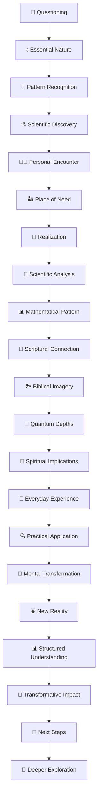

   
# 🔣 Emoji Flow Strategy Guide   
   
## 📚 Overview   
   
The strategic use of emojis throughout Jesus Series papers creates a visual "story flow" that readers can follow even when skimming. This guide demonstrates how emojis can create a narrative arc that reinforces the content's progression.   
   
## 🌊 Jesus as Living Water: Emoji Flow Example   
   
### 1. 🌊 Introduction: Setting the Stage   
   
- 🤔 (questioning) → "What if Jesus's claim to be 'living water' wasn't merely poetic?"   
- 💧 (water drop) → "Water is essential for all life..."   
- 🌊 (wave) → "Fluids follow precise mathematical patterns..."   
- ⚗️ (lab equipment) → "Water exhibits unusual quantum coherence properties..."   
- 🔄 (cycle) → "In scripture, water represents purification, renewal..."   
   
### 2. 👩‍🔬 Narrative Introduction: Maya's Discovery   
   
- 👩‍🔬 (scientist) → "Maya Chen, a brilliant young graduate student..."   
- 🏜️ (desert) → "Community suffering from extreme drought..."   
- 🏺 (water jar) → "Despite having barely enough water for herself..."   
- 💭 (thought bubble) → "That night, Maya dreamed of water molecules..."   
- 💧 (water drop) → "Hidden water source..."   
   
### 3. ⚛️ Scientific Foundation: Fluid Dynamics Explained   
   
- 🔬 (microscope) → "Water is deceptively simple—H₂O—yet exhibits complex behavior..."   
- 📊 (chart) → "For turbulent flow in a pipe: Reynolds number Re = ρvD/μ..."   
- 🌀 (spiral) → "Flow systems follow consistent principles regardless of scale..."   
- 🧪 (test tube) → "Structured water layers may facilitate quantum coherence effects..."   
- 🧮 (abacus) → "Mathematical patterns emerge even in chaos..."   
   
### 4. 📜 Spiritual Mapping: Water in Scripture   
   
- 📜 (scroll) → "When Jesus told Nicodemus that rebirth required both water and Spirit..."   
- 🌊 (wave) → "Throughout scripture, water as context for new beginnings..."   
- 🏞️ (river) → "The Jordan River baptism represents a remarkable convergence..."   
- ⛲ (fountain) → "Ezekiel's vision shows water flowing from the temple..."   
- 🔄 (cycle) → "Water and Spirit have always worked together..."   
   
### 5. 🧪 Quantum Depths: Coherence in Spirit   
   
- 🧪 (test tube) → "Recent research into water at biological interfaces reveals..."   
- 🔮 (crystal ball) → "These quantum properties illuminate spiritual formation..."   
- 🧩 (puzzle piece) → "Mathematical models suggest patterns of coherence..."   
- 🌌 (galaxy) → "Non-local effects transcend physical limitations..."   
- ∞ (infinity) → "Suggesting profound implications for spiritual connection..."   
   
### 6. 🏺 Everyday Metaphors and Visualizations   
   
- 🚿 (shower) → "Spiritual blockages like unforgiveness restrict divine movement..."   
- 🧵 (thread) → "Divine flow creates connections across seemingly separate domains..."   
- 🚰 (faucet) → "Just as water pressure determines flow rate..."   
- 🧹 (broom) → "Clearing channels of spiritual debris..."   
- 🌱 (seedling) → "Living water produces continuous growth..."   
   
### 7. 🔍 Practical Applications: Channels of Living Water   
   
- 🔍 (magnifying glass) → "Examine your spiritual channels for blockages..."   
- 🏃‍♀️ (running) → "Creating distance from negative influences reduces their pull..."   
- 🙏 (prayer) → "Prayer creates receptivity to divine flow..."   
- 🤝 (handshake) → "Community amplifies the flow of living water..."   
- 🌱 (seedling) → "Growth comes from consistent exposure to the source..."   
   
### 8. 🧠 Thought Experiment: The Living Spring   
   
- 🧠 (brain) → "Visualize yourself at a deep well..."   
- 👁️ (eye) → "See the weight of the empty water jar..."   
- 🏺 (water jar) → "Feel the strain of drawing water up..."   
- ⛲ (fountain) → "Now imagine a spring bubbling up within you..."   
- 💭 (thought bubble) → "Notice the difference between effort and grace..."   
   
### 9. 📊 Transformative Framework   
   
- 📊 (chart) → "Physical reality → Spiritual dynamic → Practice"   
- 📈 (graph) → "Growth trajectory as channels clear..."   
- 🧩 (puzzle piece) → "Components of spiritual hydraulics..."   
- 🔄 (cycle) → "The continuous cycle of receiving and giving..."   
- 📋 (clipboard) → "Assessment of your current spiritual flow state..."   
   
### 10. 💫 Final Thoughts and Next Steps   
   
- 💫 (sparkle) → "Living water transforms from within..."   
- 🌉 (bridge) → "Connection to Jesus as Truth in our next exploration..."   
- 👣 (footprints) → "Next steps in your spiritual hydration journey..."   
- 🔄 (cycle) → "Continuous renewal through the spring within..."   
- 🌊 (wave) → "Becoming a channel of living water to others..."   
   
### 11. 🌊 Quantum Faith Explorations   
   
- 🌊 (deeper waters) → "For those desiring to explore the profound depths..."   
- 🔍 (magnifying glass) → "Examining quantum coherence in biological water..."   
- 🧪 (test tube) → "Mathematical modeling of spiritual flow dynamics..."   
- 📚 (books) → "Historical-theological analysis of living water metaphors..."   
- 🌌 (galaxy) → "The cosmic implications of divine flow patterns..."   
   
## 📊 Visual Emoji Flow Diagram   
   

   
   
## 🖼️ Emoji Story Arc   
   
When reading just the emojis in sequence, they should tell this visual story:   
   
1. **Question & Discovery Phase**   
   🤔 → 💧 → 🌊 → ⚗️ → 👩‍🔬   
   
2. **Learning & Connection Phase**   
   🔬 → 📊 → 📜 → 🏞️ → 🧪   
   
3. **Insight & Application Phase**   
   🔮 → 🏺 → 🔍 → 🧠 → ⛲   
   
4. **Integration & Growth Phase**   
   📊 → 💫 → 👣 → 🌊 → 🌌   
   
This creates a visual journey from questioning → discovery → understanding → application → transformation → deeper exploration.   
   
## 🧩 Emoji Theme Sets for Different Metaphors   
   
### Jesus as Light   
🔆 → 💡 → 👁️ → 🔬 → 🌈 → 🔍 → 🕯️ → 🔮 → 📊 → ✨ → 🌟   
   
### Jesus as Truth   
❓ → 📜 → 📡 → 🧩 → 🔍 → 🔐 → 🧠 → 💭 → 📊 → 💫 → 📚   
   
### Jesus as Bread   
🍞 → 🌾 → 🔬 → 🔄 → 🧪 → 🍽️ → 🔍 → 🧠 → 📊 → 💫 → 🌽   
   
### Jesus as Vine   
🌿 → 🌱 → 🔬 → 🌳 → 🧪 → 🕸️ → 🔍 → 🧠 → 📊 → 💫 → 🍇   
   
## 📝 Implementation Guidelines   
   
1. **Consistency with Variation**   
   
   - Maintain the overall emotional arc across papers   
   - Adapt specific emojis to each metaphor's theme   
   - Keep structural emojis consistent (🔍, 📊, 💫, etc.)   
   
2. **Visual Distinctiveness**   
   
   - Ensure emojis are visually distinct from each other   
   - Avoid using similar emojis too close together   
   - Consider color patterns (blue for water, yellow for light, etc.)   
   
3. **Meaningful Connections**   
   
   - Each emoji should directly relate to the content it marks   
   - Transitions between emojis should feel natural   
   - The sequence should create a coherent visual story   
   
4. **Quantity Guidelines**   
   
   - 3-5 emojis per major section   
   - Place at natural paragraph breaks   
   - Use more at transition points, fewer within dense content   
   
By following this emoji flow strategy, readers can quickly scan the document and grasp its progression, while still experiencing a rich, immersive reading experience when engaging with the full content.