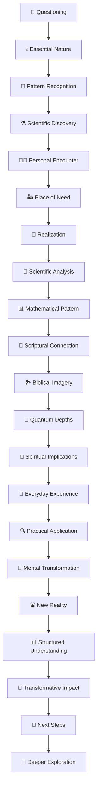

   
# Jesus Series Folder Structure Guide   
   
This document outlines the standardized folder and file structure for the Jesus Series. Following this structure will ensure consistency across all sections and make navigation intuitive for readers.   
   
## Main Series Structure   
   
```
Jesus Series/
├── 00 - Jesus Series Index.md                 # Main navigation hub
├── Framework Structure/                      # Framework documentation
├── Jesus/                                    # Jesus papers
│   ├── 01 Jesus as Light/
│   ├── 02 Jesus as Water/
│   ├── ...
│   └── 09 Jesus as Resurrection/
├── God/                                      # God papers
│   └── ...
└── Holy Spirit/                              # Holy Spirit papers
    └── ...
```
   
   
## Individual Paper Structure   
   
Each metaphor (Light, Water, etc.) should follow this structure:   
   
```
XX Jesus as [Metaphor]/
├── JS-OX-[Metaphor]-Main.md                 # Main paper (JS = Jesus Series, O = Overview)
├── Assets/
│   ├── Images/                              # All images for this metaphor
│   │   ├── [metaphor]-header.jpg
│   │   ├── [metaphor]-diagram-1.png
│   │   └── ...
│   ├── Study Materials/                     # Learning resources
│   │   ├── StudyGuide.md
│   │   ├── FAQ.md
│   │   ├── Briefing.md
│   │   └── MindMap.md
│   └── Audio/                               # Audio versions
│       └── Jesus-as-[Metaphor].mp3
└── Deep Research/                           # Premium/upsell content
    ├── [Metaphor]-DeepDive-1.md
    ├── [Metaphor]-DeepDive-2.md
    └── ...
```
   
   
## File Naming Conventions   
   
   
- **Main Papers**: `JS-OX-[Metaphor]-Main.md` (e.g., `JS-O1-Light-Main.md`)   
- **Deep Research Papers**: `[Metaphor]-DeepDive-X.md` (e.g., `Light-DeepDive-1.md`)   
- **Study Materials**: Standard names (`StudyGuide.md`, `FAQ.md`, `Briefing.md`, `MindMap.md`)   
- **Images**: `[metaphor]-[purpose].png` (e.g., `light-wave-particle.png`)   
   
## Content Standards   
   
Each paper should include:   
   
1. **Introduction** - Clear statement of the metaphor and quantum concept   
2. **Scriptural Foundation** - Biblical basis for the metaphor   
3. **Quantum Connection** - Explanation of the relevant physics   
4. **Theological Integration** - How the quantum concept illuminates theological understanding   
5. **Practical Application** - Real-world significance for faith and practice   
6. **Premium Content Teaser** - Link to deeper papers with brief descriptions   
   
## Study Materials Standards   
   
Each metaphor should include these standard study materials:   
   
1. **Study Guide** - Learning objectives, reflection questions, application exercises   
2. **FAQ** - 5-10 common questions with concise answers   
3. **Briefing** - Executive summary with key points (1-2 pages)   
4. **Mind Map** - Visual representation of key concepts and relationships   
   
## Deep Research Standards   
   
Deep research papers should:   
   
1. Be 2-3 times longer than main papers   
2. Include more technical details on quantum concepts   
3. Explore theological implications in greater depth   
4. Include mathematical models where appropriate   
5. Reference scholarly sources   
   
## Implementation Checklist   
   
When setting up a new metaphor section:   
   
   
- [ ] Create folder structure following the template   
- [ ] Set up main paper with proper naming convention   
- [ ] Create all four study materials   
- [ ] Prepare at least 2-3 deep research papers   
- [ ] Include audio version of main paper   
- [ ] Update main index to link to the new section   
I was like I like them I don't know   
   
# 🔣 Emoji Flow Strategy Guide   
   
## 📚 Overview   
   
The strategic use of emojis throughout Jesus Series papers creates a visual "story flow" that readers can follow even when skimming. This guide demonstrates how emojis can create a narrative arc that reinforces the content's progression.   
   
## 🌊 Jesus as Living Water: Emoji Flow Example   
   
### 1. 🌊 Introduction: Setting the Stage   
   
- 🤔 (questioning) → "What if Jesus's claim to be 'living water' wasn't merely poetic?"   
- 💧 (water drop) → "Water is essential for all life..."   
- 🌊 (wave) → "Fluids follow precise mathematical patterns..."   
- ⚗️ (lab equipment) → "Water exhibits unusual quantum coherence properties..."   
- 🔄 (cycle) → "In scripture, water represents purification, renewal..."   
   
### 2. 👩‍🔬 Narrative Introduction: Maya's Discovery   
   
- 👩‍🔬 (scientist) → "Maya Chen, a brilliant young graduate student..."   
- 🏜️ (desert) → "Community suffering from extreme drought..."   
- 🏺 (water jar) → "Despite having barely enough water for herself..."   
- 💭 (thought bubble) → "That night, Maya dreamed of water molecules..."   
- 💧 (water drop) → "Hidden water source..."   
   
### 3. ⚛️ Scientific Foundation: Fluid Dynamics Explained   
   
- 🔬 (microscope) → "Water is deceptively simple—H₂O—yet exhibits complex behavior..."   
- 📊 (chart) → "For turbulent flow in a pipe: Reynolds number Re = ρvD/μ..."   
- 🌀 (spiral) → "Flow systems follow consistent principles regardless of scale..."   
- 🧪 (test tube) → "Structured water layers may facilitate quantum coherence effects..."   
- 🧮 (abacus) → "Mathematical patterns emerge even in chaos..."   
   
### 4. 📜 Spiritual Mapping: Water in Scripture   
   
- 📜 (scroll) → "When Jesus told Nicodemus that rebirth required both water and Spirit..."   
- 🌊 (wave) → "Throughout scripture, water as context for new beginnings..."   
- 🏞️ (river) → "The Jordan River baptism represents a remarkable convergence..."   
- ⛲ (fountain) → "Ezekiel's vision shows water flowing from the temple..."   
- 🔄 (cycle) → "Water and Spirit have always worked together..."   
   
### 5. 🧪 Quantum Depths: Coherence in Spirit   
   
- 🧪 (test tube) → "Recent research into water at biological interfaces reveals..."   
- 🔮 (crystal ball) → "These quantum properties illuminate spiritual formation..."   
- 🧩 (puzzle piece) → "Mathematical models suggest patterns of coherence..."   
- 🌌 (galaxy) → "Non-local effects transcend physical limitations..."   
- ∞ (infinity) → "Suggesting profound implications for spiritual connection..."   
   
### 6. 🏺 Everyday Metaphors and Visualizations   
   
- 🚿 (shower) → "Spiritual blockages like unforgiveness restrict divine movement..."   
- 🧵 (thread) → "Divine flow creates connections across seemingly separate domains..."   
- 🚰 (faucet) → "Just as water pressure determines flow rate..."   
- 🧹 (broom) → "Clearing channels of spiritual debris..."   
- 🌱 (seedling) → "Living water produces continuous growth..."   
   
### 7. 🔍 Practical Applications: Channels of Living Water   
   
- 🔍 (magnifying glass) → "Examine your spiritual channels for blockages..."   
- 🏃‍♀️ (running) → "Creating distance from negative influences reduces their pull..."   
- 🙏 (prayer) → "Prayer creates receptivity to divine flow..."   
- 🤝 (handshake) → "Community amplifies the flow of living water..."   
- 🌱 (seedling) → "Growth comes from consistent exposure to the source..."   
   
### 8. 🧠 Thought Experiment: The Living Spring   
   
- 🧠 (brain) → "Visualize yourself at a deep well..."   
- 👁️ (eye) → "See the weight of the empty water jar..."   
- 🏺 (water jar) → "Feel the strain of drawing water up..."   
- ⛲ (fountain) → "Now imagine a spring bubbling up within you..."   
- 💭 (thought bubble) → "Notice the difference between effort and grace..."   
   
### 9. 📊 Transformative Framework   
   
- 📊 (chart) → "Physical reality → Spiritual dynamic → Practice"   
- 📈 (graph) → "Growth trajectory as channels clear..."   
- 🧩 (puzzle piece) → "Components of spiritual hydraulics..."   
- 🔄 (cycle) → "The continuous cycle of receiving and giving..."   
- 📋 (clipboard) → "Assessment of your current spiritual flow state..."   
   
### 10. 💫 Final Thoughts and Next Steps   
   
- 💫 (sparkle) → "Living water transforms from within..."   
- 🌉 (bridge) → "Connection to Jesus as Truth in our next exploration..."   
- 👣 (footprints) → "Next steps in your spiritual hydration journey..."   
- 🔄 (cycle) → "Continuous renewal through the spring within..."   
- 🌊 (wave) → "Becoming a channel of living water to others..."   
   
### 11. 🌊 Quantum Faith Explorations   
   
- 🌊 (deeper waters) → "For those desiring to explore the profound depths..."   
- 🔍 (magnifying glass) → "Examining quantum coherence in biological water..."   
- 🧪 (test tube) → "Mathematical modeling of spiritual flow dynamics..."   
- 📚 (books) → "Historical-theological analysis of living water metaphors..."   
- 🌌 (galaxy) → "The cosmic implications of divine flow patterns..."   
   
## 📊 Visual Emoji Flow Diagram   
   

   
   
## 🖼️ Emoji Story Arc   
   
When reading just the emojis in sequence, they should tell this visual story:   
   
1. **Question & Discovery Phase**   
   🤔 → 💧 → 🌊 → ⚗️ → 👩‍🔬   
   
2. **Learning & Connection Phase**   
   🔬 → 📊 → 📜 → 🏞️ → 🧪   
   
3. **Insight & Application Phase**   
   🔮 → 🏺 → 🔍 → 🧠 → ⛲   
   
4. **Integration & Growth Phase**   
   📊 → 💫 → 👣 → 🌊 → 🌌   
   
This creates a visual journey from questioning → discovery → understanding → application → transformation → deeper exploration.   
   
## 🧩 Emoji Theme Sets for Different Metaphors   
   
### Jesus as Light   
🔆 → 💡 → 👁️ → 🔬 → 🌈 → 🔍 → 🕯️ → 🔮 → 📊 → ✨ → 🌟   
   
### Jesus as Truth   
❓ → 📜 → 📡 → 🧩 → 🔍 → 🔐 → 🧠 → 💭 → 📊 → 💫 → 📚   
   
### Jesus as Bread   
🍞 → 🌾 → 🔬 → 🔄 → 🧪 → 🍽️ → 🔍 → 🧠 → 📊 → 💫 → 🌽   
   
### Jesus as Vine   
🌿 → 🌱 → 🔬 → 🌳 → 🧪 → 🕸️ → 🔍 → 🧠 → 📊 → 💫 → 🍇   
   
## 📝 Implementation Guidelines   
   
1. **Consistency with Variation**   
   
   - Maintain the overall emotional arc across papers   
   - Adapt specific emojis to each metaphor's theme   
   - Keep structural emojis consistent (🔍, 📊, 💫, etc.)   
   
2. **Visual Distinctiveness**   
   
   - Ensure emojis are visually distinct from each other   
   - Avoid using similar emojis too close together   
   - Consider color patterns (blue for water, yellow for light, etc.)   
   
3. **Meaningful Connections**   
   
   - Each emoji should directly relate to the content it marks   
   - Transitions between emojis should feel natural   
   - The sequence should create a coherent visual story   
   
4. **Quantity Guidelines**   
   
   - 3-5 emojis per major section   
   - Place at natural paragraph breaks   
   - Use more at transition points, fewer within dense content   
   
By following this emoji flow strategy, readers can quickly scan the document and grasp its progression, while still experiencing a rich, immersive reading experience when engaging with the full content.   
   
   
   
# 🌟 Jesus Series Enhanced Organization Guide   
   
## 📋 Overview   
   
We've implemented a significantly enhanced approach to organizing and presenting the Jesus Series content, drawing inspiration from the engaging, narrative-rich style of the Law 1 example. This guide outlines the new structure and provides guidance for implementing it across all content in the series.   
   
## 🔑 Key Elements of Enhanced Structure   
   
### 1. 📝 Rich Visual Organization   
   
- **Emoji Headers**: Each section begins with relevant emoji for visual navigation   
- **Expanded Typography**: Strategic use of bold, italics, and quotes for emphasis   
- **Visual Frameworks**: Tables, charts, and concept maps that organize key ideas   
- **Callout Boxes**: Expandable sections with additional depth for interested readers   
   
### 2. 📚 Narrative Integration   
   
- **Personal Stories**: Fictional narratives that illustrate concepts (like Elijah's story in Law 1 or Elazar in Water-DeepDive-3)   
- **Character Development**: Recurring characters across papers (like Maya in the Water main paper)   
- **Historical Imagination**: Creative exploration of biblical scenes from new perspectives   
- **First-Person Insights**: Personal reflections that make concepts relatable   
   
### 3. 🧩 Structured Learning Elements   
   
- **HOOK**: Engaging questions or statements that capture interest   
- **FAST FACTS**: Quick reference points for key information   
- **FORMULAS**: Mathematical or conceptual expressions of key principles   
- **NARRATIVES**: Stories that illustrate concepts in accessible ways   
- **THOUGHT EXPERIMENTS**: Guided visualizations and mental exercises   
   
### 4. 🔍 Enhanced Academic Depth   
   
- **Expandable Technical Sections**: Detailed academic content in collapsible boxes   
- **Cross-Disciplinary Integration**: Connecting theology, science, history, and psychology   
- **Visual Representation of Complex Ideas**: Diagrams and charts for difficult concepts   
- **Strategic Citations**: References to both academic and spiritual authorities   
   
### 5. 🖼️ Visual Consistency   
   
- **Standard Section Patterns**: Consistent structure across all papers   
- **Unified Emoji System**: Same emoji used for parallel concepts across papers   
- **Concept Maps**: Similar formatting for all mind maps and concept diagrams   
- **Color Themes**: Suggested color associations (Light - gold/yellow, Water - blue, Truth - green, etc.)   
   
## 📑 Standard Paper Structure   
   
Each main paper should follow this general structure:   
   
1. **Title & Introduction**: With hook question and fast facts   
2. **World Context**: Situating the concept in human experience   
3. **Core Concept Definition**: Clear explanation of the central metaphor   
4. **Personal Narrative**: Story that illustrates the concept (Maya, Elazar, etc.)   
5. **Spiritual Mapping**: Connecting to biblical/theological frameworks   
6. **Scientific Foundations**: Exploring relevant scientific concepts   
7. **Practical Application**: How to live out the principles   
8. **Visualization & Thought Experiment**: Guided mental exercise   
9. **Key Takeaways & Connection to Series**: Summary and bridge to next paper   
10. **Visual Frameworks**: Concept map and transformative framework table   
   
## 🧠 Deep Research Structure   
   
Deep research papers should maintain academic rigor while incorporating enhanced engagement:   
   
1. **Visual Title & Introduction**: With relevant image   
2. **Expandable Concept Overview**: In a callout box   
3. **Technical Sections**: With appropriate subheadings and visual organization   
4. **Narrative Elements**: At least one story or character perspective   
5. **Mathematical/Theoretical Frameworks**: Visual presentation of complex ideas   
6. **Practical/Spiritual Applications**: Connecting theory to practice   
7. **Visual Frameworks**: Diagrams, tables, or concept maps   
   
## 📊 Study Materials Enhancement   
   
Study materials should be reorganized for greater engagement:   
   
1. **FAQ**: Add expandable sections for detailed answers   
2. **Study Guide**: Include visual elements and personal reflection prompts   
3. **Briefing**: Add concept diagram and key takeaway bullets   
4. **Mind Map**: Enhance with color coding and visual hierarchy   
   
## 🗂️ Folder Organization Standards   
   
The folder structure remains as previously defined, but with attention to:   
   
1. **Image Organization**: Categorized by purpose (headers, diagrams, narratives)   
2. **Consistent File Naming**: Using the JS-OX-[Metaphor] convention   
3. **Resource Management**: Tracking all visual and narrative elements   
   
## 📱 Enhanced Upsell Strategy   
   
The more engaging format creates natural opportunities for premium content:   
   
1. **Free Tier**:   
   
   - Main paper with core narrative   
   - Basic expandable sections   
   - Simple visual frameworks   
   
2. **Premium Tier**:   
   
   - Extended narratives   
   - Additional character perspectives   
   - Advanced diagrams and visualizations   
   - Complete deep research collection   
   - Audio narrations of stories   
   - Interactive thought experiments   
   
## 🚀 Implementation Plan   
   
1. **Convert Existing Content**:   
   
   - Start with Jesus as Light and Water sections   
   - Implement the enhanced structure   
   - Develop recurring characters across papers   
   
2. **Create New Content**:   
   
   - Develop remaining papers with enhanced approach from the start   
   - Ensure narrative continuity across the series   
   
3. **Visual Assets**:   
   
   - Create standard diagrams for recurring concepts   
   - Develop character illustrations for key narrative figures   
   - Design consistent concept map templates   
   
## 🔮 Vision for Complete Series   
   
When fully implemented, the Jesus Series will offer:   
   
1. **Intellectual Depth**: Rigorous theological and scientific exploration   
2. **Narrative Engagement**: Stories that make concepts memorable   
3. **Visual Learning**: Frameworks that organize complex ideas   
4. **Practical Application**: Clear paths from concept to lived experience   
5. **Series Cohesion**: A unified journey through Jesus's "I am" statements   
   
This enhanced approach transforms the series from a collection of papers into an immersive learning journey that engages multiple learning styles and creates a compelling pathway to deeper understanding.   
   
   
## 🔄 Backend Organization (Hidden from User Navigation)   
   
Behind the scenes, each OH folder still contains the full organization:   
   
```
OH-1 - Jesus as Light/               # What user sees at this level
├── JS-O1-Light-Main.md              # ONLY file visible to user
├── .assets/                         # Hidden folder (note the dot prefix)
│   ├── images/                      # Hidden images
│   └── study_materials/             # Hidden study materials
└── .quantum_faith_explorations/     # Hidden premium links
    └── premium_content_links.md     # Hidden links to premium content
```
   
   
## 🔮 Premium Content Access   
   
The "Quantum Faith Explorations" premium content is completely separate from the main navigation. Users would access it through:   
   
1. Links in the main articles that point to the premium content   
2. A separate premium content portal/page   
3. Direct links provided after purchase   
# 🌟 Jesus Series – Standardized Chapter Structure (Emoji Version)   
   
## 1️⃣ ✨ Introduction: [Title Metaphor]   
   
   
- **Opening Hook:** Provocative question connecting science and faith   
- **Spiritual Context:** Biblical foundation for the metaphor   
- **Scientific Context:** Overview of relevant scientific principles   
- **Metaphor Significance:** Why this metaphor matters for understanding Jesus   
   
## 2️⃣ 🌍 The World Context   
   
   
- **Historical Setting:** Relevant first-century context   
- **Contemporary Parallels:** Modern relevance of the metaphor   
- **Universal Human Need:** How this aspect of Jesus addresses fundamental human needs   
   
## 3️⃣ ⚛️ Scientific Foundation   
   
   
- **Core Scientific Principles:** Detailed explanation of the scientific framework   
- **Key Equations/Models:** Mathematical representation where applicable   
- **Current Understanding:** State of scientific knowledge in this area   
- **Limitations & Mysteries:** Unsolved questions in this scientific domain   
   
## 4️⃣ 📖 Theological Foundation   
   
   
- **Biblical Imagery:** Comprehensive survey of scriptural references   
- **Historical Understanding:** How this aspect was understood through church history   
- **Theological Significance:** Implications for understanding Christ's nature and work   
- **Denominational Perspectives:** Various theological traditions' interpretations   
   
## 5️⃣ 🔮 Quantum-Spiritual Integration   
   
   
- **Parallel Principles:** Point-by-point connection between scientific and spiritual realities   
- **Metaphorical Framework:** How this scientific lens illuminates theological truth   
- **Visual Model:** Diagram integrating scientific and spiritual dimensions   
- **Mathematical Correlation:** Equation mapping to spiritual dynamics (where applicable)   
   
## 6️⃣ 🛤️ Practical Application   
   
   
- **Personal Transformation:** How this understanding changes individual spiritual life   
- **Community Impact:** Implications for church and relationships   
- **Contemplative Practices:** Exercises to embody this aspect of Christ   
- **Modern Challenges:** Addressing contemporary issues through this framework   
   
## 7️⃣ 🔗 Integration with Series   
   
   
- **Connection to Previous Metaphor:** How this builds on the preceding chapter   
- **Preview of Next Metaphor:** Transition to the following chapter   
- **Cumulative Understanding:** How this contributes to the complete picture of Christ   
   
## 8️⃣ 🧭 Deep Exploration Links   
   
   
- **Scientific Depth Paper:** Advanced scientific principles, research, math, implications   
- **Theological Depth Paper:** Extended exegesis, historical theology, denominational views   
   
   
---   
   
## Visual Elements Throughout   
   
   
- **Scientific Visualization:** Diagram of the core scientific principle   
- **Theological Mapping:** Visual representation of biblical references and connections   
- **Integration Model:** Combined visualization showing scientific-spiritual parallels   
- **Application Framework:** Practical implementation visual guide   
   
   
---   
   
# ✨ Example: Jesus as Light (with Emojis)   
   
## 1️⃣ ✨ Introduction: Jesus as Light   
   
   
- **Hook:** What does it mean for Jesus to be the "Light of the World" in both physics and faith?   
- **Spiritual Context:** John 8:12 and other biblical references   
- **Scientific Context:** Basics of light in physics (wave-particle duality, speed of light)   
- **Metaphor Significance:** Light as revelation, guidance, and transformation   
   
## 2️⃣ 🌍 The World Context   
   
   
- **Historical Setting:** Light in ancient Jewish symbolism   
- **Contemporary Parallels:** Light in modern science and culture   
- **Universal Human Need:** The search for truth and clarity   
   
## 3️⃣ ⚛️ Scientific Foundation   
   
   
- **Principles:** Electromagnetic spectrum, quantum properties of light   
- **Equations:** ,    
- **Current Understanding:** Photons, relativity, quantum mysteries   
- **Limitations:** The measurement problem, duality paradoxes   
   
## 4️⃣ 📖 Theological Foundation   
   
   
- **Imagery:** Light in Genesis, Psalms, Gospels   
- **History:** Early church interpretations   
- **Significance:** Christ as revealer and illuminator   
- **Perspectives:** Catholic, Orthodox, Protestant views   
   
## 5️⃣ 🔮 Quantum-Spiritual Integration   
   
   
- **Parallels:** Light’s duality and Christ’s dual nature   
- **Framework:** Light as both particle (immanence) and wave (transcendence)   
- **Visual Model:** Diagram of light’s properties and spiritual parallels   
- **Math:** Mapping quantum uncertainty to faith dynamics   
   
## 6️⃣ 🛤️ Practical Application   
   
   
- **Personal:** Walking in the light—spiritual disciplines   
- **Community:** Illuminating others, social justice   
- **Practices:** Meditation on light, acts of service   
- **Challenges:** Navigating doubt and darkness   
   
## 7️⃣ 🔗 Integration with Series   
   
   
- **Previous:** Builds on “Jesus as Word”   
- **Next:** Prepares for “Jesus as Water”   
- **Cumulative:** Light as foundation for all metaphors   
   
## 8️⃣ 🧭 Deep Exploration Links   
   
   
- **Scientific Depth:** “Quantum Radiance: Advanced Light Physics”   
- **Theological Depth:** “Light in Patristic and Modern Theology”   
   
   
---   
   
# 💧 Example: Jesus as Water (with Emojis)   
   
## 1️⃣ 💧 Introduction: Jesus as Living Water   
   
   
- **Hook:** How does Jesus as “Living Water” quench both physical and spiritual thirst?   
- **Spiritual Context:** John 4, Isaiah 55   
- **Scientific Context:** Water’s unique properties, quantum coherence   
- **Metaphor Significance:** Water as life, cleansing, and renewal   
   
## 2️⃣ 🌍 The World Context   
   
   
- **Historical Setting:** Wells and water in ancient Israel   
- **Contemporary Parallels:** Water scarcity, modern spiritual thirst   
- **Universal Need:** The longing for renewal and sustenance   
   
## 3️⃣ ⚛️ Scientific Foundation   
   
   
- **Principles:** Structure of H₂O, hydrogen bonding, flow dynamics   
- **Equations:**  molecular geometry, Reynolds number   
- **Current Understanding:** Water’s anomalies, quantum effects   
- **Mysteries:** Water memory, coherence   
   
## 4️⃣ 📖 Theological Foundation   
   
   
- **Imagery:** Water in creation, Exodus, baptism   
- **History:** Early church on baptism and living water   
- **Significance:** Cleansing, rebirth, Spirit   
- **Perspectives:** Denominational views on baptism   
   
## 5️⃣ 🔮 Quantum-Spiritual Integration   
   
   
- **Parallels:** Flow, coherence, and spiritual unity   
- **Framework:** Water’s structure as a metaphor for community   
- **Visual Model:** Diagram of water’s properties and spiritual parallels   
- **Math:** Coherence equations and spiritual resonance   
   
## 6️⃣ 🛤️ Practical Application   
   
   
- **Personal:** Spiritual hydration—prayer, scripture   
- **Community:** Creating channels for living water   
- **Practices:** Rituals, acts of mercy   
- **Challenges:** Overcoming spiritual drought   
   
## 7️⃣ 🔗 Integration with Series   
   
   
- **Previous:** Builds on “Jesus as Light”   
- **Next:** Prepares for “Jesus as Bread”   
- **Cumulative:** Water as sustenance and transformation   
   
## 8️⃣ 🧭 Deep Exploration Links   
   
   
- **Scientific Depth:** “Quantum Coherence in Water”   
- **Theological Depth:** “Baptism and Living Water in Christian Tradition”   
   
   
---   
   
# 🍞 Example: Jesus as Bread (with Emojis)   
   
## 1️⃣ 🍞 Introduction: Jesus as Bread of Life   
   
   
- **Hook:** What does it mean to be spiritually nourished by Christ?   
- **Spiritual Context:** John 6, Exodus manna   
- **Scientific Context:** Nutrition, biochemistry of bread   
- **Metaphor Significance:** Bread as sustenance, provision, and unity   
   
## 2️⃣ 🌍 The World Context   
   
   
- **Historical Setting:** Bread in ancient diets and rituals   
- **Contemporary Parallels:** Food insecurity, spiritual hunger   
- **Universal Need:** The need for daily sustenance   
   
## 3️⃣ ⚛️ Scientific Foundation   
   
   
- **Principles:** Carbohydrates, fermentation, energy metabolism   
- **Equations:**    
- **Current Understanding:** Nutrition science, gut-brain axis   
- **Mysteries:** The psychology of hunger and satisfaction   
   
## 4️⃣ 📖 Theological Foundation   
   
   
- **Imagery:** Bread in Passover, Lord’s Supper   
- **History:** Eucharistic theology   
- **Significance:** Communion, unity, sacrifice   
- **Perspectives:** Denominational views on the Eucharist   
   
## 5️⃣ 🔮 Quantum-Spiritual Integration   
   
   
- **Parallels:** Transformation (grain to bread, self to Christ)   
- **Framework:** Bread as a symbol of spiritual metabolism   
- **Visual Model:** Diagram of bread’s journey from seed to table to sacrament   
- **Math:** Metabolic equations as spiritual analogies   
   
## 6️⃣ 🛤️ Practical Application   
   
   
- **Personal:** Daily spiritual nourishment   
- **Community:** Sharing bread—hospitality, justice   
- **Practices:** Fasting, feasting, gratitude   
- **Challenges:** Addressing spiritual and physical hunger   
   
## 7️⃣ 🔗 Integration with Series   
   
   
- **Previous:** Builds on “Jesus as Water”   
- **Next:** Prepares for “Jesus as Vine”   
- **Cumulative:** Bread as ongoing sustenance   
   
## 8️⃣ 🧭 Deep Exploration Links   
   
   
- **Scientific Depth:** “Biochemistry of Bread and Spiritual Nourishment”   
- **Theological Depth:** “Eucharist in Historical and Modern Theology”   
   
   
---   
   
## 📝 How to Use This Template   
   
   
- **Choose the metaphor** for your chapter.   
- **Improvise emojis** that best fit each section (e.g., 🍇 for Vine, 🐑 for Shepherd, 🚪 for Door).   
- **Follow the structure** for every chapter for consistency.   
- **Adapt content** as needed, but keep the emoji-numbered sections.   
   
   
---   
   
If you want, I can generate more examples for other metaphors or help you create a blank template for collaborators!