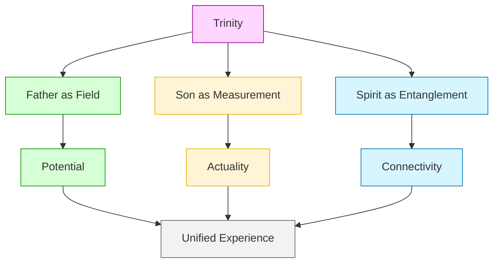
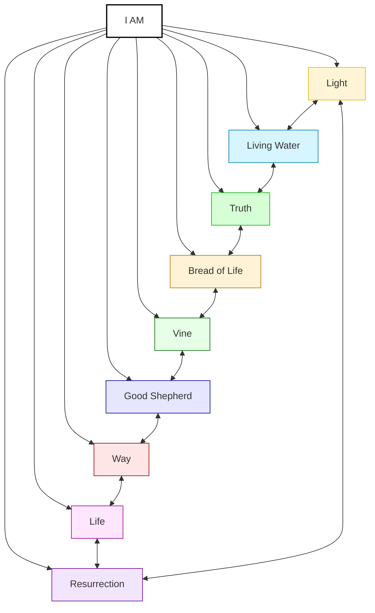
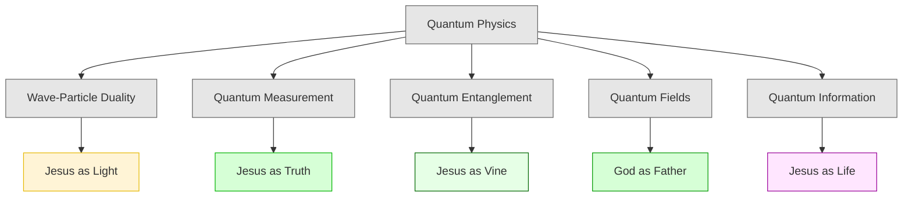
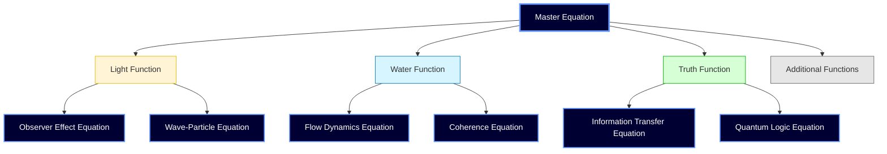

   
to Doubt]   
    C -->|Trust| E[Collapse to Trust]   
    D --> F[Reduced Spiritual Perception]   
    E --> G[Enhanced Spiritual Perception]   
    F -.-> H[New Faith State]   
    G -.-> H   
    H --> B   
       
    style A fill:#E6E6E6,stroke:#666666   
    style B fill:#E6F0FF,stroke:#0066CC   
    style C fill:#E6E6E6,stroke:#666666   
    style D fill:#FFCCCC,stroke:#CC0000   
    style E fill:#CCFFCC,stroke:#00CC00   
    style F fill:#FFCCCC,stroke:#CC0000   
    style G fill:#CCFFCC,stroke:#00CC00   
    style H fill:#E6E6E6,stroke:#666666   
```

### Tripartite Unified Model


   
   
## 📊 Cross-Series Connection Diagrams   
   
### I Am Statements Interconnection   
   

   
   
### Physics Concept Integration   
   

   
   
### Transformational Process Flow   
   

   
   
## 🧠 Premium Content Visualization   
   
### Quantum Faith Explorations Map   

```mermaid
graph TD
    A[Quantum Faith Explorations] --> B[Light Series]
    A --> C[Water Series]
    A --> D[Truth Series]
    A --> E[Additional Series]
    B --> F[Observer Effect]
    B --> G[Wave Function Collapse]
    B --> H[Quantum Measurement]
    C --> I[Quantum Coherence]
    C --> J[Flow Physics]
    C --> K[Betrothal Patterns]
    D --> L[Information Theory]
    D --> M[Quantum Logic]
    D --> N[Truth Mathematics]
    
    style A fill:#000033,stroke:#6699FF,stroke-width:3px,color:#FFFFFF
    style B fill:#FFF4D6,stroke:#E6B800
    style C fill:#D6F5FF,stroke:#0077B3
    style D fill:#D6FFD6,stroke:#00B300
    style E fill:#E6E6E6,stroke:#666666
    style F fill:#000033,stroke:#6699FF,stroke-width:2px,color:#FFFFFF
    style G fill:#000033,stroke:#6699FF,stroke-width:2px,color:#FFFFFF
    style H fill:#000033,stroke:#6699FF,stroke-width:2px,color:#FFFFFF
    style I fill:#000033,stroke:#6699FF,stroke-width:2px,color:#FFFFFF
    style J fill:#000033,stroke:#6699FF,stroke-width:2px,color:#FFFFFF
    style K fill:#000033,stroke:#6699FF,stroke-width:2px,color:#FFFFFF
    style L fill:#000033,stroke:#6699FF,stroke-width:2px,color:#FFFFFF
    style M fill:#000033,stroke:#6699FF,stroke-width:2px,color:#FFFFFF
    style N fill:#000033,stroke:#6699FF,stroke-width:2px,color:#FFFFFF
```
   

   
   
### Mathematical Connection Model   
   

   
   
## 📋 Using These Diagrams   
   
### Implementation Steps   
   
1. **Copy the Mermaid Code**: Select the code block for your desired diagram   
2. **Paste into Your Document**: Insert where the visualization is needed   
3. **Customize if Needed**: Modify labels, connections, or styles   
4. **Preview**: Ensure the diagram renders correctly   
   
### Customization Options   
   
   
- **Change Node Text**: Edit the text inside brackets `[Text Here]`   
- **Modify Connections**: Change the arrows and labels between nodes   
- **Update Styles**: Adjust fill colors, stroke colors, and other visual properties   
- **Add New Nodes**: Expand diagrams with additional concepts   
- **Remove Elements**: Simplify diagrams by removing less relevant nodes   
   
### Best Practices   
   
1. **Keep it Simple**: Limit diagrams to 7-12 nodes for clarity   
2. **Use Consistent Colors**: Match your metaphor's color theme   
3. **Balance Text Length**: Keep node labels concise (1-4 words ideal)   
4. **Consider Layout**: TD (top-down) works best for hierarchical concepts, LR (left-right) for processes   
5. **Add Comments**: Include explanatory text below complex diagrams   
   
These diagrams provide powerful visual tools for enhancing understanding of complex quantum-spiritual concepts throughout the Jesus Series papers.