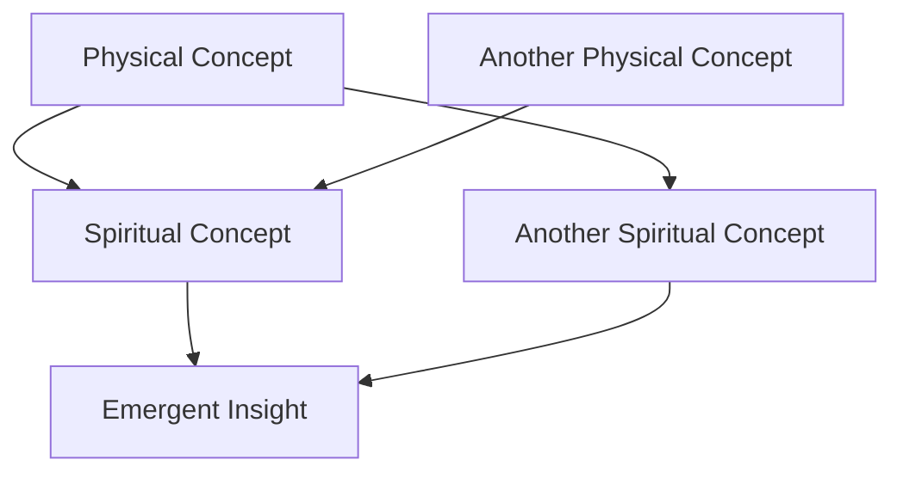
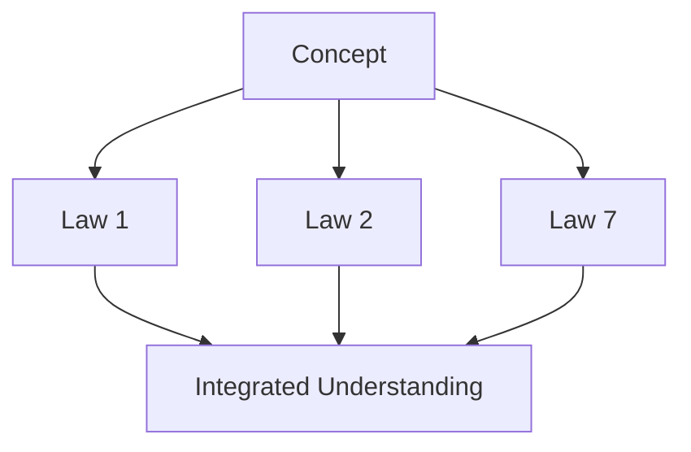

   
# Academy Folder Structure   
   
## Core Files   
   
### 1. 📁 Academy/Meta   
   
- `Research Framework.md` - Your overall methodology for connecting physics and spirituality   
- `Hypothesis Registry.md` - Central list of all hypotheses being explored   
- `Connection Patterns.md` - Recurring patterns you've noticed between physical and spiritual concepts   
   
### 2. 📁 Academy/Hypothesis Labs   
   
- `H1 - Quantum Spirituality.md` - Exploring quantum physics principles in spiritual contexts   
- `H2 - Information Theology.md` - Information theory's application to divine communication   
- `H3 - Cosmological Structure & Divine Order.md` - Universe's structure reflects spiritual principles   
- `H4 - Nuclear Forces as Spiritual Binding.md` - Strong/weak nuclear forces as metaphors for spiritual connection   
- `H5 - Spiritual Relativity.md` - Relativistic frameworks applied to spiritual experiences   
   
### 3. 📁 Academy/Connection Maps   
   
- `Physics-Theology Map.md` - Visual mapping of connections between physics concepts and theological principles   
- `Mathematical-Spiritual Map.md` - Connections between mathematical principles and spiritual concepts   
- `Energy-Grace Map.md` - Mapping energy concepts to spiritual grace concepts   
- `Quantum-Consciousness Map.md` - Connections between quantum phenomena and consciousness/spirit   
   
### 4. 📁 Academy/Research   
   
- `Literature Review.md` - Analysis of existing work connecting physics and spirituality   
- `Experimental Framework.md` - How spiritual hypotheses might be tested/validated   
- `Research Questions.md` - Central questions driving your exploration   
- `Evidence Registry.md` - Catalog of supporting evidence for different connections   
   
### 5. 📁 Academy/Cross-Law Analysis   
   
- `Law Interaction Matrix.md` - How your 10 laws interact with and support each other   
- `Unifying Principles.md` - Core principles that appear across multiple laws   
- `Contradiction Resolution.md` - Addressing apparent contradictions between laws   
- `Meta-Law Hypothesis.md` - Exploring whether there's a single "meta-law" that generates all others   
   
## Connection-Generating Templates   
   
### Concept Bridge Template   
```markdown
# Concept Bridge: [Physics Concept] ↔ [Spiritual Concept]

## Core Connection
- **Physical Principle**: [Explanation of physical principle]
- **Spiritual Parallel**: [Explanation of spiritual parallel]
- **Mathematical Expression**: [Formula if applicable]

## Connection Strength
- **Direct Evidence**: [Supporting evidence for direct connection]
- **Inferential Evidence**: [Indirect support for the connection]
- **Predictive Power**: [What this connection might predict or explain]

## Bidirectional Insights
- **Physics → Spirituality**: [What physics reveals about spirituality]
- **Spirituality → Physics**: [What spiritual concepts might reveal about physics]

## Related Laws
- Primary: [[Law X]]
- Secondary: [[Law Y]], [[Law Z]]

## Open Questions
- [Question 1]
- [Question 2]

## Research Directions
- [Potential research avenue 1]
- [Potential research avenue 2]
```
   
   
### Cross-Disciplinary Analysis Template   
```markdown
# Cross-Disciplinary Analysis: [Topic]

## Disciplinary Perspectives
- **Physics**: [How physics understands this]
- **Theology**: [Theological perspective]
- **Philosophy**: [Philosophical angle]
- **Mathematics**: [Mathematical framework]

## Harmony Analysis
- **Areas of Agreement**: [Where disciplines align]
- **Apparent Contradictions**: [Where they seem to disagree]
- **Synthesis Opportunities**: [How to harmonize perspectives]

## Dimensional Analysis
- **Physical Dimension**: [Space-time analysis]
- **Informational Dimension**: [Information theory perspective]
- **Consciousness Dimension**: [How consciousness interacts]
- **Spiritual Dimension**: [Spiritual framework]

## Integration Model
- **Proposed Framework**: [Integrated understanding]
- **Mathematical Model**: [Formalization if possible]
- **Testable Elements**: [What could be validated]

## Connected Concepts
- [List of related concepts with links]
```
   
   
### Radical Hypothesis Template   
```markdown
# Radical Hypothesis: [Title]

## The Wild Idea
- [Concise statement of unconventional hypothesis]

## Conventional Understanding
- [What current science/theology says]

## The Paradigm Shift
- [How this hypothesis changes our understanding]

## Potential Implications
- **For Physics**: [Implications]
- **For Theology**: [Implications]
- **For Consciousness**: [Implications]
- **For Humanity**: [Implications]

## Supporting Patterns
- [Pattern 1 with links to supporting concepts]
- [Pattern 2 with links to supporting concepts]

## Thought Experiments
- [Experiment 1 to consider this hypothesis]
- [Experiment 2 to consider this hypothesis]

## Integration with Laws
- [How this connects to your existing laws]
```
   
   
## Tag System for Academy Files   
   
Use these tags for cross-referencing in your Academy files:   
   
   
- `#hypothesis` - For speculative connections   
- `#evidence` - For supporting evidence   
- `#contradiction` - For noting conflicts to resolve   
- `#pattern` - For recurring patterns   
- `#quantum` - For quantum physics related concepts   
- `#consciousness` - For consciousness related concepts   
- `#information-theory` - For information theory concepts   
- `#nuclear` - For nuclear physics concepts   
- `#relativity` - For relativity concepts   
- `#mathematics` - For mathematical models and frameworks   
- `#experiment` - For testable elements   
- `#metaphor` - For using concepts as metaphors   
- `#direct-parallel` - For concepts with strong parallels   
- `#creative-leap` - For particularly innovative connections   
- `#cross-law` - For concepts spanning multiple laws   
   
## Connection Tracking System   
   
Create a central file `Connection_Registry.md` with this format:   
   
```markdown
# Connection Registry

## Physics → Spirituality Connections
| Physics Concept | Spiritual Concept | Connection Strength | Primary Law | Notes |
|----------------|-------------------|---------------------|-------------|-------|
| [Concept 1] | [Concept 2] | Strong/Medium/Weak | [[Law X]] | [Brief note] |
| [Concept 3] | [Concept 4] | Strong/Medium/Weak | [[Law Y]] | [Brief note] |

## Spirituality → Physics Insights
| Spiritual Concept | Physics Insight | Validation Status | Primary Law | Notes |
|-------------------|----------------|-------------------|-------------|-------|
| [Concept 1] | [Insight 1] | Validated/Hypothetical | [[Law Z]] | [Brief note] |
```
   
   
## Visualization Framework   
   
Use these Mermaid diagrams to visualize connections:   
   
### Concept Network   
```
%%
%%  Use this in your files to map concept relationships
%%

   
```

### Law Integration Map
```
   
%%   
%%  Use this to show how a concept integrates across laws   
%%   

   
```   
`{_obsidian_pattern_tag_Law-2Folder}`   
##strong-nuclear-force   
##quark-binding   
##nuclear-binding-energy   
##gluons   
##quantum-entanglement   
##covalent-bonding   
##atomic-cohesion   
##nuclear-stability   
##binding-energy-formula   
##quantum-field-theory   
##unified-force-model   
##divine-unity   
##faith-cohesion   
##spiritual-binding   
##covenantal-strength   
##spiritual-communion   
##theological-unity   
##divine-love-exchange   
##unbreakable-covenant   
##redemptive-connection   
##spiritual-resonance   
##faith-community-bond   
##faith-physics   
##divine-bond   
##theological-chromodynamics   
##spiritual-cohesion   
##prayer-quantum-link   
##gluon-theology   
##quantum-faith-mechanics   
##covenant-physics   
##spiritual-nuclear-stability   
##nonlocal-spirituality   
##binding-force-of-love   
##logos   
##biblical-covenant   
##Pauline-theology   
##unbreakable-faith   
##body-of-Christ   
##Ephesians-unity   
##Romans-bond-of-love   
##spiritual-symphony   
##Gods-binding-force   
##John17-divine-unity   
##Master-Equation   
##Reality-Laws   
##Universal-Cohesion   
##Faith-Structural-Integrity   
##Truth-in-Physics   
##Christ-as-the-Binding-Agent   
##Trinity-Divine-Bond   
##Metaphysical-Gravity   
##Heavenly-Physics   
##Resonant-Truth