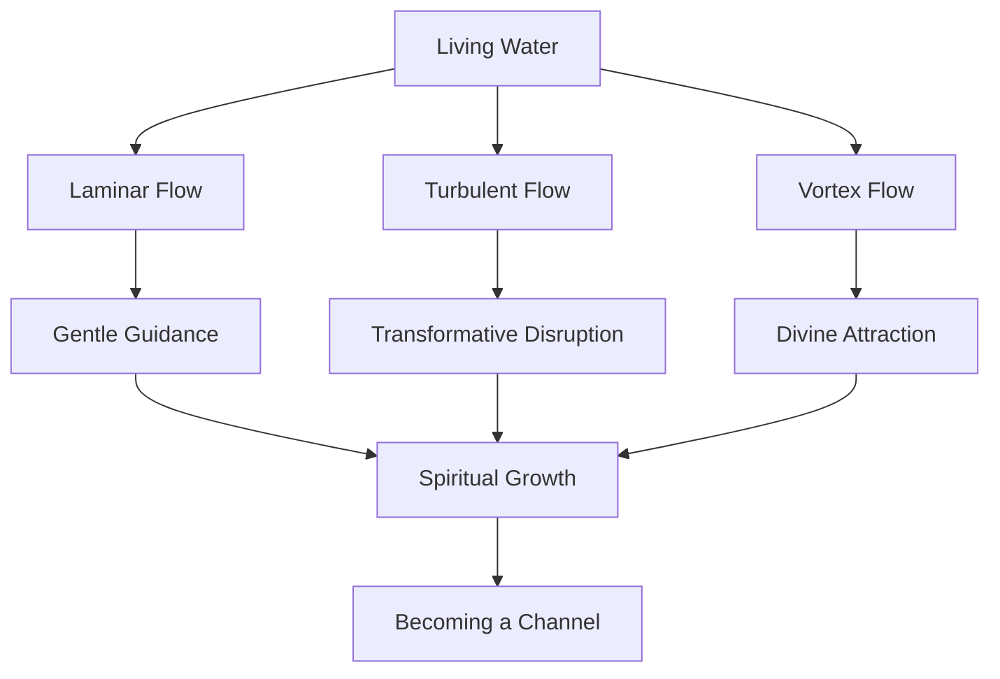

   
# Jesus as Living Water: Enhanced Structure Template   
   
This template demonstrates how we can reorganize the Jesus as Living Water content following the engaging, segmented approach from the Law 1 example.   
   
## 🌊 **Core Structure for JS-O2-Water-Main.md**   
   
```
# 💧 Jesus as Living Water: The Flow Dynamics of Spirit

> 💦 "Whoever drinks the water I give them will never thirst. Indeed, the water I give them will become in them a spring of water welling up to eternal life." — John 4:14

![[water-flow-dynamics.jpg]]

## 🌊 Introduction: The Divine Flow

**HOOK:** 🤔 What if Jesus's claim to be "living water" wasn't merely poetic language, but a profound insight into how divine influence moves through creation—following principles that fluid dynamics and quantum coherence are only now helping us understand?

**FAST FACTS:** 📋
- 💧 Water is essential for all life, constituting 60% of the human body
- 🌊 Fluids follow precise mathematical patterns of flow and turbulence
- ⚗️ Water exhibits unusual quantum coherence properties at biological scales
- 🔄 In scripture, water represents purification, renewal, and the Holy Spirit

**NARRATIVE:** 📖
[Engaging narrative about Jesus at the Jordan and with the Samaritan woman]

## 🏜️ The World Context: Spiritual Thirst

**HOOK:** 🏜️ In a world of parched souls and spiritual drought, where do we find genuine refreshment?

**FAST FACTS:** 📋
[Key facts about water scarcity, historical context, etc.]

**NARRATIVE:** 📖
[Story about the Samaritan woman's daily journey for water]

> [!info]- 🌐 **Fluid Dynamics & Spiritual Reality**  
> _Click to expand_
> 
> > Fluid dynamics describes three primary flow patterns that mirror spiritual experience: Laminar flow (smooth, predictable) resembles times of gentle spiritual guidance; turbulent flow (chaotic, unpredictable) resembles disruptive spiritual transformation; vortex flow (spiral, concentrating) resembles the focusing power of divine love.

## 🌟 Core Concept Definition: Quantum Flow Dynamics of Spirit

**HOOK:** 🌀 How does the Spirit move? Both fluid dynamics and quantum biology offer surprising insights into this ancient question.

**FAST FACTS:** 📋
[Key facts about flow dynamics, quantum coherence, etc.]

**FORMULA:** 📊 
The Navier-Stokes equations govern fluid flow: ρ(∂v/∂t + v∇v) = -∇p + μ∇²v + ρg
In spiritual terms, divine influence (G) flows according to receptivity (R), creating a spiritual pressure gradient that drives transformation.

**NARRATIVE:** 📖
[Exploration of flow patterns and spiritual parallels]

## 🔍 Spiritual Mapping: Baptism, Birth, and Flow

[Continue with this structure for each section...]

## 📊 **CONCEPT MAP: VISUAL LAYOUT** 📊


   
   
## 📐 **TRANSFORMATIVE FRAMEWORK** 📐   
   
|Physical Reality|Spiritual Dynamic|Emoji|   
|---|---|---|   
|Laminar Flow|Gentle Guidance|🧘|   
|Turbulent Flow|Disruptive Grace|🌪️|   
|Vortex Flow|Divine Attraction|🌀|   
|Pressure Gradient|Spiritual Receptivity|📉|   
|Channel Capacity|Heart Openness|💓|   
|Flow Distribution|Ministry Outreach|🤲|   
|Quantum Coherence|Spiritual Unity|🔄|   
|Structured Water|Transformed Life|✨|   
|Flow Resistance|Spiritual Blockage|🚧|   
|Spring vs. Well|Grace vs. Works|⛲|   
```   
   
## 🧠 **Strategy for Using This Structure**   
   
1. **For Main Papers**:    
   
   - Convert the main papers to this vibrant, segmented format   
   - Include expandable information boxes for deeper concepts   
   - Add concept maps and transformative frameworks   
   - Incorporate narrative elements (like the Elijah story in your example)   
   
2. **For Study Materials**:   
   
   - Make FAQs more visual with expandable sections   
   - Structure study guides with clear visual sections   
   - Create more visually engaging mind maps   
   
3. **For Deep Research**:   
   
   - Keep the academic depth but add visual headers   
   - Include more diagrams and conceptual visualizations   
   - Add expandable technical sections for the most complex material   
   
4. **For the Overall Series**:   
   
   - Create a consistent visual language across all papers   
   - Use the same emoji system for parallel concepts   
   - Ensure narrative continuity between papers   
   
This approach maintains the academic rigor while making the content more engaging, visually appealing, and accessible to different learning styles.