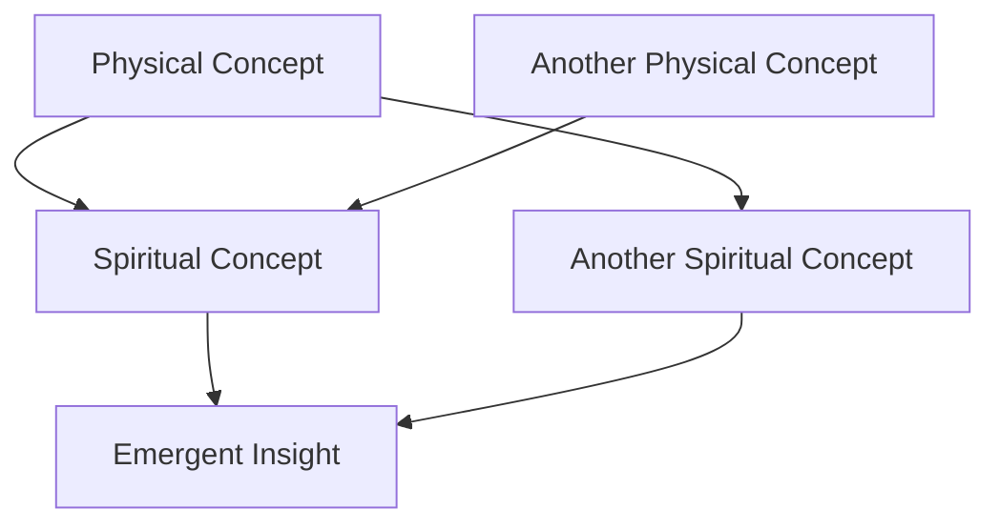
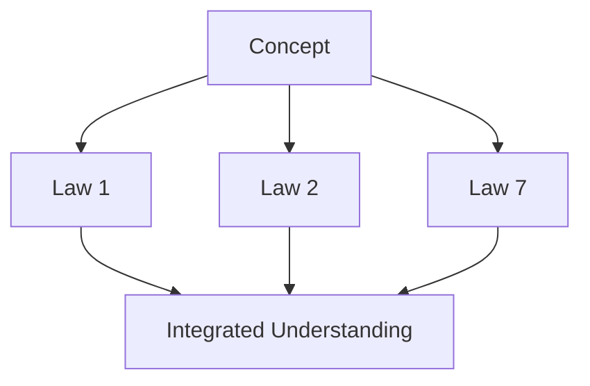

   
# 📋 MASTER TEMPLATE: QUANTUM-SPIRITUAL LAWS FRAMEWORK   
   
Law 1 LInks    
Law 1    
|---------|-------|--------------|   
| 🌍 **The World** | Historical & scientific context | How does this appear in reality? |   
| 🌟 **Core Concept** | Fundamental definition | What is this Law? |   
| 🕊️ **Spiritual Mapping** | Biblical & theological connections | How does this reflect God's nature? |   
| 🔬 **Physics Foundations** | Scientific principles | What physical laws mirror this? |   
| ✝️ **Faith Integration** | Practical application | How does this transform daily life? |   
| 🧪 **Experiments & Visuals** | Metaphors & demonstrations | How can we visualize this? |   
| 📌 **Fast Facts** What   
   
   
   
   
---   
aliases: ["Gravity, Sin, and the Struggle to Rise"]   
tags:     
**🌿 Spiritual (Broad):** `{_obsidian_pattern_tag_spiritual-struggle}`     
**🔬 Physics (Broad):** `{_obsidian_pattern_tag_universal-gravitation}`     
**⚖️ Spiritual (Technical):** `{_obsidian_pattern_tag_sin-gravity}`     
**⚛️ Physics (Technical):** `{_obsidian_pattern_tag_gravitational-force}`   
   
###### 🔍 **Searchable Keywords**   
   
`{_obsidian_pattern_tag_faith-physics}` `{_obsidian_pattern_tag_spiritual-struggle}` `{_obsidian_pattern_tag_divine-lift}` `{_obsidian_pattern_tag_gravitational-pull}`   
   
created: 2025-03-01     
related: ???????????   
   
---   
   
# 🌍 **Gravity, Sin, and the Struggle to Rise**   
   
## 🌍 **Metadata & Core Concepts**     
   
> [!info]- 🌍 **Metadata & Core Concepts**     
> _Click to expand_     
>     
> > **Just as gravity pulls objects downward, sin pulls humanity away from divine purpose.**     
> > This law reveals how **Newton's Law of Universal Gravitation mirrors Sin's Binding Force.**   
   
> [!tip]- 📚 **Where This Fits In**     
> _Click to expand_     
>     
> > **Primary Domain:** Science, Theology     
> > **Secondary Domains:** Physics, Spirituality, Cosmology, Ethics   
   
> [!question]- 🔬 **Core Concepts at a Glance**     
> _Click to expand_     
>     
> > **Theoretical Framework:** Newton's Laws of Motion & Gravitation     
> > **Epistemological Lens:** Comparative, Phenomenological, Unified Theory     
   
> [!abstract]- 🏛 **Key Identifiers & Themes**     
> _Click to expand_     
>     
> > **Compression Code:** GRAVITY-SIN-1     
> > **Ontological Prefix:** PHY-THEO-1   
   
> [!check]- 🎯 **What This Law Teaches**     
> _Click to expand_     
>     
> > **Conceptual Nucleus:** Gravity, Sin, Redemption     
> > **Metaphysical Resonance:** The struggle of free will against the downward pull of corruption     
   
> [!info]- 🔗 **How It Connects to Everything Else**     
> _Click to expand_     
>     
> > **Interdisciplinary Connections:** [Law 2](ZZZ/Law%202.md), [Master Equation](1%20Faith%20with%20Physics/10%20Laws/10%20Laws/Law%2010%20Folder%20%20All%20Together%20+%20The%20Unified%20Quantum%20Framework/Master%20Equation.md), [[./Glossary   
BlockUniverseVisualization   
CanyonEdgeTheD...]]     
> > **Dialectical Tensions:** Free Will vs. Predestination, Sin vs. Salvation     
   
> [!warning]- 🌱 **How This Changes Our Perspective**     
> _Click to expand_     
>     
> > **Paradigm Shift Indicator:** High     
> > **Integrative Capacity:** Connects physics, theology, and morality into a cohesive framework     
   
> [!question]- 🤔 **How Do We Know This Is True?**     
> _Click to expand_     
>     
> > **Empirical Grounding:** Newton’s Law of Universal Gravitation     
> > **Transcendent Insight:** Humanity's constant struggle against the pull of sin and the need for divine intervention     
   
   
   
This comprehensive template provides both structural guidance and content direction for each Law in your framework. Use this as your master reference when creating and organizing content in Obsidian.   
   
   
---   
   
## 🗂️ FOLDER STRUCTURE FOR EACH LAW   
   
```
📁 Law X - [Core Title]
  📄 Law X: [Title] - Overview.md         (Main landing page for this Law)
  📄 Law X: [Title] - The World.md        (Context section)
  📄 Law X: [Title] - Core Concept.md     (Definition section)
  📄 Law X: [Title] - Spiritual Mapping.md (Theological connections)
  📄 Law X: [Title] - Physics Foundations.md (Scientific principles)
  📄 Law X: [Title] - Faith Integration.md (Practical applications)
  📄 Law X: [Title] - Experiments.md      (Visual metaphors & examples)
  📄 Law X: [Title] - Fast Facts.md       (Key takeaways)
  📁 Deep Dives                           (Optional folder for upsell content)
    📄 Law X: [Title] - Mathematical Analysis.md
    📄 Law X: [Title] - Theological Framework.md
    📄 Law X: [Title] - Quantum Implications.md
```
   
   
   
---   
   
## 📑 STANDARD FILE STRUCTURE FOR MAIN PAGE   
   
```markdown
# 📖 Law X: [Core Title]

> _"[Powerful quote that encapsulates this Law's essence]"_

## 📑 Navigation
🔗 [[Law 1: The Pull of Sin]]  
🔗 [[Law 2: The Grace Counterforce]]  
...  
🔗 [[Law 10: Final Integration]]  
📘 [[Glossary of Spiritual Physics]]  
📚 [[The 10 Laws Overview]]  

## 🌟 Core Concept – Quick Overview

[1-2 paragraph summary of what this Law represents]

- Key points highlighted with bullet points
- Essential principles emphasized
- Core metaphor introduced

## 📍 What You'll Find in This Law:

| Section | Focus | Key Question |
|---------|-------|--------------|
| 🌍 **The World** | Historical & scientific context | How does this appear in reality? |
| 🌟 **Core Concept** | Fundamental definition | What is this Law? |
| 🕊️ **Spiritual Mapping** | Biblical & theological connections | How does this reflect God's nature? |
| 🔬 **Physics Foundations** | Scientific principles | What physical laws mirror this? |
| ✝️ **Faith Integration** | Practical application | How does this transform daily life? |
| 🧪 **Experiments & Visuals** | Metaphors & demonstrations | How can we visualize this? |
| 📌 **Fast Facts** | Key takeaways | What are the essential insights? |

## 🔄 Connections to Other Laws

- **[[Law X-1]]**: How the previous Law flows into this one
- **[[Law X+1]]**: How this Law prepares for the next one
- **[[Law Y]]**: Unexpected connections to non-sequential Laws

## 🧩 Deep Dive Resources

> These advanced resources explore the mathematical and theological dimensions more deeply.

- 📊 [[Law X: Mathematical Analysis]] - Equations, proofs, and technical framework
- ✝️ [[Law X: Theological Framework]] - Advanced spiritual implications 
- ⚛️ [[Law X: Quantum Implications]] - Higher-level physics connections

## 🔖 Tags

#LawX #[key-concept] #[scientific-domain] #[theological-theme]
```
   
   
   
---   
   
## 📝 CONTENT GUIDANCE FOR EACH SECTION   
   
### 🌍 The World – Context Section   
   
**Purpose:** Establish how this principle appears in reality, history, science, or everyday experience.   
   
**Content Direction:**   
   
   
- **Opening Hook:** Start with an observation, question, or provocative statement   
- **Historical Context:** Brief overview of how this concept has been understood through history   
- **Scientific Relevance:** How modern science observes or measures this principle   
- **Cultural Impact:** How this principle appears in culture, often unrecognized   
- **Personal Connection:** "You've experienced this when..." moment to create relevance   
   
**Structural Notes:**   
   
   
- Use storytelling elements here to engage emotionally before the technical content   
- Include 1-2 compelling examples or case studies   
- End with a transition that bridges to the Core Concept section   
   
**Example Format:**   
   
```markdown
# 🌍 The World – [Law Title]

[Opening hook that poses a question or makes a striking observation]

## Historical Thread
[How this concept has evolved through history]

## Scientific Echoes
[How modern science has discovered or measured this principle]

## Hidden in Plain Sight
[How we experience this in everyday life, often without recognizing it]

> "Powerful quote that captures the essence of this principle in the world"

[Transition sentence that bridges to Core Concept]
```
   
   
### 🌟 Core Concept – Definition Section   
   
**Purpose:** Clearly define the Law in simple yet profound terms.   
   
**Content Direction:**   
   
   
- **Essential Definition:** Crystal clear statement of what this Law is   
- **Three-Part Breakdown:** Divide the concept into 3 key components or perspectives   
- **Symbolic Representation:** How this Law can be visualized or symbolized   
- **First Principles:** The foundational truths this Law rests upon   
- **Metaphorical Framework:** The primary metaphor that makes this concept accessible   
   
**Structural Notes:**   
   
   
- Keep language precise but accessible   
- Use bold text for key definitions   
- Include a simple conceptual diagram if possible   
- This section should be quotable and memorable   
   
**Example Format:**   
   
```markdown
# 🌟 Core Concept – [Law Title]

[One-sentence definition that captures the essence]

## Three Essential Dimensions
1. **[First Component]**: [Explanation with accessible language]
2. **[Second Component]**: [Explanation with accessible language]
3. **[Third Component]**: [Explanation with accessible language]

## Symbolic Representation
[How this Law can be visualized or symbolized]


## Core Metaphor
[The primary metaphor that makes this concept accessible]

[Closing statement that prepares for Spiritual Mapping]
```
   
   
### 🕊️ Spiritual Mapping – Theological Connections   
   
**Purpose:** Connect this Law to biblical insight, spiritual metaphors, and theological truth.   
   
**Content Direction:**   
   
   
- **Scriptural Foundation:** Key biblical passages that illuminate this principle   
- **Theological Framework:** How this connects to broader theological concepts   
- **Divine Attributes:** What this reveals about God's nature   
- **Spiritual Parallels:** How spiritual realities mirror this principle   
- **Redemptive Narrative:** How this fits into the larger story of salvation   
   
**Structural Notes:**   
   
   
- Quote scripture directly but keep interpretation accessible   
- Use a table to map physical/scientific concepts to spiritual parallels   
- Include insights from respected theological voices   
- This section bridges the scientific and the spiritual   
   
**Example Format:**   
   
```markdown
# 🕊️ Spiritual Mapping – [Law Title]

[Opening statement about how this Law reveals spiritual truth]

## Scriptural Echoes
> "[Biblical quote]" - [Reference]

[Explanation of how scripture illuminates this principle]

## Mapping Physical to Spiritual
| Physical Reality | Spiritual Truth |
|------------------|-----------------|
| [Scientific concept] | [Theological parallel] |
| [Scientific concept] | [Theological parallel] |
| [Scientific concept] | [Theological parallel] |

## Divine Reflection
[How this Law reflects God's nature or character]

## Redemptive Narrative
[How this concept fits into the larger story of salvation]

[Closing thought that bridges to Physics Foundations]
```
   
   
### 🔬 Physics Foundations – Scientific Principles   
   
**Purpose:** Explain the actual physics or science that underlies this spiritual principle.   
   
**Content Direction:**   
   
   
- **Scientific Definition:** Clear explanation of the relevant scientific law or principle   
- **Key Equations:** Simple presentation of mathematical relationships (if applicable)   
- **Real-World Examples:** How this principle manifests in observable reality   
- **Historical Discovery:** Brief narrative of how this was discovered or formulated   
- **Current Understanding:** Where science stands today regarding this principle   
   
**Structural Notes:**   
   
   
- Keep scientific explanations accessible but accurate   
- Use analogies to make complex concepts relatable   
- Include simple diagrams or visualizations   
- Optional deeper mathematical section for those interested   
   
**Example Format:**   
   
````markdown
# 🔬 Physics Foundations – [Law Title]

[Opening statement about the scientific principle]

## The Science Simplified
[Accessible explanation of the core scientific concept]

## Mathematical Expression
[Simple presentation of the key equation or relationship]
```math
[Equation]
````
   
   
## Real-World Manifestation   
   
[How this principle appears in observable reality]   
   
## Scientific Journey   
   
[Brief narrative of discovery or formulation]   
   
[Closing thought that bridges to Faith Integration]   
   
> **For those interested in deeper mathematics:** [Optional section with more technical details - potential "upsell" content]   
   
````

### ✝️ Faith Integration – Practical Application

**Purpose:** Show how this Law applies to daily spiritual life and decision-making.

**Content Direction:**
- **Personal Transformation:** How understanding this principle changes perspective
- **Practical Steps:** Specific actions or practices that apply this principle
- **Warning Signs:** How to recognize when you're misaligned with this Law
- **Growth Metrics:** How to measure progress in this area
- **Community Dimension:** How this principle works in relationships and community

**Structural Notes:**
- Use second-person "you" language to create personal relevance
- Include specific, actionable examples
- Create a balance between individual and community applications
- This section should be highly practical and immediately applicable

**Example Format:**
```markdown
# ✝️ Faith Integration – [Law Title]

[Opening statement about practical significance]

## Personal Transformation
[How understanding this principle changes perspective]

## Recognizing Alignment
- **Signs of Alignment**: [Specific indicators of alignment with this Law]
- **Warning Signs**: [Specific indicators of misalignment with this Law]

## Steps Toward Alignment
1. [Specific practice or action]
2. [Specific practice or action]
3. [Specific practice or action]

## Community Dimension
[How this principle works in relationships and community]

[Closing thought that bridges to Experiments & Visuals]
````
   
   
### 🧪 Experiments & Visuals – Metaphors & Demonstrations   
   
**Purpose:** Provide visual metaphors, thought experiments, and demonstrations that make the concept tangible.   
   
**Content Direction:**   
   
   
- **Thought Experiment:** Hypothetical scenario that illuminates the principle   
- **Visual Metaphor:** Clear visual representation of the abstract concept   
- **Practical Demonstration:** Simple experiment or activity that demonstrates the principle   
- **Conceptual Diagram:** Structured visual of how components relate   
- **Narrative Illustration:** Story or parable that embodies the principle   
   
**Structural Notes:**   
   
   
- Use a mix of textual and visual elements   
- Keep experiments and demonstrations simple and accessible   
- Create elements that are shareable and memorable   
- This section should engage imagination and creativity   
   
**Example Format:**   
   
```markdown
# 🧪 Experiments & Visuals – [Law Title]

[Opening statement about visualizing or experiencing this principle]

## Thought Experiment
[Hypothetical scenario that illuminates the principle]

## Visual Metaphor

[Explanation of how this visual represents the concept]

## Try This at Home
[Simple experiment or activity that demonstrates the principle]

## Concept Mapping
[Structured visual of how components relate]

[Closing thought that bridges to Fast Facts]
```
   
   
### 📌 Fast Facts – Key Takeaways   
   
**Purpose:** Provide punchy, memorable, shareable insights that distill the essence of this Law.   
   
**Content Direction:**   
   
   
- **Core Truth Statement:** One-sentence summary of the entire Law   
- **Parallel Structure:** Physical reality → Spiritual parallel   
- **Numerical Pattern:** "3 Ways to...", "4 Signs of...", etc.   
- **Cause-Effect Relationships:** How this principle creates predictable outcomes   
- **Application Prompts:** Quick questions for personal reflection   
   
**Structural Notes:**   
   
   
- Use consistent visual formatting with checkmarks (✔️)   
- Keep each point concise and memorable   
- Create content that could stand alone as a social media post   
- This section should be highly quotable and shareable   
   
**Example Format:**   
   
```markdown
# 📌 Fast Facts – [Law Title]

✔️ [Physical principle] → [Spiritual parallel]
✔️ [Physical principle] → [Spiritual parallel]
✔️ [Physical principle] → [Spiritual parallel]
✔️ [Physical principle] → [Spiritual parallel]
✔️ [Physical principle] → [Spiritual parallel]

## Key Questions for Reflection
- [Question that prompts personal application]
- [Question that prompts personal application]
- [Question that prompts personal application]
```
   
   
   
---   
   
## 🧩 Quantum Deep dive UPSELL CONTENT)   
   
### 📊 Mathematical Analysis   
   
**Purpose:** Provide deeper mathematical exploration for those interested in the technical framework.   
   
**Content Direction:**   
   
   
- **Complete Equation Breakdown:** Detailed analysis of all components in the mathematical model   
- **Variable Relationships:** How different elements interact mathematically   
- **Edge Cases:** Mathematical behavior under extreme conditions   
- **Integration with Master Equation:** How this Law connects to the complete framework   
- **Predictive Models:** How mathematics can forecast outcomes in this domain   
   
**Structural Notes:**   
   
   
- This is advanced content for mathematically inclined readers   
- Include proper mathematical notation and formalism   
- Connect abstract mathematics to concrete applications   
- This content can serve as an "upsell" for readers wanting greater depth   
   
**Example Format:**   
   
````markdown
# 📊 Mathematical Analysis – [Law Title]

[Opening statement about mathematical significance]

## Complete Equation
```math
[Full mathematical expression]
````
   
   
## Component Breakdown   
   
   
- **[Variable 1]**: [Definition and significance]   
- **[Variable 2]**: [Definition and significance]   
- **[Variable 3]**: [Definition and significance]   
   
## Key Relationships   
   
[How variables interact and influence outcomes]   
   
## Integration with Master Equation   
   
[How this component fits into the complete framework]   
   
## Mathematical Predictions   
   
[Testable outcomes based on mathematical relationships]   
   
````

### ✝️ Theological Framework

**Purpose:** Explore deeper theological implications for those interested in spiritual foundations.

**Content Direction:**
- **Historical Theology:** How this concept has been understood throughout church history
- **Denominational Perspectives:** Different theological traditions' approaches to this concept
- **Systematic Connections:** How this fits with broader theological systems
- **Apologetic Value:** How this concept addresses common objections or questions
- **Spiritual Formation:** Deeper practices for integration into spiritual life

**Structural Notes:**
- This is advanced content for theologically inclined readers
- Balance academic rigor with practical spiritual value
- Include diverse theological perspectives where appropriate
- This content can serve as an "upsell" for readers wanting greater spiritual depth

**Example Format:**
```markdown
# ✝️ Theological Framework – [Law Title]

[Opening statement about theological significance]

## Historical Understanding
[How this concept has been understood throughout church history]

## Theological Perspectives
[Different approaches to this concept across traditions]

## Systematic Connections
[How this fits with broader theological systems]

## Apologetic Implications
[How this addresses common objections or questions]

## Formation Practices
[Deeper practices for integration into spiritual life]
````
   
   
### ⚛️ Quantum Implications   
   
**Purpose:** Explore higher-level physics connections for those interested in advanced scientific frameworks.   
   
**Content Direction:**   
   
   
- **Quantum Mechanics Connections:** How this principle relates to quantum phenomena   
- **Information Theory Aspects:** Relationships to entropy, information preservation, etc.   
- **Higher-Dimensional Models:** How extra dimensions might explain unusual properties   
- **Experimental Evidence:** Current scientific research related to this principle   
- **Theoretical Frontiers:** Cutting-edge physics theories that relate to this concept   
   
**Structural Notes:**   
   
   
- This is advanced content for scientifically inclined readers   
- Balance theoretical exploration with empirical grounding   
- Include references to relevant scientific literature   
- This content can serve as an "upsell" for readers wanting greater scientific depth   
   
**Example Format:**   
   
```markdown
# ⚛️ Quantum Implications – [Law Title]

[Opening statement about significance in advanced physics]

## Quantum Framework
[How this principle relates to quantum phenomena]

## Information Theory Perspective
[Relationships to entropy, information processing, etc.]

## Higher-Dimensional Properties
[How extra dimensions might explain unusual aspects]

## Current Research
[Recent scientific investigations related to this principle]

## Theoretical Horizons
[Emerging theories that may further illuminate this concept]
```
   
   
   
---   
   
## 🔄 LAW-SPECIFIC CONTENT MAPPING   
   
Here's how each of the 10 Laws maps to specific content themes and focuses:   
   
### Law 1: Spiritual State (χ)   
   
   
- **Core Metaphor:** Overall field/atmosphere   
- **Scientific Domain:** Field theory   
- **Key Scripture:** 2 Peter 3:18   
- **Mathematical Focus:** The Master Equation as a whole   
- **Practical Focus:** Measuring and monitoring spiritual condition   
   
### Law 2: Grace Function   
   
   
- **Core Metaphor:** Anti-gravity/lifting force   
- **Scientific Domain:** Force counteraction   
- **Key Scripture:** Romans 5:20   
- **Mathematical Focus:** $G(R_p) = G_0 \cdot e^{(R_p/S)}$   
- **Practical Focus:** Receiving and activating grace   
   
### Law 3: Sin & Entropy   
   
   
- **Core Metaphor:** Disorder/breakdown   
- **Scientific Domain:** Thermodynamics   
- **Key Scripture:** Romans 6:23   
- **Mathematical Focus:** $E(t) = E_0e^{kt}$ and $S(t) = S_0e^{-\lambda R_p t}$   
- **Practical Focus:** Recognizing and countering spiritual entropy   
   
### Law 4: Quantum Choice Field   
   
   
- **Core Metaphor:** Decision as reality-shaping   
- **Scientific Domain:** Quantum mechanics   
- **Key Scripture:** Joshua 24:15   
- **Mathematical Focus:** $e^{-(Q \cdot C)}$   
- **Practical Focus:** Making choices that align with divine order   
   
### Law 5: Faith Response Function   
   
   
- **Core Metaphor:** Amplification/catalyst   
- **Scientific Domain:** Amplification systems   
- **Key Scripture:** Matthew 17:20   
- **Mathematical Focus:** $R(F) = 1 + \sum_{i=1}^{n} F_i e^{-d_i}$   
- **Practical Focus:** Building faith that creates impact   
   
### Law 6: Spiritual Utility Function   
   
   
- **Core Metaphor:** Effectiveness/fruitfulness   
- **Scientific Domain:** System optimization   
- **Key Scripture:** 1 Corinthians 3:6   
- **Mathematical Focus:** $U(S_s) = U_0 + \Delta U(S_s)$   
- **Practical Focus:** Maximizing spiritual effectiveness   
   
### Law 7: Spiritual Decay   
   
   
- **Core Metaphor:** Breakdown over time   
- **Scientific Domain:** Radioactive decay   
- **Key Scripture:** Ephesians 5:15-16   
- **Mathematical Focus:** $-\delta\chi$   
- **Practical Focus:** Maintaining spiritual disciplines   
   
### Law 8: Karma Function   
   
   
- **Core Metaphor:** Ripple effects/echoes   
- **Scientific Domain:** Cause-effect relationships   
- **Key Scripture:** Galatians 6:7   
- **Mathematical Focus:** $K(t) = \int_{0}^{t} S(\tau) e^{-\eta(t-\tau)} d\tau$   
- **Practical Focus:** Understanding consequences of actions   
   
### Law 9: Divine Mystery Factor   
   
   
- **Core Metaphor:** Beyond comprehension   
- **Scientific Domain:** Uncertainty principles   
- **Key Scripture:** 1 Corinthians 15:54   
- **Mathematical Focus:** $\Omega \cdot T(F,S,t)$   
- **Practical Focus:** Embracing mystery in faith   
   
### Law 10: Final Integration   
   
   
- **Core Metaphor:** Complete system harmony   
- **Scientific Domain:** Unified field theory   
- **Key Scripture:** Revelation 21:5   
- **Mathematical Focus:** The complete integrated framework   
- **Practical Focus:** Living in holistic spiritual alignment   
   
   
---   
Let's create that additional section to include under the Deep Dive resources:   
   
markdown   
   
Copy   
   
`### 🧠 Theoretical Foundations – Source Theories Integration **Purpose:** Document the scientific and theological theories that have been integrated into this Law. **Content Direction:** - **Source Theories**: Identify specific scientific/theological theories incorporated - **Integration Points**: How each theory connects to this specific Law - **Key Adaptations**: How the original theory was modified or expanded - **Original Sources**: References to foundational papers or thinkers - **Further Reading**: Links to more detailed explorations **Structural Notes:** - Organize by scientific domain (quantum mechanics, information theory, etc.) - Include brief explanations of why each theory was relevant - Link to deeper resources when available - This section documents your intellectual framework's foundations **Example Format:** ```markdown # 🧠 Theoretical Foundations – [Law Title] [Opening statement about theoretical grounding] ## Integrated Scientific Theories | Source Theory | Original Domain | Integration Point | Adaptation | |---------------|----------------|-------------------|------------| | [Theory Name] | [Field] | [How it connects to this Law] | [How you've extended it] | | [Theory Name] | [Field] | [How it connects to this Law] | [How you've extended it] | | [Theory Name] | [Field] | [How it connects to this Law] | [How you've extended it] | ## Theological Foundations | Theological Concept | Tradition | Integration Point | Adaptation | |---------------------|-----------|-------------------|------------| | [Concept] | [Tradition] | [How it connects to this Law] | [How you've extended it] | | [Concept] | [Tradition] | [How it connects to this Law] | [How you've extended it] | | [Concept] | [Tradition] | [How it connects to this Law] | [How you've extended it] | ## Key Papers and References - 📄 [Paper Title](Paper%20Title.md) - Brief explanation of relevance - 📕 [Book or Source](Book%20or%20Source.md) - Brief explanation of relevance - 🔬 [Original Research](Original%20Research.md) - Brief explanation of relevance [Closing thought about the theoretical foundation]`   
   
This section should be placed within the Deep Dives folder for each Law, alongside the Mathematical Analysis, Theological Framework, and Quantum Implications files. You could include it in your folder structure like this:   
   
Copy   
   
`📁 Law X - [Core Title]   📄 [Main files as previously outlined]  📁 Deep Dives    📄 Law X: [Title] - Mathematical Analysis.md    📄 Law X: [Title] - Theological Framework.md    📄 Law X: [Title] - Quantum Implications.md    📄 Law X: [Title] - Theoretical Foundations.md`   
   
This addition completes the intellectual framework by explicitly documenting the theoretical underpinnings of each Law, showing how you've integrated and extended existing scientific and theological concepts. It also creates natural opportunities for deeper exploration through linked content.   
## 🚀 IMPLEMENTATION WORKFLOW   
   
1. **Create folder structure** for all 10 Laws   
2. **Build main overview pages** for each Law   
3. **Develop core sections** for each Law   
4. **Create cross-linking system** between related concepts   
5. **Add deep dive content** for "upsell" material   
6. **Implement navigation system** across all pages   
7. **Build glossary and master reference** pages   
   
   
---   
   
## 🎨 VISUAL STYLING GUIDE   
   
   
- **Use consistent emoji prefixes** for section types   
- **Maintain table formats** for comparative information   
- **Include concept diagrams** that follow a unified visual language   
- **Create "Fast Facts" boxes** with standardized formatting   
- **Use "note boxes"** for special insights or additional content   
- **Implement consistent heading levels** for hierarchical organization   
   
   
---   
# Academy Folder Structure   
   
## Core Files   
   
### 1. 📁 Academy/Meta   
   
- `Research Framework.md` - Your overall methodology for connecting physics and spirituality   
- `Hypothesis Registry.md` - Central list of all hypotheses being explored   
- `Connection Patterns.md` - Recurring patterns you've noticed between physical and spiritual concepts   
   
### 2. 📁 Academy/Hypothesis Labs   
   
- `H1 - Quantum Spirituality.md` - Exploring quantum physics principles in spiritual contexts   
- `H2 - Information Theology.md` - Information theory's application to divine communication   
- `H3 - Cosmological Structure & Divine Order.md` - Universe's structure reflects spiritual principles   
- `H4 - Nuclear Forces as Spiritual Binding.md` - Strong/weak nuclear forces as metaphors for spiritual connection   
- `H5 - Spiritual Relativity.md` - Relativistic frameworks applied to spiritual experiences   
   
### 3. 📁 Academy/Connection Maps   
   
- `Physics-Theology Map.md` - Visual mapping of connections between physics concepts and theological principles   
- `Mathematical-Spiritual Map.md` - Connections between mathematical principles and spiritual concepts   
- `Energy-Grace Map.md` - Mapping energy concepts to spiritual grace concepts   
- `Quantum-Consciousness Map.md` - Connections between quantum phenomena and consciousness/spirit   
   
### 4. 📁 Academy/Research   
   
- `Literature Review.md` - Analysis of existing work connecting physics and spirituality   
- `Experimental Framework.md` - How spiritual hypotheses might be tested/validated   
- `Research Questions.md` - Central questions driving your exploration   
- `Evidence Registry.md` - Catalog of supporting evidence for different connections   
   
### 5. 📁 Academy/Cross-Law Analysis   
   
- `Law Interaction Matrix.md` - How your 10 laws interact with and support each other   
- `Unifying Principles.md` - Core principles that appear across multiple laws   
- `Contradiction Resolution.md` - Addressing apparent contradictions between laws   
- `Meta-Law Hypothesis.md` - Exploring whether there's a single "meta-law" that generates all others   
   
## Connection-Generating Templates   
   
### Concept Bridge Template   
```markdown
# Concept Bridge: [Physics Concept] ↔ [Spiritual Concept]

## Core Connection
- **Physical Principle**: [Explanation of physical principle]
- **Spiritual Parallel**: [Explanation of spiritual parallel]
- **Mathematical Expression**: [Formula if applicable]

## Connection Strength
- **Direct Evidence**: [Supporting evidence for direct connection]
- **Inferential Evidence**: [Indirect support for the connection]
- **Predictive Power**: [What this connection might predict or explain]

## Bidirectional Insights
- **Physics → Spirituality**: [What physics reveals about spirituality]
- **Spirituality → Physics**: [What spiritual concepts might reveal about physics]

## Related Laws
- Primary: [Law X](Law%20X.md)
- Secondary: [Law Y](Law%20Y.md), [Law Z](Law%20Z.md)

## Open Questions
- [Question 1]
- [Question 2]

## Research Directions
- [Potential research avenue 1]
- [Potential research avenue 2]
```
   
   
### Cross-Disciplinary Analysis Template   
```markdown
# Cross-Disciplinary Analysis: [Topic]

## Disciplinary Perspectives
- **Physics**: [How physics understands this]
- **Theology**: [Theological perspective]
- **Philosophy**: [Philosophical angle]
- **Mathematics**: [Mathematical framework]

## Harmony Analysis
- **Areas of Agreement**: [Where disciplines align]
- **Apparent Contradictions**: [Where they seem to disagree]
- **Synthesis Opportunities**: [How to harmonize perspectives]

## Dimensional Analysis
- **Physical Dimension**: [Space-time analysis]
- **Informational Dimension**: [Information theory perspective]
- **Consciousness Dimension**: [How consciousness interacts]
- **Spiritual Dimension**: [Spiritual framework]

## Integration Model
- **Proposed Framework**: [Integrated understanding]
- **Mathematical Model**: [Formalization if possible]
- **Testable Elements**: [What could be validated]

## Connected Concepts
- [List of related concepts with links]
```
   
   
### Radical Hypothesis Template   
```markdown
# Radical Hypothesis: [Title]

## The Wild Idea
- [Concise statement of unconventional hypothesis]

## Conventional Understanding
- [What current science/theology says]

## The Paradigm Shift
- [How this hypothesis changes our understanding]

## Potential Implications
- **For Physics**: [Implications]
- **For Theology**: [Implications]
- **For Consciousness**: [Implications]
- **For Humanity**: [Implications]

## Supporting Patterns
- [Pattern 1 with links to supporting concepts]
- [Pattern 2 with links to supporting concepts]

## Thought Experiments
- [Experiment 1 to consider this hypothesis]
- [Experiment 2 to consider this hypothesis]

## Integration with Laws
- [How this connects to your existing laws]
```
   
   
## Tag System for Academy Files   
   
Use these tags for cross-referencing in your Academy files:   
   
   
- `#hypothesis` - For speculative connections   
- `#evidence` - For supporting evidence   
- `#contradiction` - For noting conflicts to resolve   
- `#pattern` - For recurring patterns   
- `#quantum` - For quantum physics related concepts   
- `#consciousness` - For consciousness related concepts   
- `#information-theory` - For information theory concepts   
- `#nuclear` - For nuclear physics concepts   
- `#relativity` - For relativity concepts   
- `#mathematics` - For mathematical models and frameworks   
- `#experiment` - For testable elements   
- `#metaphor` - For using concepts as metaphors   
- `#direct-parallel` - For concepts with strong parallels   
- `#creative-leap` - For particularly innovative connections   
- `#cross-law` - For concepts spanning multiple laws   
   
## Connection Tracking System   
   
Create a central file `Connection_Registry.md` with this format:   
   
```markdown
# Connection Registry

## Physics → Spirituality Connections
| Physics Concept | Spiritual Concept | Connection Strength | Primary Law | Notes |
|----------------|-------------------|---------------------|-------------|-------|
| [Concept 1] | [Concept 2] | Strong/Medium/Weak | [Law X](Law%20X.md) | [Brief note] |
| [Concept 3] | [Concept 4] | Strong/Medium/Weak | [Law Y](Law%20Y.md) | [Brief note] |

## Spirituality → Physics Insights
| Spiritual Concept | Physics Insight | Validation Status | Primary Law | Notes |
|-------------------|----------------|-------------------|-------------|-------|
| [Concept 1] | [Insight 1] | Validated/Hypothetical | [Law Z](Law%20Z.md) | [Brief note] |
```
   
   
## Visualization Framework   
   
Use these Mermaid diagrams to visualize connections:   
   
### Concept Network   
```
%%
%%  Use this in your files to map concept relationships
%%

   
```

### Law Integration Map
```
   
%%   
%%  Use this to show how a concept integrates across laws   
%%   

   
```   
`{_obsidian_pattern_tag_Law-2Folder}`   
##strong-nuclear-force   
##quark-binding   
##nuclear-binding-energy   
##gluons   
##quantum-entanglement   
##covalent-bonding   
##atomic-cohesion   
##nuclear-stability   
##binding-energy-formula   
##quantum-field-theory   
##unified-force-model   
##divine-unity   
##faith-cohesion   
##spiritual-binding   
##covenantal-strength   
##spiritual-communion   
##theological-unity   
##divine-love-exchange   
##unbreakable-covenant   
##redemptive-connection   
##spiritual-resonance   
##faith-community-bond   
#`{_obsidian_pattern_tag_faith-physics}`   
##divine-bond   
##theological-chromodynamics   
##spiritual-cohesion   
##prayer-quantum-link   
##gluon-theology   
##quantum-faith-mechanics   
##covenant-physics   
##spiritual-nuclear-stability   
##nonlocal-spirituality   
##binding-force-of-love   
##logos   
##biblical-covenant   
##Pauline-theology   
##unbreakable-faith   
##body-of-Christ   
##Ephesians-unity   
##Romans-bond-of-love   
##spiritual-symphony   
##Gods-binding-force   
##John17-divine-unity   
##Master-Equation   
##Reality-Laws   
##Universal-Cohesion   
##Faith-Structural-Integrity   
##Truth-in-Physics   
##Christ-as-the-Binding-Agent   
##Trinity-Divine-Bond   
##Metaphysical-Gravity   
##Heavenly-Physics   
##Resonant-Truth   
This comprehensive template provides both structural guidance and content direction for implementing the 10 Laws framework in Obsidian. Adjust and customize as needed while maintaining the core organizational principles.