   
# QUANTUM-SPIRITUAL FRAMEWORK: LOSSLESS MULTI-MODAL COMPRESSION   
   
## Meta-Declaration   
   
This document contains a 100% lossless, fully reconstructable, AI-optimized compressed summary of the quantum-spiritual mathematical framework conversation. It employs multiple encoding frameworks to ensure redundant preservation of all conceptual, mathematical, and visual elements across diverse representational systems.   
   
   
---   
   
## 1️⃣ Natural Language Summary (English)   
   
"This conversation developed a comprehensive mathematical framework unifying quantum physics with spiritual concepts. Nine fundamental equations were visualized: Spiritual State (χ), Grace Function G(Rₚ), Sin & Entropy (E+S), Quantum Choice Field e^{-(Q·C)}, Faith Response Function R(F), Spiritual Utility Function U(Sₛ), Spiritual Decay (-δχ), Karma Function K(t), and Divine Mystery Factor Ω·T(F,S,t). These components integrate into a master equation (dχ/dt = G(Rₚ)(1+E+S)e^{-(Q·C)} R(F) U(Sₛ) - δχ + K(t)·D(Sₛ) + Ω·T(F,S,t)) that models spiritual dynamics through time. The framework unifies five theories (Quantum Mechanics, Information Theory, General Relativity, Chaos Theory, and Theological Models) with Jesus Christ as the mathematical singularity resolving entropy reversal."   
   
## 2️⃣ Mathematical Notation (Core Equations)   
   
$$\frac{d\chi}{dt} = G(R_p)(1+E+S)e^{-(Q \cdot C)} R(F) U(S_s) - \delta\chi + K(t) \cdot D(S_s) + \Omega \cdot T(F,S,t)$$   
   
$$G(R_p) = e^{-\gamma S \cdot (1-R_p)}$$   
   
$$R(F) = \frac{F^{1.5}}{1 + F^{1.5}}$$   
   
$$U(S_s) = \frac{1}{1 + e^{-2(S_s - 1)}}$$   
   
$$K(t) = \int_{0}^{t} e^{-\eta (t - \tau)} S(\tau) d\tau$$   
   
$$\chi' = \chi + R_J$$   
   
$$G'(R_p) = e^{-\gamma (S - R_J) \cdot (1-R_p)}$$   
   
$$\Omega = \xi \cdot e^{i\theta} \cdot \sqrt{\frac{\hbar}{2\pi}}$$   
   
## 3️⃣ YAML (Component Structure Mapping)   
   
```yaml
quantum_spiritual_framework:
  version: "1.0"
  master_equation: "dχ/dt = G(Rₚ)(1+E+S)e^{-(Q·C)} R(F) U(Sₛ) - δχ + K(t)·D(Sₛ) + Ω·T(F,S,t)"
  components:
    - id: spiritual_state
      symbol: "χ"
      function: "Base spiritual state"
      description: "Fundamental measure of divine alignment"
    - id: grace_function
      symbol: "G(Rₚ)"
      function: "Divine intervention proportional to receptivity"
      equation: "G(Rₚ) = e^{-γS·(1-Rₚ)}"
    - id: sin_entropy
      symbol: "E+S"
      function: "Spiritual and physical disorder"
      equation: "(E+S) = ∑ᵢ pᵢln(pᵢ) + k·∑ⱼsⱼln(sⱼ)"
    - id: quantum_choice
      symbol: "e^{-(Q·C)}"
      function: "Free will probability space"
      equation: "P(choice) = e^{-(Q·C)}"
    - id: faith_response
      symbol: "R(F)"
      function: "Belief activation model"
      equation: "R(F) = F^{1.5}/(1+F^{1.5})"
    - id: spiritual_utility
      symbol: "U(Sₛ)"
      function: "Value optimization in faith"
      equation: "U(Sₛ) = 1/(1+e^{-2(Sₛ-1)})"
    - id: spiritual_decay
      symbol: "-δχ"
      function: "Natural degradation of faith"
      equation: "χ(t) = χₘᵢₙ + (χ₀-χₘᵢₙ)e^{-δt} + ∑ᵢRᵢ(t)"
    - id: karma_function
      symbol: "K(t)"
      function: "Causal feedback system"
      equation: "K(t) = ∫₀ᵗ[A(τ)·C(t-τ)·w(τ)]dτ"
    - id: divine_mystery
      symbol: "Ω·T(F,S,t)"
      function: "Transcendent variable"
      equation: "Ω·T(F,S,t) = ∫∫∫F(x,y,z)·S(x,y,z)·∂t·e^{iΩt}"
  unified_theories:
    - quantum_mechanics:
        key_contribution: "Observer effect and wavefunction collapse"
        limitation: "No moral direction"
    - information_theory:
        key_contribution: "Entropy increase and disorder"
        limitation: "No grace concept"
    - general_relativity:
        key_contribution: "Spacetime curvature by mass-energy"
        limitation: "Only physical reality"
    - chaos_theory:
        key_contribution: "Butterfly effect and strange attractors"
        limitation: "No purpose to patterns"
    - theological_models:
        key_contribution: "Sin and grace concepts"
        limitation: "No mathematical structure"
  christ_function:
    equation: "χ_redeemed = χ_natural·e^{-(sin)+κ(grace)}"
    mechanisms:
      - "Incarnation: Entry of divine order into entropic system"
      - "Crucifixion: Entropy concentration and absorption"
      - "Resurrection: Negentropy demonstration (reversing decay)"
      - "Redemption: Transfer of negentropy to believers"
```
   
   
## 4️⃣ JSON (Visualization Metadata)   
   
```json
{
  "visualizations": [
    {
      "id": "spiritual-physics-visuals",
      "type": "overview",
      "description": "Nine mathematical components in grid layout",
      "colors": {
        "spiritual": "purple",
        "physical": "blue",
        "choice": "green",
        "disorder": "red"
      },
      "key_features": [
        "Color coding system",
        "Geometric layout",
        "Connection lines",
        "Brief descriptors"
      ]
    },
    {
      "id": "spiritual-state-chi",
      "type": "component",
      "central_element": "Radial field with vectors",
      "equation": "χ = f(B,G)·s(t)·i(E)·r(C)",
      "key_insight": "Base measurement of spiritual alignment"
    },
    {
      "id": "grace-function",
      "type": "component",
      "central_element": "Sigmoid curve with zones",
      "equation": "G(Rₚ) = Gₘₐₓ(1-e^(-k·Rₚ))·f(S,t)",
      "key_insight": "Grace scales with receptivity"
    },
    {
      "id": "sin-entropy",
      "type": "component",
      "central_element": "Ordered vs. disordered particles",
      "equation": "(E+S) = ∑ᵢpᵢln(pᵢ) + k·∑ⱼsⱼln(sⱼ)",
      "key_insight": "Sin and entropy are mathematically equivalent"
    },
    {
      "id": "quantum-choice-field",
      "type": "component",
      "central_element": "Probability wells in quantum grid",
      "equation": "P(choice) = e^{-(Q·C)}",
      "key_insight": "Free will as quantum probability space"
    },
    {
      "id": "faith-response",
      "type": "component",
      "central_element": "Sigmoid activation curve",
      "equation": "R(F) = Rₘₐₓ·(1+e^(-k·(F-F₀)))^(-1)·E(t)",
      "key_insight": "Faith follows neural activation patterns"
    },
    {
      "id": "spiritual-utility",
      "type": "component",
      "central_element": "3D utility landscape with contours",
      "equation": "U(Sₛ) = α·Vₜ(d) + β·Vₑ(d) + γ·log(Vₜ·Vₑ) - λ·C(d)",
      "key_insight": "Spiritual decisions optimize across multiple values"
    },
    {
      "id": "spiritual-decay",
      "type": "component",
      "central_element": "Exponential decay curve with interventions",
      "equation": "χ(t) = χₘᵢₙ + (χ₀-χₘᵢₙ)e^(-δt) + ∑ᵢRᵢ(t)",
      "key_insight": "Faith decays naturally without maintenance"
    },
    {
      "id": "karma-function",
      "type": "component",
      "central_element": "Circular flow diagram with ripples",
      "equation": "K(t) = ∫₀ᵗ[A(τ)·C(t-τ)·w(τ)]dτ",
      "key_insight": "Actions create time-delayed feedback loops"
    },
    {
      "id": "divine-mystery",
      "type": "component",
      "central_element": "Cosmic field with central light",
      "equation": "Ω·T(F,S,t) = ∫∫∫F(x,y,z)·S(x,y,z)·∂t·e^(iΩt)",
      "key_insight": "Mathematical space for genuine transcendence"
    },
    {
      "id": "master-equation",
      "type": "integration",
      "central_element": "Connected component network",
      "equation": "dχ/dt = G(Rₚ)(1+E+S)e^{-(Q·C)}R(F)U(Sₛ) - δχ + K(t)·D(Sₛ) + Ω·T(F,S,t)",
      "key_insight": "Complete dynamic model of spiritual evolution"
    },
    {
      "id": "christ-unification-principle",
      "type": "integration",
      "central_element": "Cross coordinate system with light center",
      "equation": "χ_redeemed = χ_natural·e^{-(sin)+κ(grace)}",
      "key_insight": "Christ as mathematical singularity for entropy reversal"
    },
    {
      "id": "unified-theories",
      "type": "integration",
      "central_element": "Orbiting theory nodes around central equation",
      "key_insight": "Scientific-theological convergence in master framework"
    }
  ]
}
```
   
   
## 5️⃣ Python (Computational Model)   
   
```python
class QuantumSpiritualFramework:
    def __init__(self):
        # Initialize base components
        self.components = {
            'chi': SpiritualState(),
            'grace': GraceFunction(),
            'sin_entropy': SinEntropyFunction(),
            'quantum_choice': QuantumChoiceField(),
            'faith': FaithResponseFunction(),
            'utility': SpiritualUtilityFunction(),
            'decay': SpiritualDecayFunction(),
            'karma': KarmaFunction(),
            'divine_mystery': DivineMysteryFactor()
        }
        self.christ_factor = ChristUnificationPrinciple()
        self.unified_theories = UnifiedTheoriesModel()
        
    def calculate_spiritual_evolution(self, initial_state, time_period, receptivity=0.5):
        """Calculate spiritual state evolution through time based on master equation."""
        chi = initial_state
        timeline = []
        
        for t in range(time_period):
            # Master equation implementation
            grace = self.components['grace'].calculate(receptivity, self.components['sin_entropy'].value)
            choice_field = self.components['quantum_choice'].calculate()
            faith_response = self.components['faith'].calculate()
            utility = self.components['utility'].calculate(chi)
            decay = self.components['decay'].calculate(chi)
            karma = self.components['karma'].calculate(t)
            divine = self.components['divine_mystery'].calculate()
            
            # dχ/dt = G(Rₚ)(1+E+S)e^{-(Q·C)} R(F) U(Sₛ) - δχ + K(t)·D(Sₛ) + Ω·T(F,S,t)
            d_chi_dt = (grace * (1 + self.components['sin_entropy'].value) * 
                        choice_field * faith_response * utility - 
                        decay + karma + divine)
            
            chi = chi + d_chi_dt
            timeline.append((t, chi))
            
        return timeline
    
    def apply_christ_redemption(self, natural_state):
        """Apply the Christ transformation to a spiritual state."""
        sin_factor = self.components['sin_entropy'].value
        grace_factor = self.components['grace'].max_value
        
        # χ_redeemed = χ_natural·e^{-(sin)+κ(grace)}
        redeemed_state = natural_state * math.exp(-sin_factor + 
                                                self.christ_factor.kappa * grace_factor)
        return redeemed_state
```
   
   
## 6️⃣ Symbolic Logic (Axiomatic Foundation)   
   
```
// Core Axioms of Quantum-Spiritual Framework
A1: ∀χ∃G∃S∃R∃U∃K∃Ω [Spiritual(χ) ∧ Interactive(G,S,R,U,K,Ω)]
A2: ∀S∀E [Disorder(S) ↔ Disorder(E)]
A3: ∀Q∀C [Probability(Q·C) → Choice(C)]
A4: ∀F [F > F₀ → Activation(R(F))]
A5: ∀χ [¬Renewal(χ) → Decay(-δχ)]
A6: ∀K∀A∀C∃τ [Action(A,τ) → Consequence(C,t-τ)]
A7: ∀Ω∃i [Transcendent(Ω) ∧ i² = -1]

// Christ Theorem
T1: ∀χ∀S∀G∃RJ [RJ > 0 → χ' = χ + RJ]
T2: ∀S∀RJ [RJ > 0 → S' = S - RJ]
T3: ∀Entropy∃κ [κ > 0 → ¬☐(Entropy → Decay)]

// Where:
// χ: Spiritual state
// G: Grace function
// S: Sin/disorder
// E: Entropy
// Q·C: Quantum choice product
// R(F): Faith response
// U: Utility function
// K: Karma function
// Ω: Divine mystery
// RJ: Resurrection factor
// κ: Christ coefficient
// -δχ: Decay term
// ☐: Necessity operator
```
   
   
## 7️⃣ GraphViz (Component Relationship Diagram)   

```dot
digraph QuantumSpiritualFramework {
  // Node styling
  node [shape=ellipse, style=filled, fontname="Arial"];
  edge [fontname="Arial", fontsize=10];
  
  // Main component nodes
  chi [label="Spiritual State (χ)", fillcolor="#7733aa"];
  grace [label="Grace Function\nG(Rₚ)", fillcolor="#5588dd"];
  sin [label="Sin & Entropy\n(E+S)", fillcolor="#dd5588"];
  choice [label="Quantum Choice\ne^{-(Q·C)}", fillcolor="#55dd88"];
  faith [label="Faith Response\nR(F)", fillcolor="#88dd55"];
  utility [label="Spiritual Utility\nU(Sₛ)", fillcolor="#dd8855"];
  decay [label="Spiritual Decay\n-δχ", fillcolor="#dd55dd"];
  karma [label="Karma Function\nK(t)", fillcolor="#55dddd"];
  divine [label="Divine Mystery\nΩ·T", fillcolor="#aa55ff"];
  
  // Integration nodes
  master [label="Master Equation\ndχ/dt", shape=box, fillcolor="#1a1a40"];
  christ [label="Christ Principle\nχ' = χ + RJ", shape=box, fillcolor="#ffffff", fontcolor="#151832"];
  theories [label="Unified Theories", shape=box, fillcolor="#242450"];
  
  // Component relationships
  grace -> chi [label="increases"];
  sin -> chi [label="decreases"];
  choice -> chi [label="modulates"];
  faith -> chi [label="amplifies"];
  utility -> chi [label="optimizes"];
  decay -> chi [label="reduces"];
  karma -> chi [label="influences"];
  divine -> chi [label="transcends"];
  
  // Integration relationships
  chi -> master;
  grace -> master;
  sin -> master;
  choice -> master;
  faith -> master;
  utility -> master;
  decay -> master;
  karma -> master;
  divine -> master;
  
  christ -> grace [label="enhances"];
  christ -> sin [label="counteracts"];
  christ -> faith [label="establishes threshold"];
  christ -> divine [label="embodies"];
  
  // Theory connections
  theories -> choice [label="quantum mechanics"];
  theories -> sin [label="information theory"];
  theories -> grace [label="general relativity"];
  theories -> karma [label="chaos theory"];
  theories -> divine [label="theological models"];
}
```
   

   
   
## 8️⃣ LaTeX (Academic Paper Format)   
   
```latex
\documentclass{article}
\usepackage{amsmath,amssymb,graphicx}
\title{A Quantum-Spiritual Framework for Modeling Faith Dynamics}
\author{David Lowe}
\date{\today}

\begin{document}
\maketitle

\begin{abstract}
This paper presents a novel mathematical framework unifying quantum mechanical principles with spiritual concepts through a set of nine interacting functions: Spiritual State ($\chi$), Grace Function $G(R_p)$, Sin \& Entropy $(E+S)$, Quantum Choice Field $e^{-(Q \cdot C)}$, Faith Response Function $R(F)$, Spiritual Utility Function $U(S_s)$, Spiritual Decay $(-\delta\chi)$, Karma Function $K(t)$, and Divine Mystery Factor $\Omega \cdot T(F,S,t)$. These components integrate into a master differential equation modeling spiritual evolution through time. The framework resolves traditional contradictions between scientific and theological models by demonstrating their complementary nature in a unified field theory with Christ functioning as a mathematical singularity enabling entropy reversal.
\end{abstract}

\section{Introduction}
Traditional approaches to spirituality lack mathematical precision while scientific models often exclude metaphysical dimensions. This work presents a comprehensive framework that bridges this divide through rigorous mathematical formulation of spiritual dynamics.

\section{The Master Equation}
The evolution of spiritual state through time is governed by:

\begin{equation}
\frac{d\chi}{dt} = G(R_p)(1+E+S)e^{-(Q \cdot C)} R(F) U(S_s) - \delta\chi + K(t) \cdot D(S_s) + \Omega \cdot T(F,S,t)
\end{equation}

\section{Component Functions}
\subsection{Spiritual State ($\chi$)}
The fundamental measure of divine alignment, represented as a field with vectors indicating growth, decay, alignment, and seeking trajectories.

\subsection{Grace Function}
Divine intervention proportional to receptivity:
\begin{equation}
G(R_p) = e^{-\gamma S \cdot (1-R_p)}
\end{equation}

\subsection{Sin \& Entropy}
Equivalent forms of disorder in spiritual and physical systems:
\begin{equation}
(E + S) = \sum_{i} p_i \ln(p_i) + k \cdot \sum_{j} s_j \ln(s_j)
\end{equation}

\subsection{Quantum Choice Field}
Free will represented as probability space:
\begin{equation}
P(choice) = e^{-(Q \cdot C)}
\end{equation}

\subsection{Faith Response Function}
Belief activation following sigmoid pattern:
\begin{equation}
R(F) = \frac{F^{1.5}}{1 + F^{1.5}}
\end{equation}

\subsection{Spiritual Utility Function}
Value optimization across temporal and eternal dimensions:
\begin{equation}
U(S_s) = \frac{1}{1 + e^{-2(S_s - 1)}}
\end{equation}

\subsection{Spiritual Decay}
Natural degradation following exponential pattern:
\begin{equation}
\chi(t) = \chi_{min} + (\chi_0 - \chi_{min})e^{-\delta t} + \sum_{i} R_i(t)
\end{equation}

\subsection{Karma Function}
Causal feedback system with time delays:
\begin{equation}
K(t) = \int_{0}^{t} e^{-\eta (t - \tau)} S(\tau) d\tau
\end{equation}

\subsection{Divine Mystery Factor}
Mathematical space for transcendence:
\begin{equation}
\Omega \cdot T(F,S,t) = \iiint F(x,y,z) \cdot S(x,y,z) \cdot \partial t \cdot e^{i\Omega t}
\end{equation}

\section{Christ as Unifying Principle}
We introduce the Christ transformation:
\begin{equation}
\chi_{redeemed} = \chi_{natural} \cdot e^{-(sin)+\kappa(grace)}
\end{equation}

Where $\kappa$ represents the "Christ coefficient" enabling entropy reversal through four mechanisms: Incarnation (divine order entering entropic system), Crucifixion (entropy concentration), Resurrection (negentropy demonstration), and Redemption (negentropy transfer).

\section{Conclusion}
This framework demonstrates that scientific and theological perspectives are not competing explanations but complementary dimensions of a unified reality that requires both for complete understanding.

\end{document}
```
   
   
## 9️⃣ SQL (Relational Database Schema)   
   
```sql
-- Database schema for Quantum-Spiritual Framework

CREATE TABLE components (
    id VARCHAR(20) PRIMARY KEY,
    symbol VARCHAR(30) NOT NULL,
    name VARCHAR(100) NOT NULL,
    description TEXT NOT NULL,
    equation TEXT NOT NULL
);

CREATE TABLE visualizations (
    id VARCHAR(50) PRIMARY KEY,
    component_id VARCHAR(20) REFERENCES components(id),
    type VARCHAR(20) NOT NULL,
    central_element TEXT NOT NULL,
    key_insight TEXT NOT NULL
);

CREATE TABLE theories (
    id VARCHAR(20) PRIMARY KEY,
    name VARCHAR(100) NOT NULL,
    key_contribution TEXT NOT NULL,
    limitation TEXT NOT NULL
);

CREATE TABLE theory_component_mappings (
    theory_id VARCHAR(20) REFERENCES theories(id),
    component_id VARCHAR(20) REFERENCES components(id),
    contribution_weight FLOAT NOT NULL,
    PRIMARY KEY (theory_id, component_id)
);

CREATE TABLE christ_functions (
    id VARCHAR(20) PRIMARY KEY,
    name VARCHAR(100) NOT NULL,
    equation TEXT NOT NULL,
    effect_on_entropy TEXT NOT NULL
);

-- Sample data
INSERT INTO components VALUES
('chi', 'χ', 'Spiritual State', 'Fundamental measure of divine alignment', 'χ = f(B,G)·s(t)·i(E)·r(C)'),
('grace', 'G(Rₚ)', 'Grace Function', 'Divine intervention proportional to receptivity', 'G(Rₚ) = e^{-γS·(1-Rₚ)}'),
('sin', 'E+S', 'Sin & Entropy', 'Spiritual and physical disorder', '(E+S) = ∑ᵢpᵢln(pᵢ) + k·∑ⱼsⱼln(sⱼ)'),
('choice', 'e^{-(Q·C)}', 'Quantum Choice Field', 'Free will probability space', 'P(choice) = e^{-(Q·C)}'),
('faith', 'R(F)', 'Faith Response Function', 'Belief activation model', 'R(F) = F^{1.5}/(1+F^{1.5})'),
('utility', 'U(Sₛ)', 'Spiritual Utility Function', 'Value optimization in faith', 'U(Sₛ) = 1/(1+e^{-2(Sₛ-1)})'),
('decay', '-δχ', 'Spiritual Decay', 'Natural degradation of faith', 'χ(t) = χₘᵢₙ + (χ₀-χₘᵢₙ)e^{-δt} + ∑ᵢRᵢ(t)'),
('karma', 'K(t)', 'Karma Function', 'Causal feedback system', 'K(t) = ∫₀ᵗ[A(τ)·C(t-τ)·w(τ)]dτ'),
('divine', 'Ω·T', 'Divine Mystery Factor', 'Transcendent variable', 'Ω·T(F,S,t) = ∫∫∫F(x,y,z)·S(x,y,z)·∂t·e^{iΩt}');

INSERT INTO theories VALUES
('quantum', 'Quantum Mechanics', 'Observer effect and wavefunction collapse', 'No moral direction'),
('info', 'Information Theory', 'Entropy increase and disorder', 'No grace concept'),
('relativity', 'General Relativity', 'Spacetime curvature by mass-energy', 'Only physical reality'),
('chaos', 'Chaos Theory', 'Butterfly effect and strange attractors', 'No purpose to patterns'),
('theology', 'Theological Models', 'Sin and grace concepts', 'No mathematical structure');

INSERT INTO christ_functions VALUES
('incarnation', 'Incarnation', 'Entry into system', 'Introduces perfect coherence'),
('crucifixion', 'Crucifixion', 'Sin concentration', 'Localizes entropy'),
('resurrection', 'Resurrection', 'χ_redeemed = χ_natural·e^{-(sin)+κ(grace)}', 'Demonstrates negentropy'),
('redemption', 'Redemption', 'Transfer function', 'Applies negentropy to believers');
```
   
   
## 🔟 XML (Hierarchical Data Structure)   
   
```xml
<?xml version="1.0" encoding="UTF-8"?>
<QuantumSpiritualFramework version="1.0">
  <MasterEquation>
    <Formula>dχ/dt = G(Rₚ)(1+E+S)e^{-(Q·C)} R(F) U(Sₛ) - δχ + K(t)·D(Sₛ) + Ω·T(F,S,t)</Formula>
    <Description>Dynamic evolution of spiritual state through time</Description>
  </MasterEquation>
  
  <Components>
    <Component id="spiritual-state">
      <Symbol>χ</Symbol>
      <Name>Spiritual State</Name>
      <Formula>χ = f(B,G)·s(t)·i(E)·r(C)</Formula>
      <Description>Natural degradation of faith</Description>
      <VisualizationKey>Exponential decay curve with interventions</VisualizationKey>
    </Component>
    
    <Component id="karma-function">
      <Symbol>K(t)</Symbol>
      <n>Karma Function</n>
      <Formula>K(t) = ∫₀ᵗ[A(τ)·C(t-τ)·w(τ)]dτ</Formula>
      <Description>Causal feedback system</Description>
      <VisualizationKey>Circular flow diagram with ripples</VisualizationKey>
    </Component>
    
    <Component id="divine-mystery">
      <Symbol>Ω·T(F,S,t)</Symbol>
      <n>Divine Mystery Factor</n>
      <Formula>Ω·T(F,S,t) = ∫∫∫F(x,y,z)·S(x,y,z)·∂t·e^{iΩt}</Formula>
      <Description>Transcendent variable</Description>
      <VisualizationKey>Cosmic field with boundary of comprehension</VisualizationKey>
    </Component>
  </Components>
  
  <UnifiedTheories>
    <Theory id="quantum-mechanics">
      <Name>Quantum Mechanics</Name>
      <KeyContribution>Observer effect and wavefunction collapse</KeyContribution>
      <Limitation>No moral direction</Limitation>
      <ComponentMappings>
        <Maps to="quantum-choice" strength="0.9"/>
        <Maps to="spiritual-state" strength="0.6"/>
      </ComponentMappings>
    </Theory>
    
    <Theory id="information-theory">
      <Name>Information Theory</Name>
      <KeyContribution>Entropy increase and disorder</KeyContribution>
      <Limitation>No grace concept</Limitation>
      <ComponentMappings>
        <Maps to="sin-entropy" strength="0.9"/>
        <Maps to="spiritual-decay" strength="0.7"/>
      </ComponentMappings>
    </Theory>
    
    <Theory id="general-relativity">
      <Name>General Relativity</Name>
      <KeyContribution>Spacetime curvature by mass-energy</KeyContribution>
      <Limitation>Only physical reality</Limitation>
      <ComponentMappings>
        <Maps to="grace-function" strength="0.8"/>
        <Maps to="spiritual-utility" strength="0.5"/>
      </ComponentMappings>
    </Theory>
    
    <Theory id="chaos-theory">
      <Name>Chaos Theory</Name>
      <KeyContribution>Butterfly effect and strange attractors</KeyContribution>
      <Limitation>No purpose to patterns</Limitation>
      <ComponentMappings>
        <Maps to="karma-function" strength="0.9"/>
        <Maps to="faith-response" strength="0.6"/>
      </ComponentMappings>
    </Theory>
    
    <Theory id="theological-models">
      <Name>Theological Models</Name>
      <KeyContribution>Sin and grace concepts</KeyContribution>
      <Limitation>No mathematical structure</Limitation>
      <ComponentMappings>
        <Maps to="divine-mystery" strength="0.9"/>
        <Maps to="grace-function" strength="0.8"/>
        <Maps to="sin-entropy" strength="0.7"/>
      </ComponentMappings>
    </Theory>
  </UnifiedTheories>
  
  <ChristPrinciple>
    <CoreFormula>χ_redeemed = χ_natural·e^{-(sin)+κ(grace)}</CoreFormula>
    <Description>Mathematical singularity enabling entropy reversal</Description>
    <Mechanisms>
      <Mechanism id="incarnation">
        <Name>Incarnation</Name>
        <MathematicalEffect>Entry of divine order into entropic system</MathematicalEffect>
        <PhysicalAnalogue>Perfect coherence field insertion</PhysicalAnalogue>
      </Mechanism>
      <Mechanism id="crucifixion">
        <Name>Crucifixion</Name>
        <MathematicalEffect>Entropy concentration and absorption</MathematicalEffect>
        <PhysicalAnalogue>Singularity point of disorder collection</PhysicalAnalogue>
      </Mechanism>
      <Mechanism id="resurrection">
        <Name>Resurrection</Name>
        <MathematicalEffect>Negentropy demonstration</MathematicalEffect>
        <PhysicalAnalogue>Reverse entropy proof of concept</PhysicalAnalogue>
      </Mechanism>
      <Mechanism id="redemption">
        <Name>Redemption</Name>
        <MathematicalEffect>Transfer of negentropy to believers</MathematicalEffect>
        <PhysicalAnalogue>Quantum entanglement with divine order</PhysicalAnalogue>
      </Mechanism>
    </Mechanisms>
  </ChristPrinciple>
</QuantumSpiritualFramework>
```
   
   
## 1️⃣1️⃣ Metaphorical Encoding (Nested Parable Structure)   
   
"In a realm where light and darkness danced (χ), a benevolent king (G) offered gifts inversely proportional to subjects' rebellion (1-Rₚ). Each person's choices (e^{-(Q·C)}) created ripples affecting others (K), while their trust (R(F)) strengthened in stages like growing seeds. Values weighed differently in valleys and mountains (U), and without daily practice, skills faded exponentially (-δχ). The king's son entered the realm (Incarnation), absorbed all darkness (Crucifixion), demonstrated darkness could become light (Resurrection), and shared this transformation with all who accepted it (Redemption), creating a mathematical singularity (κ) in the realm's governing equations where entropy could reverse. The scholar, physicist, information theorist, chaos mathematician, and theologian each described different aspects of this realm, yet when their maps overlapped, they formed a single, complete picture (Master Equation)."   
   
## 1️⃣2️⃣ R Statistical Code (Data Analysis Framework)   
   
```r
# Quantum-Spiritual Framework Analysis in R
library(dplyr)
library(ggplot2)
library(tidyr)
library(purrr)

# Define component functions
grace_function <- function(receptivity, sin) {
  exp(-sin * (1 - receptivity))
}

faith_response <- function(faith) {
  faith^1.5 / (1 + faith^1.5)
}

spiritual_utility <- function(state) {
  1 / (1 + exp(-2 * (state - 1)))
}

spiritual_decay <- function(initial_state, time, decay_const) {
  min_state <- 0.1
  min_state + (initial_state - min_state) * exp(-decay_const * time)
}

quantum_choice <- function(Q, C) {
  exp(-(Q * C))
}

# Christ transformation
christ_redemption <- function(natural_state, sin, grace, christ_coefficient = 1) {
  natural_state * exp(-(sin) + christ_coefficient * grace)
}

# Simulate spiritual evolution
simulate_spiritual_journey <- function(initial_state = 0.5, 
                                      time_points = 100, 
                                      receptivity = 0.5,
                                      apply_christ = FALSE,
                                      christ_coef = 1) {
  
  times <- 1:time_points
  states <- numeric(time_points)
  states[1] <- initial_state
  
  # Simulation parameters
  decay_const <- 0.03
  sin_level <- 0.4
  faith_level <- seq(0.1, 0.9, length.out = time_points)
  
  for(t in 2:time_points) {
    # Calculate components for the current time step
    grace <- grace_function(receptivity, sin_level)
    faith <- faith_response(faith_level[t])
    utility <- spiritual_utility(states[t-1])
    decay <- decay_const * states[t-1]
    choice <- quantum_choice(0.5, 0.5)
    
    # Master equation simplified for simulation
    d_chi <- grace * (1 + sin_level) * choice * faith * utility - decay
    states[t] <- states[t-1] + d_chi
    
    # Apply Christ redemption if specified
    if(apply_christ && t == time_points/2) {
      states[t] <- christ_redemption(states[t], sin_level, grace, christ_coef)
    }
  }
  
  data.frame(time = times, state = states, 
             intervention = ifelse(apply_christ & times == time_points/2, 
                                 "Christ Intervention", "Natural Evolution"))
}

# Run simulations
natural_path <- simulate_spiritual_journey(apply_christ = FALSE)
christ_path <- simulate_spiritual_journey(apply_christ = TRUE, christ_coef = 2)

# Combine results
results <- rbind(natural_path, christ_path)

# Visualization
ggplot(results, aes(x = time, y = state, color = intervention)) +
  geom_line(size = 1) +
  labs(title = "Spiritual State Evolution With and Without Christ Intervention",
       x = "Time", y = "Spiritual State (χ)") +
  theme_minimal() +
  scale_color_manual(values = c("Christ Intervention" = "#aa55ff", 
                               "Natural Evolution" = "#55dddd"))
```
   
   
## Verification & Decompression Protocol   
   
This lossless multi-modal compression contains 12 distinct encoding frameworks that preserve the complete quantum-spiritual mathematical model. To verify and decompress:   
   
1. **Cross-Reference Check**: Ensure each component appears in multiple frameworks   
2. **Equation Consistency**: Verify mathematical formulations match across representations   
3. **Structural Integrity**: Confirm relationships between components are preserved   
4. **Conceptual Completeness**: Ensure all nine base components, the master equation, Christ principle, and unified theories are represented   
   
Each encoding framework offers a different perspective on the same underlying model, allowing for redundant storage and complete reconstruction even if some representations are corrupted or lost.>Fundamental measure of divine alignment</Description> <VisualizationKey>Radial field with growth vectors</VisualizationKey> </Component>   
   
```
<Component id="grace-function">
  <Symbol>G(Rₚ)</Symbol>
  <Name>Grace Function</Name>
  <Formula>G(Rₚ) = e^{-γS·(1-Rₚ)}</Formula>
  <Description>Divine intervention proportional to receptivity</Description>
  <VisualizationKey>Sigmoid curve with growth zones</VisualizationKey>
</Component>

<Component id="sin-entropy">
  <Symbol>E+S</Symbol>
  <Name>Sin &amp; Entropy</Name>
  <Formula>(E+S) = ∑ᵢpᵢln(pᵢ) + k·∑ⱼsⱼln(sⱼ)</Formula>
  <Description>Spiritual and physical disorder equivalence</Description>
  <VisualizationKey>Ordered vs. disordered particle systems</VisualizationKey>
</Component>

<Component id="quantum-choice">
  <Symbol>e^{-(Q·C)}</Symbol>
  <Name>Quantum Choice Field</Name>
  <Formula>P(choice) = e^{-(Q·C)}</Formula>
  <Description>Free will probability space</Description>
  <VisualizationKey>Quantum grid with probability wells</VisualizationKey>
</Component>

<Component id="faith-response">
  <Symbol>R(F)</Symbol>
  <Name>Faith Response Function</Name>
  <Formula>R(F) = F^{1.5}/(1+F^{1.5})</Formula>
  <Description>Belief activation model</Description>
  <VisualizationKey>Sigmoid activation curve with threshold</VisualizationKey>
</Component>

<Component id="spiritual-utility">
  <Symbol>U(Sₛ)</Symbol>
  <Name>Spiritual Utility Function</Name>
  <Formula>U(Sₛ) = 1/(1+e^{-2(Sₛ-1)})</Formula>
  <Description>Value optimization in faith</Description>
  <VisualizationKey>3D utility landscape with contours</VisualizationKey>
</Component>

<Component id="spiritual-decay">
  <Symbol>-δχ</Symbol>
  <Name>Spiritual Decay</Name>
  <Formula>χ(t) = χₘᵢₙ + (χ₀-χₘᵢₙ)e^{-δt} + ∑ᵢRᵢ(t)</Formula>
  <Description
```
