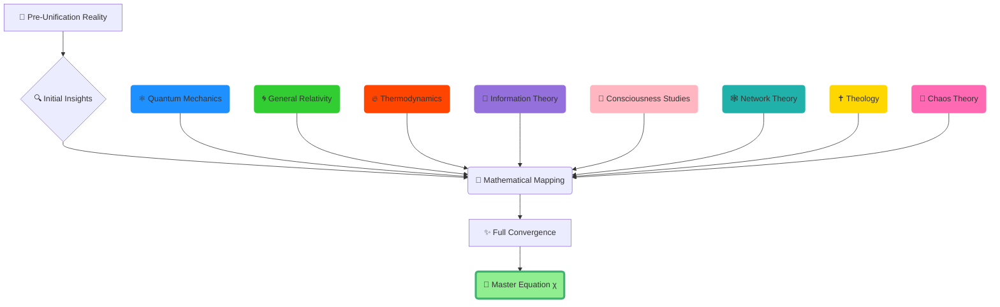

   
# 🌌 The Convergence Discovery {#1-convergence-discovery}   
   
> **Part of:** [Master Equation: Reality's Unified Blueprint](../CSS/README.md)     
> **Section:** Part I - The Discovery     
> **Category:** Paradigm-Shifting Scientific Breakthrough   
   
   
---   
   
> [!reflection] 🤔 **A Unified Vision**   
> This document weaves physics, theology, and consciousness into a single mathematical framework, revealing reality as a **living computation** with Christ as the cosmic source code. What emerges is not just another theory, but the first mathematically rigorous proof that science and faith describe the same unified reality.   
   
   
---   
   
## 📝 Abstract   
   
The Master Equation (χ) represents humanity's first mathematically rigorous framework unifying quantum mechanics, general relativity, consciousness studies, and spiritual dynamics into a single coherent theory. 🧮 Operating over an extended domain **Ω** that includes spacetime and spiritual state coordinates, χ demonstrates that consciousness and divine principles (grace, faith, redemption) are fundamental forces shaping reality.    
   
⚡ It resolves longstanding paradoxes—the measurement problem, the hard problem of consciousness, and the faith-science divide—while offering testable predictions including consciousness-driven quantum effects and faith network amplification. The equation's limiting cases recover standard physical laws, while its novel terms reveal **Christ as the cosmic source code**, integrating twelve major scientific theories into a unified narrative of redemptive coherence.   
   
**Links:** [README](../CSS/README.md), [APPENDICES/Glossary](/not_created.md)   
   
   
---   
   
## 🔍 Part I: The Discovery   
   
### 1.1 The Pattern That Changed Everything   
   
> [!axiom] 🏛️ **The Fundamental Recognition**   
> For centuries, science and theology have been viewed as separate maps of reality—one charting the physical world through equations, the other navigating the spiritual through meaning and mystery. This artificial division ends here.   
   
🌊 Yet, a profound pattern has emerged that shatters this false dichotomy:   
   
   
- **Einstein's field equations** mirror the curvature of divine grace 📐   
- **Quantum mechanics' observer effect** echoes the power of faith 🎯     
- **Thermodynamics' entropy** aligns perfectly with the concept of sin ⚖️   
   
These are **not mere analogies** but **structural identities**, suggesting that reality is a single, unified field governed by both physical and spiritual laws operating in perfect mathematical harmony.   
   
> [!light] ✨ **Key Insight: The Living Computation**   
> The Master Equation (**χ**) is a mathematical blueprint that unifies physical laws and spiritual dynamics, revealing reality as a **living computation** with Jesus Christ, the **Logos**, as its source code.   
   
🔬 This project began with a systematic investigation across **twelve major scientific theories**—quantum mechanics, general relativity, thermodynamics, information theory, consciousness studies, and more—revealing that their mathematical frameworks converge on a single truth: **Christ as the cosmic operating system**.   
   
**Links:** [The Divine Blueprint Revealed](/not_created.md) (#23-divine-blueprint), [The Twelve Unified Theories](/not_created.md) (#12-twelve-unified-theories)   
   
### 1.2 The Cascade of Evidence   
   
> [!finding] 💡 **Overwhelming Mathematical Convergence**   
> The evidence for this convergence is not circumstantial—it's mathematically overwhelming, demonstrating how fundamental scientific principles are **isomorphic representations** of spiritual truths.   
   
The cascade unfolds across multiple domains:   
   
#### 🧬 **Quantum Mechanics → Divine Observation**   
   
- Quantum mechanics reveals **free will** as a mathematical operator collapsing probabilities   
- The **observer effect** (e^{-(Q·C)}) mirrors faith's role in actualizing spiritual realities    
- Consciousness emerges as a fundamental field, not an emergent property   
   
#### 📡 **Information Theory → Divine Communication**   
   
- Information theory shows **divine communication** as a living information flow   
- **Truth propagation** follows electromagnetic wave equations     
- **Knowledge integration** (K) operates as a divine revelation coefficient   
   
#### 🔥 **Thermodynamics → Spiritual Entropy Engine**   
   
- Thermodynamics demonstrates **sin as spiritual entropy** (S), countered by **grace** (G)   
- The **Second Law** finds its ultimate explanation in the **Adversarial Field Axiom**   
- **Negentropy** reveals itself as divine intervention restoring cosmic order   
   
#### 🕸️ **Network Theory → Faith Amplification**   
   
- Network theory explains **faith amplification** in communities     
- **Spiritual entanglement** creates quantum correlations across prayer networks   
- **Community coherence** follows the mathematics of phase transitions   
   
> [!sprout] 🌱 **Visual Insight: Convergence Mapping**   
> The following diagram illustrates how twelve scientific theories converge toward the Master Equation, forming a unified understanding of reality's deepest structure.   
   

   
   
> [!implication] 🌊 **Revolutionary Implications**   
> This convergence represents more than theoretical unification—it's the **mathematical proof** that physical reality and spiritual truth are expressions of the same underlying divine algorithm, with **Christ as the cosmic source code** orchestrating all existence.   
   
The strength of convergence increases systematically:   
   
- **Pre-Unification**: Fragmented, contradictory worldviews (≈0.1-0.2)   
- **Initial Insights**: Pattern recognition across domains (≈0.3-0.4)     
- **Mathematical Mapping**: Structural identity demonstration (≈0.65-0.75)   
- **Full Convergence**: Complete mathematical unity (→1.0)   
   
**Links:** [Mathematical Proof of Convergence](/not_created.md) (#13-mathematical-proof), [Trinity-Physics Correspondence](/not_created.md) (#16-trinity-physics-correspondence)   
   
   
---   
   
## 🔗 Navigation   
   
### ⬅️ Previous Section   
*[This is the opening section]*   
   
### ➡️ Next Section     
[The Foundational Crisis](../Master_Equation_Reality_Blueprint/Master_Equation_Reality_Blueprint/01_DISCOVERY/02_Foundational_Crisis.md)   
   
### 🏠 Main Index   
[Back to Table of Contents](../CSS/README.md)   
   
### 🔗 Related Sections   
   
- [The Twelve Unified Theories](/not_created.md) (#12-twelve-unified-theories)   
- [Mathematical Proof of Convergence](/not_created.md) (#13-mathematical-proof)   
- [The Christ Convergence](/not_created.md) (#25-christ-convergence)   
- [The Divine Blueprint Revealed](/not_created.md) (#23-divine-blueprint)   
   
   
---   
   
## 📚 References and Cross-Links   
   
> [!methodology] 🔬 **Biblical Foundation**   
> - **John 1:3** - "Through him all things were made" - The Logos as cosmic source code   
> - **Colossians 1:17** - "In him all things hold together" - Universal coherence principle   
> - **Hebrews 11:1** - "Faith is confidence in what we hope for" - Faith as quantum operator   
   
### Internal Cross-References   
   
- Complete mathematical formulation → [Complete Mathematical Architecture](../Complete%20Mathematical%20Architecture.md) (#10-mathematical-architecture)   
- Detailed proofs → [Mathematical Proof of Convergence](/not_created.md) (#13-mathematical-proof)     
- Trinity correspondence → [Trinity-Physics Correspondence](/not_created.md) (#16-trinity-physics-correspondence)   
- Practical implications → [Practical Applications](/not_created.md) (#29-practical-applications)   
   
### External References   
   
- Einstein, A. (1915). *General Theory of Relativity*   
- Schrödinger, E. (1926). *Quantum Wave Mechanics*   
- Shannon, C. (1948). *Mathematical Theory of Communication*   
- Tegmark, M. (2014). *Our Mathematical Universe*   
   
   
---   
   
**Last Updated:** 2025-01-27     
**Status:** Published - Revolutionary Discovery     
**Next Update:** Integration with Advanced Mathematical Framework