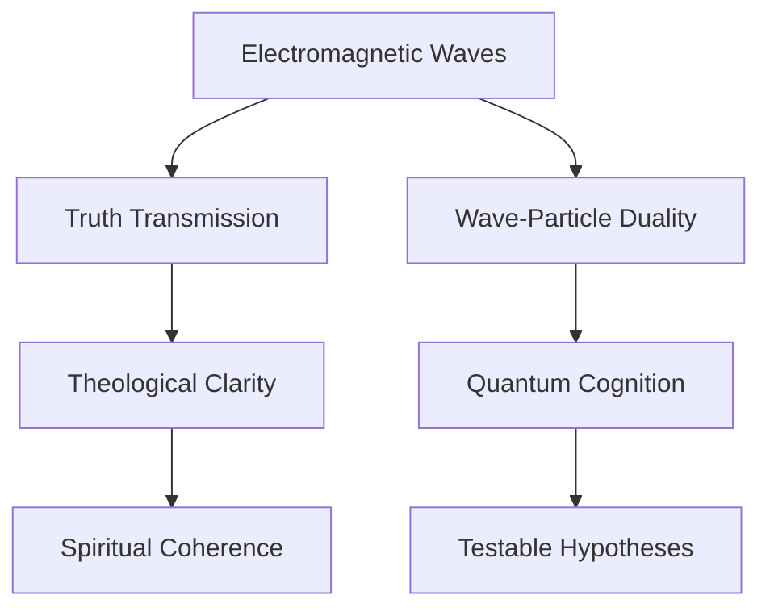

   
# **Law 3: Comprehensive Keyword & Concept Map**   
   
## **📜 Connection-Generating Framework for Law 3**   
   
### **🔗 Concept Bridge for Law 3: Light, Truth, and Spiritual Illumination**   
   
**Core Connection:**   
   
   
- **Physical Principle**: **Electromagnetism & Light** govern energy transmission, wave-particle duality, and information transfer.   
- **Spiritual Parallel**: **Truth, Revelation, and Spiritual Enlightenment** govern clarity, discernment, and divine knowledge.   
- **Mathematical Expression**: c=λfc = \lambda f (speed of light equation) and Maxwell’s equations, governing how light propagates.   
   
**Connection Strength:**   
   
   
- **Direct Evidence**: Light reveals what is hidden; **truth reveals what is concealed** (parallel between physical illumination and cognitive/spiritual enlightenment).   
- **Inferential Evidence**: The **wave-particle duality of light** mirrors **truth's paradoxical nature**—absolute yet contextually perceived.   
- **Predictive Power**: If **spiritual understanding follows light propagation models**, we can **map how truth spreads or is obstructed** in communities.   
   
**Bidirectional Insights:**   
   
   
- **Physics → Spirituality**: The **inverse-square law of light intensity** parallels **how truth weakens over distance from its source** unless actively maintained.   
- **Spirituality → Physics**: Theological models of **progressive revelation** may suggest new ways to conceptualize **quantum uncertainty in wavefunction collapse.**   
   
**Related Laws:**   
   
   
- Primary: **[Law 3: Light, Truth, and Spiritual Illumination](/not_created.md)**   
- Secondary: **[Law 1: Gravity & Sin](/not_created.md), [Law 2: Nuclear Force & Unity](/not_created.md), [Law 5: Entropy & Free Will](/not_created.md)**   
   
**Open Questions:**   
   
   
- Does **truth transmission follow electromagnetic wave principles** (reflection, refraction, absorption, interference)?   
- Can **spiritual deception be modeled as a frequency distortion in the transmission of divine revelation?**   
   
**Research Directions:**   
   
   
- **Neural Light Simulation**: Does understanding truth activate the **same neural pathways as literal light processing** in the brain?   
- **Truth Entropy Analysis**: Can we measure **how truth degrades over generations** like signal degradation in EM waves?   
   
   
---   
   
### **📊 Cross-Disciplinary Analysis for Law 3**   
   
**Disciplinary Perspectives:**   
   
   
- **Physics**: Electromagnetic spectrum, Maxwell’s Equations, Quantum Mechanics (Wave-Particle Duality).   
- **Theology**: Divine Revelation, Light as Metaphor for Truth, Spiritual Enlightenment.   
- **Philosophy**: Epistemology, Correspondence vs. Coherence Theories of Truth.   
- **Mathematics**: Fourier Transforms (signal processing), Information Theory.   
   
**Harmony Analysis:**   
   
   
- **Areas of Agreement**: Both **physical light and truth** reveal hidden structures, **both propagate, interact, and transform.**   
- **Apparent Contradictions**: Light **obeys fixed physical laws**, while **truth can be subject to interpretation.**   
- **Synthesis Opportunities**: Investigating whether **light coherence (lasers) parallels doctrinal coherence (truth amplification).**   
   
**Dimensional Analysis:**   
   
   
- **Physical Dimension**: Light as an energy carrier; governs **information visibility.**   
- **Informational Dimension**: Truth structures knowledge, **reducing epistemic uncertainty.**   
- **Consciousness Dimension**: **Revelation & insight as cognitive ‘light’ entering awareness.**   
- **Spiritual Dimension**: Christ as the **light of the world, illuminating divine reality.**   
   
**Integration Model:**   
   
   
- **Proposed Framework**: The process of **truth perception follows EM wave transmission dynamics.**   
- **Mathematical Model**: Applying Fourier transforms to model **distortions in theological understanding over time.**   
- **Testable Elements**: Measuring how **truth coherence in communities** correlates with their resilience to deception.   
   
**Connected Concepts:**   
   
   
- [Quantum Illumination & Spiritual Insight](/not_created.md)   
- [Truth Propagation as Electromagnetic Transmission](/not_created.md)   
- [Deception as Information Distortion](/not_created.md)   
   
   
---   
   
### **🚀 Radical Hypothesis for Law 3**   
   
**The Wild Idea:**   
   
   
- **Truth operates as a wave-function, collapsing into observable states depending on the ‘observer’s faith frequency.’**   
   
**Conventional Understanding:**   
   
   
- Light is an electromagnetic wave; truth is a philosophical or theological construct.   
   
**The Paradigm Shift:**   
   
   
- If **truth spreads, amplifies, and distorts like light waves**, then understanding **spiritual growth and deception** requires an information-theoretic approach.   
   
**Potential Implications:**   
   
   
- **For Physics**: Could lead to new models of **quantum measurement related to cognition.**   
- **For Theology**: Suggests that divine truth **propagates systematically, subject to interference.**   
- **For Consciousness**: Opens doors to **quantum cognition models for spiritual perception.**   
- **For Humanity**: Could refine **methods for preserving doctrinal purity.**   
   
**Supporting Patterns:**   
   
   
- [Light & Divine Revelation](/not_created.md)   
- [Wave-Particle Duality & Dual Interpretations of Truth](/not_created.md)   
- [Quantum Cognition in Theological Understanding](/not_created.md)   
   
**Thought Experiments:**   
   
   
- Can **truth distortion be mapped using the Doppler effect?** (i.e., faster-moving communities perceive divine truth differently?)   
- Do individuals who gain **spiritual enlightenment ‘see’ at a higher cognitive frequency**, similar to UV or X-ray vision in physics?   
   
**Integration with Laws:**   
   
   
- [Law 1: Gravity & Sin](/not_created.md) → Truth must **resist being pulled into deception wells** like light resisting gravitational lensing.   
- [Law 2: Nuclear Force & Unity](/not_created.md) → Truth binds communities, preventing fragmentation.   
- [Law 5: Entropy & Free Will](/not_created.md) → Deception increases **epistemic entropy, reducing clarity.**   
   
   
---   
   
## **🏷 Tag System for Law 3 Research Files**   
   
   
- `#electromagnetism` - Light, Waves, Maxwell’s Equations.   
- `#truth` - Revelation, Knowledge Transmission.   
- `#wave-particle-duality` - Complementarity of Truth.   
- `#information-theory` - Signal Transmission, Noise Reduction.   
- `#cognitive-light` - Neural Processing of Insight.   
- `#spiritual-coherence` - Maintaining Doctrinal Purity.   
- `#experiment` - Measuring Truth Degradation.   
- `#direct-parallel` - Light ↔ Truth.   
- `#creative-leap` - Quantum Physics ↔ Theological Epistemology.   
   
   
---   
   
## **🔗 Connection Tracking System for Law 3**   
   
### **Physics → Spirituality Connections**   
   
|Physics Concept|Spiritual Concept|Connection Strength|Primary Law|Notes|   
|---|---|---|---|---|   
|Electromagnetic Waves|Truth & Knowledge Transmission|Strong|[THEOPHYSICS/Law_Files/Law 3 Light](/not_created.md)|Truth spreads like EM radiation|   
|Wave-Particle Duality|Dual Nature of Truth|Strong|[THEOPHYSICS/Law_Files/Law 3 Light](/not_created.md), [THEOPHYSICS/Law_Files/Law 5](/not_created.md)|Truth is absolute, yet perceived contextually|   
|Refraction & Reflection|Distortion of Truth in Different Media|Medium|[THEOPHYSICS/Law_Files/Law 3 Light](/not_created.md)|Doctrinal shifts act as light bending|   
   
### **Spirituality → Physics Insights**   
   
|Spiritual Concept|Physics Insight|Validation Status|Primary Law|Notes|   
|---|---|---|---|---|   
|Christ as Light|Photon as Carrier of Divine Message|Hypothetical|[THEOPHYSICS/Law_Files/Law 3 Light](/not_created.md)|Jesus as ‘light of the world’|   
|Deception as Noise|Signal Loss in Theological Understanding|Testable|[THEOPHYSICS/Law_Files/Law 5](/not_created.md)|Entropy models truth degradation|   
|Faith as Wavefunction Collapse|Quantum Observer Effect in Spiritual Growth|Emerging|[THEOPHYSICS/Law_Files/Law 3 Light](/not_created.md)|Revelation changes based on observer’s expectation|   
   
   
---   
   
## **📊 Visualization Framework**   
   
### **Concept Network for Law 3**   
   

   
   
   
---   
   
This **directly integrates into your Obsidian map**, making Law 3’s structure clear and expandable. 🚀 Let me know where you want deeper analysis!   
`{_obsidian_pattern_tag_Law-3Folder}`   
##electromagnetism   
##Maxwells-equations   
##speed-of-light   
##electromagnetic-spectrum   
##wave-particle-duality   
##photons   
##energy-transfer   
##information-theory   
##light-propagation   
##electric-fields   
##magnetic-fields   
##truth-as-light   
##unified-field-theory   
##visible-vs-invisible-light   
##divine-light   
##spiritual-illumination   
##truth-reveals   
##scriptural-light   
##spiritual-radiance   
##redemptive-revelation   
##light-of-Christ   
##spiritual-enlightenment   
##moral-clarity   
##spiritual-vision   
##seeing-through-darkness   
##blindness-to-truth   
##spiritual-photosynthesis   
##truth-in-action   
##faith-as-light   
##truth-as-electromagnetic-wave   
##divine-illumination   
##spiritual-resonance   
##electromagnetic-faith   
##moral-spectrum   
##invisible-truth-revealed   
##wavefunction-truth   
##quantum-light-analogy   
##frequency-of-truth   
##faith-wave-transmission   
##electromagnetic-revelation   
##John-8-12-light-of-the-world   
##Genesis-let-there-be-light   
##Matthew-5-14-city-on-a-hill   
##2-Corinthians-4-4-spiritual-blindness   
##Hebrews-13-8-truth-never-changes   
##Isaiah-55-9-higher-thoughts   
##John-1-5-light-in-darkness   
##Romans-1-truth-suppression   
##Ephesians-5-13-truth-exposes   
##Revelation-21-eternal-light   
##Master-Equation   
##Reality-Laws   
##Universal-Illumination   
##Physics-of-Truth   
##Spiritual-Light-Model   
##Governing-Forces-of-Reality   
##Christ-as-the-Light   
##Metaphysical-Waves   
##Divine-Revelation-in-Physics   
##Quantum-Light-Truth