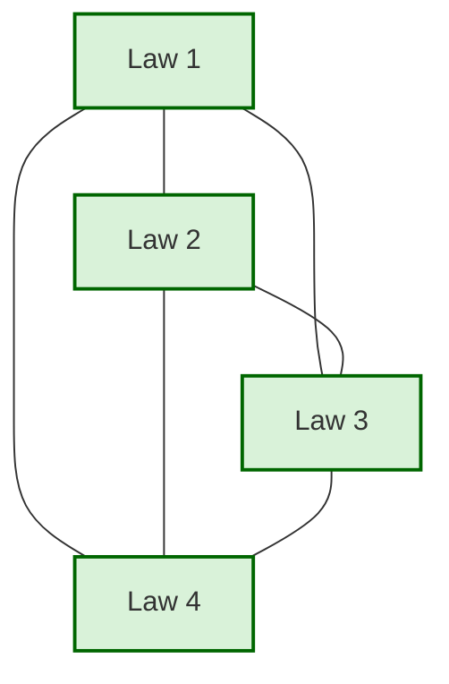
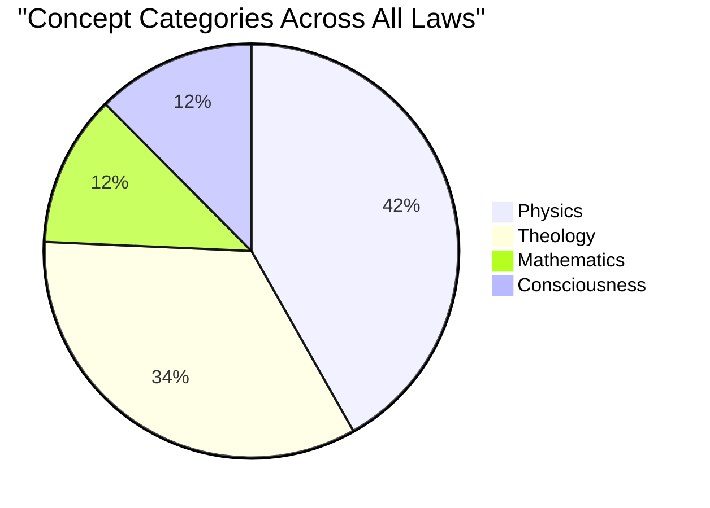

   
# Concept Network Visualization   
   
This document provides visualizations of the concept network across Laws.   
   
## Law Connection Network   
   

   
   
## Concept Category Distribution   
   

   
   
## Detailed Concept Network   
   
This visualization shows how key concepts are connected across different laws.   
   
```mermaid   
graph TD   
    Gravity["Gravity"]    
    energy["energy"]    
    Light["Light"]    
    Faith["Faith"]    
    faith["faith"]    
    Truth["Truth"]    
    Entropy["Entropy"]    
    Law5EntropyFreeWill["Law 5: Entropy & Free Will"]    
    Dimension["Dimension"]    
    Law5EntropyFreeWill["Law 5: Entropy & Free Will"]    
    FreeWill["Free Will"]    
    Thought["Thought"]    
    Law5EntropyFreeWill---Gravity   
    Law5EntropyFreeWill---Truth   
    Law5EntropyFreeWill---energy   
    Law5EntropyFreeWill---Faith   
    Law5EntropyFreeWill---Light   
    Law5EntropyFreeWill---Thought   
    Law5EntropyFreeWill---Entropy   
    Law5EntropyFreeWill---FreeWill   
    Law5EntropyFreeWill---Dimension   
    Law5EntropyFreeWill---faith   
    Gravity---Truth   
    Gravity---energy   
    Gravity---Faith   
    Gravity---Light   
    Gravity---Thought   
    Gravity---Entropy   
    Gravity---FreeWill   
    Gravity---Dimension   
    Gravity---faith   
    Truth---energy   
    Truth---Faith   
    Truth---Light   
    Truth---Thought   
    Truth---Entropy   
    Truth---FreeWill   
    Truth---Dimension   
    Truth---faith   
    energy---Faith   
    energy---Light   
    energy---Thought   
    energy---Entropy   
    energy---FreeWill   
    energy---Dimension   
    energy---faith   
    Faith---Light   
    Faith---Thought   
    Faith---Entropy   
    Faith---FreeWill   
    Faith---Dimension   
    Faith---faith   
    Light---Thought   
    Light---Entropy   
    Light---FreeWill   
    Light---Dimension   
    Light---faith   
    Thought---Entropy   
    Thought---FreeWill   
    Thought---Dimension   
    Thought---faith   
    Entropy---FreeWill   
    Entropy---Dimension   
    Entropy---faith   
    FreeWill---Dimension   
    FreeWill---faith   
    Dimension---faith   
## Concept Relationship Map   
   
For a more detailed interactive visualization, consider using a network visualization tool with this data.