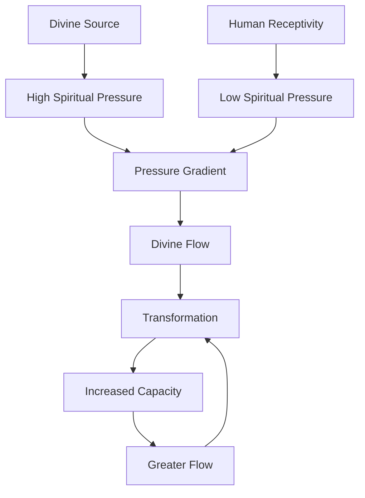

   
# 🌊 Deeper Waters: Integration Template for JS-O2-Water-Main   
   
To integrate the "Deeper Waters" premium content into the main "Jesus as Living Water" paper, insert the following sections at strategic points:   
   
## 1. Add after the Introduction section:   
   
> [!info]- 🌊 **Deeper Waters Preview: Quantum Properties of Water**     
> _Click to expand_   
>    
> > Recent research into water at biological interfaces has revealed extraordinary properties that defy classical understanding. Water molecules near cell membranes, proteins, and DNA form highly ordered structures with quantum coherence properties—maintaining synchronized behavior across distances in ways that classical physics struggles to explain.   
> >    
> > This remarkable discovery provides a powerful metaphor for understanding how the "living water" Jesus offers might function at the spiritual level—creating coherent transformation across seemingly disconnected aspects of our lives.   
> >    
> > This concept is explored fully in our **Deeper Waters** paper: "Quantum Coherence in Spiritual Hydrology"   
> >    
> > [Learn More](Deeper%2520Waters%2520Integration.md##) | [View Full Collection](Deeper%2520Waters%2520Integration.md.md##)   
   
## 2. Add after the "Spiritual Mapping" section:   
   
**DEEPER EXPLORATION:** 🌊   
For those fascinated by the ancient well imagery and its connection to Jesus's encounter with the Samaritan woman, our **Deeper Waters** paper "The Bridegroom at the Well" examines the profound betrothal patterns embedded in Scripture's well encounters and how Jesus's offer of living water represents a divine marriage proposal to humanity. [Learn More](Deeper%2520Waters%2520Integration.md##)   
   
## 3. Add after the "Scientific Foundations" section:   
   
> [!question]- 🤔 **Have you ever wondered...**     
> _Click to expand_   
>    
> > - How does water's ability to form complex hydrogen bond networks relate to spiritual community formation?   
> > - What if the three patterns of fluid flow (laminar, turbulent, vortex) represent divine movement in different seasons of spiritual life?   
> > - Could the mathematical principles governing fluid dynamics provide a model for understanding spiritual transformation?   
> >    
> > These questions and more are explored in depth in our **Deeper Waters** paper: "The Physics of Flow: Divine Movement in Creation."   
> >    
> > [Explore Deeper Waters](Deeper%2520Waters%2520Integration.md.md.md.md##)   
   
## 4. Add after the "Visualization & Thought Experiment" section:   
   
**CONCEPT PREVIEW:** 📊   

   
   
**Caption:** This simplified visualization offers a glimpse of the more comprehensive Spiritual Hydraulics Model explored in our **Deeper Waters** paper: "The Physics of Flow: Divine Movement in Creation"   
   
## 5. Add at the end of the paper, before "Deep Research Topics":   
   
## 🌊 Deeper Waters: Beyond the Surface   
   
For those desiring to explore the profound depths of Jesus as Living Water, our **Deeper Waters** collection offers advanced exploration:   
   
1. **Quantum Coherence in Spiritual Hydrology**: Examines how water's quantum properties provide a framework for understanding spiritual formation and divine influence   
2. **The Physics of Flow: Divine Movement in Creation**: Explores how fluid dynamics principles illuminate the movement of God's Spirit in human experience   
3. **The Bridegroom at the Well**: Reveals the ancient betrothal patterns in Scripture's well encounters and how Jesus's offer of living water represents a divine marriage proposal   
   
These papers examine the mathematical foundations, quantum implications, historical contexts, and transformative applications that remain hidden to casual readers.   
   
[Explore Deeper Waters](Deeper%2520Waters%2520Integration.md.md.md.md##) | [View Complete Collection](Deeper%2520Waters%2520Integration.md.md.md.md.md.md##)   
   
## 6. Add after "Deep Research Topics":   
   
## 🎧 Premium Resources   
   
The **Deeper Waters** collection includes:   
   
   
- 🎙️ **Audio Narrations**: Professional recordings of all papers   
- 📊 **Expanded Diagrams**: High-resolution visualizations of flow patterns   
- 📝 **Reflection Guides**: Structured exercises for personal application   
- 👨‍🏫 **Expert Commentary**: Insights from hydrologists, physicists, and theologians   
- 🧮 **Mathematical Appendices**: Detailed exploration of relevant equations   
   
[Learn More About Premium Content](Deeper%2520Waters%2520Integration.md.md.md.md.md.md.md##)   
   
## 7. Add at the very end:   
   
## 💬 What Readers Say About Deeper Waters   
   
> "The connections between water's quantum coherence and spiritual unity completely transformed my understanding of Jesus's teachings about living water." — Dr. Sarah Jensen, Quantum Biologist   
   
> "I've studied John's Gospel for decades, but the Deeper Waters papers revealed patterns in the well narratives I'd never noticed before." — Pastor Michael Torres   
   
> "As someone with both theological training and scientific background, these papers provided the integration I've been seeking for years." — Dr. Rebecca Chen, Physical Chemist   
   
[Join the Conversation](Deeper%2520Waters%2520Integration.md.md.md.md.md.md.md.md##)