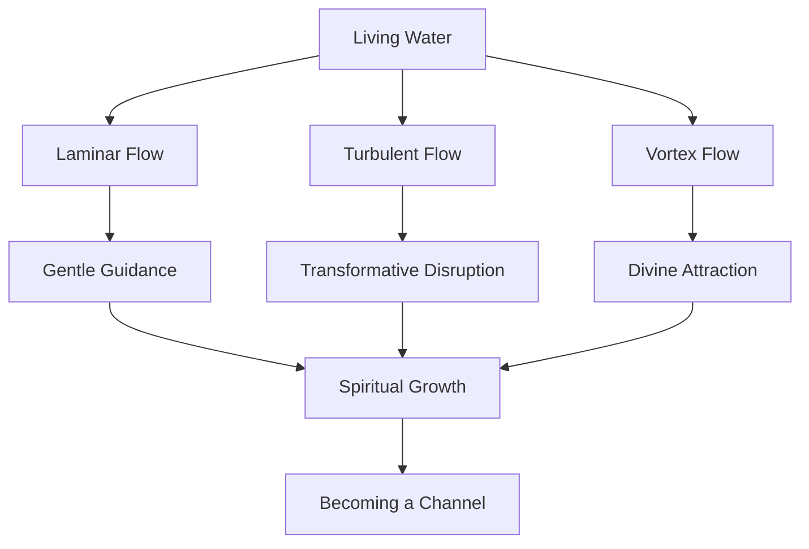

   
# 💧 Jesus as Living Water: The Flow Dynamics of Spirit   
   
> 💦 "Whoever drinks the water I give them will never thirst. Indeed, the water I give them will become in them a spring of water welling up to eternal life." — John 4:14   
   
   
   
## 🌊 Introduction: The Divine Flow   
   
**HOOK:** 🤔 What if Jesus's claim to be "living water" wasn't merely poetic language, but a profound insight into how divine influence moves through creation—following principles that fluid dynamics and quantum coherence are only now helping us understand?   
   
**FAST FACTS:** 📋   
   
- 💧 Water is essential for all life, constituting 60% of the human body   
- 🌊 Fluids follow precise mathematical patterns of flow and turbulence   
- ⚗️ Water exhibits unusual quantum coherence properties at biological scales   
- 🔄 In scripture, water represents purification, renewal, and the Holy Spirit   
   
**NARRATIVE:** 📖   
When John the Baptist stood in the flowing Jordan River, immersing those who came for repentance, he was participating in an ancient ritual with profound new meaning. 🏞️ Into these same waters stepped Jesus of Nazareth, and as he emerged, the heavens opened and the Spirit descended "like a dove" upon him. This pivotal moment—water, Spirit, voice—marked the beginning of Jesus's public ministry. Later, to a Samaritan woman drawing ordinary water from a well, Jesus would make an extraordinary claim: that he offered "living water" springing up to eternal life. 💧 The physical properties of water—its flow, its life-giving nature, its ability to cleanse and transform—provide a powerful framework for understanding how divine presence operates in the human experience.   
   
## 🏜️ The World Context: Spiritual Thirst   
   
**HOOK:** 🏜️ In a world of parched souls and spiritual drought, where do we find genuine refreshment?   
   
**FAST FACTS:** 📋   
   
- 💧 Water scarcity affected the ancient Middle East, making water imagery powerful   
- 🚶‍♀️ The Samaritan woman at the well had to draw water daily for survival   
- 🌊 Jewish purification rituals required flowing ("living") water   
- 🏞️ The Jordan River was a boundary marker and symbolic of new beginnings   
   
**NARRATIVE:** 📖   
When Jesus met the Samaritan woman at Jacob's well, he encountered someone making her daily journey for physical survival. 🏺 Drawing water was not a convenience but a necessity—heavy labor under the hot sun. Her need for water symbolized deeper thirsts: for acceptance despite social rejection, for spiritual truth amid religious confusion, for healing from relationship wounds. The well itself stood as a reminder of tribal divisions—Samaritans versus Jews—competing for the same essential resource. 👥 Jesus transcended these boundaries, offering water that would eliminate spiritual thirst altogether. Today, we face our own forms of thirst—for meaning in materialism, connection in isolation, truth in information overload. The promise of "living water" speaks to these contemporary droughts as powerfully as it did to the Samaritan woman's physical and spiritual needs.   
   
> [!info]- 🌐 **Fluid Dynamics & Spiritual Reality**     
> _Click to expand_   
>    
> > Fluid dynamics describes three primary flow patterns that mirror spiritual experience: Laminar flow (smooth, predictable) resembles times of gentle spiritual guidance; turbulent flow (chaotic, unpredictable) resembles disruptive spiritual transformation; vortex flow (spiral, concentrating) resembles the focusing power of divine love.   
   
## 🌟 Core Concept Definition: Quantum Flow Dynamics of Spirit   
   
**HOOK:** 🌀 How does the Spirit move? Both fluid dynamics and quantum biology offer surprising insights into this ancient question.   
   
**FAST FACTS:** 📋   
   
- 🌊 Fluid dynamics describes patterns of flow: laminar (smooth), turbulent (chaotic), and vortex (spiral)   
- 💧 Water molecules exhibit quantum coherence—coordinated behavior across distances   
- 🔄 The Holy Spirit is described with fluid metaphors: poured out, flowing, filling   
- 🌱 Living water produces ongoing growth, unlike stagnant water   
   
**FORMULA:** 📊    
The Navier-Stokes equations govern fluid flow: ρ(∂v/∂t + v∇v) = -∇p + μ∇²v + ρg   
In spiritual terms, divine influence (G) flows according to receptivity (R), creating a spiritual pressure gradient that drives transformation.   
   
**NARRATIVE:** 📖   
Water can flow in three distinct patterns. Laminar flow is smooth and predictable—like the gentle spiritual guidance we experience in times of peace. Turbulent flow is chaotic, with unpredictable eddies and currents—like the disruptive, transformative work of the Spirit in times of dramatic change. Vortex flow creates powerful spirals that draw everything toward their center—like the concentrating power of divine love. 🌀    
   
The promise of "living water" suggests not a one-time drink but an ongoing, self-sustaining spring. Recent research into water at biological interfaces reveals unexpected quantum coherence properties—water molecules working in coordinated ways that classical physics struggle to explain. 🧪 Similarly, the Spirit produces coordinated changes across seemingly disconnected aspects of life, creating coherent growth that exceeds what natural causes alone would predict. Just as water supports life through remarkable physical properties, the Spirit supports spiritual life through an even more remarkable divine physics.   
   
## 🧑‍🏫 **Maya's Discovery: A Personal Story**   
   
   
   
Maya Chen, a brilliant young graduate student, found herself increasingly fascinated by Professor Carter's lectures on water's quantum properties. But it wasn't until a personal crisis that these concepts transcended academic interest.   
   
During a research expedition to study water systems in a remote village, Maya encountered a community suffering from extreme drought. 🏜️ Their wells were dry, their crops withering. An elderly woman named Sophia invited Maya to her humble home and, despite having barely enough water for herself, offered Maya a small cup. "This is all I have," Sophia said, "but I share it freely."   
   
That night, Maya dreamed of the water molecules she studied in her quantum research—millions of particles suddenly behaving with synchronized purpose, as if guided by an invisible conductor. When she awoke, something had shifted in her understanding.   
   
"Water doesn't just sustain life physically," she wrote in her journal. "It models how life itself works at its deepest level—through giving, through flow, through unexpected connections."   
   
The next day, Maya noticed something the villagers had overlooked—a particular pattern of morning dew that suggested an underground spring nearby. Using her scientific training, she helped the village locate and access this hidden water source. 💧   
   
Years later, as a professor herself, Maya would begin each lecture on quantum hydrology with this story. "Sometimes," she would tell her students, "you must become empty enough to receive before you can become full enough to give. That's not just spiritual wisdom—it's a principle embedded in the physics of flow itself."   
   
## 🔍 Spiritual Mapping: Baptism, Birth, and Flow   
   
**HOOK:** 🔄 "Unless one is born of water and the Spirit, he cannot enter the kingdom of God" (John 3:5). What deep connection exists between physical water and spiritual transformation?   
   
**FAST FACTS:** 📋   
   
- 💧 Baptism symbolizes both cleansing and new birth   
- 🌊 In Genesis 1, the Spirit "hovers over the waters" at creation   
- ⛲ Ezekiel's vision shows water flowing from the temple, bringing life wherever it goes   
- 🔄 Ritual immersion (mikveh) in Judaism required "living water" (flowing, not stagnant)   
   
**NARRATIVE:** 📖   
When Jesus told Nicodemus that rebirth required both water and Spirit, he was connecting physical and spiritual realities in a profound way. 🔄 The same Creator who designed water's remarkable life-giving properties also designed the spiritual laws of regeneration. Throughout scripture, we see water as the context for new beginnings—creation emerging from watery chaos, Israel passing through the Red Sea to freedom, John's baptism preparing the way for Messiah. Water and Spirit have always worked together.    
   
The Jordan River baptism represents a remarkable convergence: heaven opening, Spirit descending, divine voice speaking, human obedience flowing. 🔍 In this moment, Jesus—though sinless—identified with humanity's need for cleansing while simultaneously revealing the pattern for how divine life would be made available. Just as water flows from high pressure to low pressure, spiritual life flows from divine abundance to human emptiness. The woman at the well discovered this principle: when we acknowledge our thirst, living water can begin to flow.   
   
> [!tip]- 📚 **Historical Baptism Practices**     
> _Click to expand_   
>    
> > In the early church, baptism was typically performed in flowing rivers or streams whenever possible, emphasizing the "living water" concept. When indoor baptisteries were later developed, many were designed with flowing water systems rather than static pools. The Greek term "baptizo" means complete immersion, suggesting not just washing but a complete surrounding by and submission to the water's flow.   
   
## 🔬 Scientific Foundations: Fluid Dynamics and Quantum Coherence   
   
**HOOK:** 🧪 Why does water behave so strangely at the nanoscale, and what might this tell us about how divine influence operates in creation?   
   
**FAST FACTS:** 📋   
   
- 🔬 Water forms complex hydrogen bond networks that enable long-range information transfer   
- 🌡️ Water has unusual thermal properties that stabilize biological systems   
- 🔄 Recent research suggests quantum effects may be important in biological water   
- 🌊 Flow patterns follow mathematical fractals that repeat across scales   
   
**FORMULA:** 📊   
For turbulent flow in a pipe: Reynolds number Re = ρvD/μ    
For laminar flow, Re < 2300; for turbulent flow, Re > 4000   
The transition between spiritual states may follow similar threshold principles.   
   
**NARRATIVE:** 📖   
Water is deceptively simple—H₂O—yet exhibits remarkably complex behavior. At biological interfaces (near cell membranes, DNA, proteins), water forms structured layers with properties unlike bulk water. These ordered water layers may facilitate quantum coherence effects that classical physics cannot fully explain. 🧬    
   
Flow systems follow consistent principles regardless of scale. Small disturbances in initial conditions can create dramatic differences in outcomes—the basis of chaos theory. Yet patterns emerge even in chaos. These principles offer profound metaphors for spiritual dynamics. 🌀 The Spirit may work through quantum-like effects—subtle influences that create profound, non-local changes across interconnected systems. When Jesus said his living water would become "a spring of water welling up to eternal life," he described not just a one-time gift but a self-perpetuating system that grows and expands within the believer, creating an ongoing flow that defies spiritual entropy.   
   
## ✝️ Practical Application: Channels of Living Water   
   
**HOOK:** 💧 "Whoever believes in me, as Scripture has said, rivers of living water will flow from within them" (John 7:38). How do we become not just recipients but channels of divine flow?   
   
**FAST FACTS:** 📋   
   
- 🚶‍♀️ Pipes must be clear of blockages to maintain flow   
- 🔄 Water follows the path of least resistance   
- 🌱 Healthy systems distribute water where it's most needed   
- 🔋 Water can generate power when properly channeled (hydroelectricity)   
   
**NARRATIVE:** 📖   
Jesus promised that believers would become channels of living water—conduits through which divine refreshment reaches others. This process follows consistent principles. Just as physical pipes must be clear to maintain flow, spiritual blockages like unforgiveness, pride, or fear restrict divine movement through our lives. 🚿 Removing these obstructions increases flow capacity.   
   
Flow dynamics teach us that water naturally moves from high pressure to low pressure, seeking the path of least resistance. Similarly, the Spirit flows readily toward honest acknowledgment of need. When we maintain an attitude of receptivity and dependence (low spiritual pressure), divine resources flow naturally toward and through us. 🔄   
   
Living water is meant to be distributed, not hoarded. In healthy irrigation systems, water goes where it's most needed, not where it's most convenient to deliver. As channels of living water, we're called to direct spiritual resources toward genuine needs, especially to those experiencing spiritual drought. 💧 This requires discernment about where the Spirit wants to flow through us—which relationships, which needs, which opportunities represent the divine irrigation strategy for this season.   
   
> [!warning]- 🌱 **Blockage Assessment**     
> _Click to expand_   
>    
> > Common spiritual blockages that restrict the flow of living water include:   
> > - **Unforgiveness**: Creates "dams" in our spiritual channels   
> > - **Pride**: Creates "uphill" resistance against divine flow   
> > - **Fear**: Causes "constriction" in our spiritual conduits   
> > - **Busyness**: Creates "sediment" that gradually restricts flow   
> > - **Unbelief**: Creates "valves" that shut off certain areas to divine influence   
   
## 🧠 Visualization & Thought Experiment: The Living Spring   
   
**HOOK:** 🤔 What's the difference between drawing water from a well and having an artesian spring within you?   
   
**FAST FACTS:** 📋   
   
- ⛲ Artesian wells flow spontaneously without pumping   
- 🔄 Springs create their own channels over time   
- 💧 Structured water in biological systems maintains properties longer than bulk water   
- 🌊 Flow patterns are self-similar across different scales (fractal patterns)   
   
**THOUGHT EXPERIMENT:** 🧠   
Close your eyes and visualize yourself at a deep well, like the Samaritan woman. Feel the weight of the empty water jar, the strain of lowering it down the dark shaft, the effort of drawing it up full, the temporary relief of thirst, and the knowledge that tomorrow you'll repeat this labor. This represents the exhausting cycle of seeking fulfillment from external sources. 🏺   
   
Now imagine something different: a spring spontaneously bubbling up within you. You don't need to dig, lower, or draw. The water finds its own path to the surface, creating channels through previously dry ground. The flow is continuous, requiring no effort to maintain. It not only quenches your thirst but begins to create a small stream flowing outward, bringing life to everything it touches. 🌱   
   
The difference is profound—one requires constant effort and provides temporary relief; the other effortlessly provides continuous abundance that naturally extends beyond your personal needs to benefit others. This is the difference between religious effort and spiritual indwelling, between law and grace, between the Old Covenant and the New.   
   
**IMAGE CONCEPT:** 🖼️ A split-screen visualization showing: 1) A person laboriously drawing water from a deep well with a heavy jar, and 2) The same person with an artesian spring bubbling up from within, creating flowing streams that nourish surrounding plants and people.   
   
## 📌 Key Takeaways: The Divine Hydraulics   
   
**HOOK:** 💧 "The water I give them will become in them a spring of water welling up to eternal life." (John 4:14)   
   
**FAST FACTS:** 📋   
   
- 🌊 Jesus's baptism in the Jordan initiated his public ministry and modeled spiritual immersion   
- 💧 Living water represents the indwelling Spirit that provides continuous renewal   
- 🔄 Spiritual dynamics follow principles similar to fluid flow and quantum coherence   
- 🚶‍♀️ Believers become channels through which divine refreshment reaches others   
   
**NARRATIVE CONNECTION:** 🔄   
Jesus's identity as Living Water builds upon his nature as Light. 💫 While Light reveals truth and reality, Water cleanses and gives life. His baptism in the Jordan physically enacted what would become spiritually available through him—complete immersion in divine presence. From being revealed by starlight as an infant, Jesus now steps into flowing water to reveal the pathway of spiritual rebirth. This progression sets the stage for his emerging ministry of teaching truth, which we'll explore next in his role as the embodiment of Truth itself. 📚   
   
**NEXT STEPS:** 👣   
In our next exploration, we'll follow Jesus into his teaching ministry, where his parables and proclamations reveal him as [Jesus as Truth: The Information Theory of Revelation](JS-O3-Truth-Main.md). The principles of information theory provide another window into Christ's nature and our spiritual transformation. 📡   
   
## 📊 **CONCEPT MAP: VISUAL LAYOUT** 📊   
   

   
   
## 📐 **TRANSFORMATIVE FRAMEWORK** 📐   
   
|Physical Reality|Spiritual Dynamic|Emoji|   
|---|---|---|   
|Laminar Flow|Gentle Guidance|🧘|   
|Turbulent Flow|Disruptive Grace|🌪️|   
|Vortex Flow|Divine Attraction|🌀|   
|Pressure Gradient|Spiritual Receptivity|📉|   
|Channel Capacity|Heart Openness|💓|   
|Flow Distribution|Ministry Outreach|🤲|   
|Quantum Coherence|Spiritual Unity|🔄|   
|Structured Water|Transformed Life|✨|   
|Flow Resistance|Spiritual Blockage|🚧|   
|Spring vs. Well|Grace vs. Works|⛲|   
   
   
---   
   
## 🔍 Deep Research Topics   
   
### 🧪 Quantum Physics Exploration   
   
- 🧪 Quantum coherence in biological water systems   
- 🌊 Fractal mathematics of fluid dynamics and application to spiritual growth patterns   
- 🔄 Self-organizing principles in complex flow systems   
- 🌡️ Phase transitions in water and metaphorical spiritual thresholds   
   
### 🕯️ Spiritual Framework Applications   
   
- 🌍 Water purification rituals across faith traditions   
- 💧 Baptism practices throughout church history   
- 🧘‍♂️ Contemplative prayer as "immersion" in divine presence   
- 📚 Biblical hydrology: rivers, seas, wells, and springs as spiritual metaphors   
   
[Explore Premium Content](../enveloppe/JS-O2-Water-Enhanced.md)   
   
   
---   
   
**Audio Version Available**: [Listen to this paper](JS-O2-Water-Enhanced.md.md##)