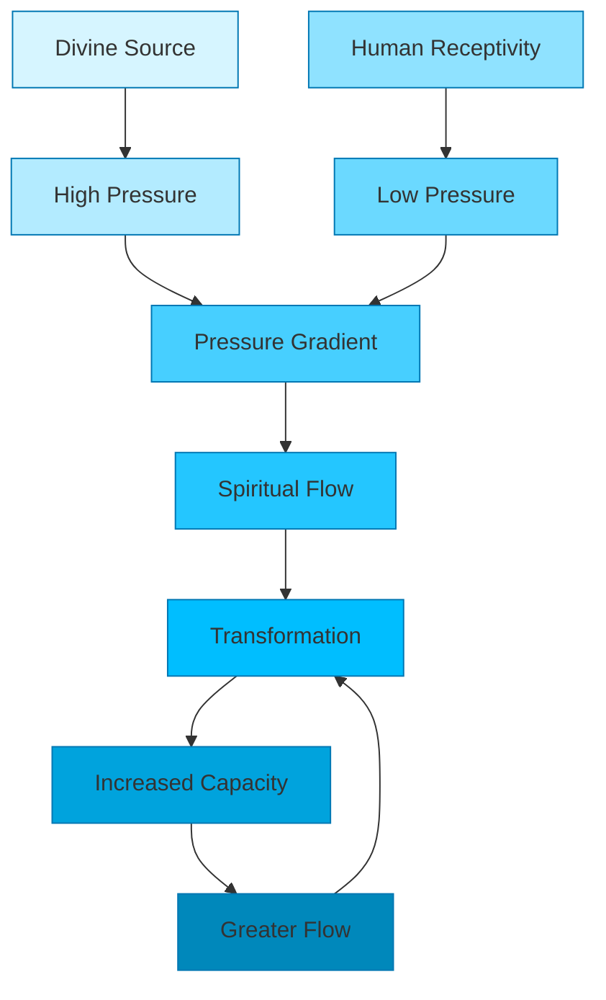

   
# 🎨 Visual Strategy Guide for Jesus Series   
   
## 📋 Overview   
   
This guide outlines a comprehensive visual strategy for Jesus Series papers, with 2-7 high-impact visuals per paper depending on length. Each visual serves a specific purpose in enhancing understanding, engagement, and memorability.   
   
## 🖼️ Visual Categories   
   
### 1. 🌅 Hero Images   
**Purpose:** Create emotional connection and set the tone   
**Placement:** At the beginning of the paper   
**Style:** High-quality, evocative imagery related to the metaphor   
   
#### Examples:   
   
- **Light:** Sunlight streaming through clouds or forest canopy   
- **Water:** Crystal clear spring bubbling up from rocks   
- **Truth:** Ancient scroll being unrolled with light illuminating text   
- **Bread:** Freshly baked bread broken open, steam rising   
   
### 2. 🧑‍🏫 Narrative Visuals   
**Purpose:** Support character stories and make them relatable   
**Placement:** In the narrative introduction section   
**Style:** Character-focused scenes that convey emotion and setting   
   
#### Examples:   
   
- **Light:** Elijah and grandfather at sunset, shadows creating contrast   
- **Water:** Maya discovering hidden spring in drought-stricken village   
- **Truth:** Professor demonstrating information theory with students   
- **Bread:** Family gathered around table sharing meaningful meal   
   
### 3. ⚛️ Scientific Diagrams   
**Purpose:** Explain complex scientific concepts clearly   
**Placement:** In the scientific foundation section   
**Style:** Clean, labeled diagrams with minimal color palette   
   
#### Examples:   
   
- **Light:** Wave-particle duality visualization showing both properties   
- **Water:** Fluid dynamics diagram showing three flow patterns   
- **Truth:** Information theory model showing sender-receiver-noise   
- **Bread:** Energy transfer system diagram from food to cellular function   
   
### 4. 📜 Biblical Imagery   
**Purpose:** Connect scientific concepts to scriptural foundations   
**Placement:** In the spiritual mapping section   
**Style:** Artistic renderings of biblical scenes related to the metaphor   
   
#### Examples:   
   
- **Light:** Creation scene with "Let there be light" moment   
- **Water:** Jesus and Samaritan woman at Jacob's well   
- **Truth:** Jesus before Pilate saying "I am the way, the truth, the life"   
- **Bread:** Last Supper with bread being broken   
   
### 5. 🧪 Quantum Visualization   
**Purpose:** Represent advanced quantum concepts accessibly   
**Placement:** In the quantum depths section   
**Style:** Abstract, slightly mysterious visualizations that suggest depth   
   
#### Examples:   
   
- **Light:** Observer effect visualization showing measurement changing outcome   
- **Water:** Quantum coherence visualization showing synchronized molecules   
- **Truth:** Quantum encryption visualization showing information protection   
- **Bread:** Quantum energy transfer visualization showing efficient pathways   
   
### 6. 🧠 Thought Experiment Visuals   
**Purpose:** Support guided visualization exercises   
**Placement:** In the thought experiment section   
**Style:** Dreamlike, imaginative imagery that aids mental visualization   
   
#### Examples:   
   
- **Light:** Split screen showing person in darkness vs. illuminated by light   
- **Water:** Comparison between laborious well-drawing and effortless spring   
- **Truth:** Maze with and without illuminated path   
- **Bread:** Visualization of energy flowing through body systems   
   
### 7. 📊 Conceptual Frameworks   
**Purpose:** Organize key concepts into memorable visual systems   
**Placement:** In the transformative framework section   
**Style:** Clean, structured diagrams, tables, or flowcharts   
   
#### Examples:   
   
- **Light:** Spectrum diagram showing physical light to spiritual illumination   
- **Water:** Flow system diagram showing spiritual hydraulics   
- **Truth:** Information processing model of spiritual discernment   
- **Bread:** Energy transformation cycle from physical to spiritual nourishment   
   
## 🎯 Visual Distribution Strategy   
   
For a typical ~3000 word paper, aim for 5 strategically placed visuals:   
   
1. **Opening (Hero Image)** - First 10% of paper   
2. **Narrative Visual** - 15-25% mark   
3. **Scientific Diagram** - 30-40% mark   
4. **Quantum Visualization** - 50-60% mark (premium content bridge)   
5. **Conceptual Framework** - 80-90% mark   
   
For shorter papers (~1500 words), use 3 visuals:   
1. Hero Image (beginning)   
2. Scientific/Quantum Diagram (middle)   
3. Conceptual Framework (end)   
   
For longer papers (~5000+ words), add up to 7 visuals:   
   
- Add Biblical Imagery (45% mark)   
- Add Thought Experiment Visual (70% mark)   
   
## 🎨 Visual Style Guidelines   
   
### Color Themes by Metaphor   
   
   
- **Light:** Gold/amber primary, blue secondary, white accents   
- **Water:** Deep blue primary, teal secondary, white accents   
- **Truth:** Green primary, gold secondary, white accents   
- **Bread:** Warm brown primary, amber secondary, white accents   
- **Vine:** Deep green primary, purple secondary, white accents   
   
### Design Consistency   
   
   
- **Typography:** Same font styles across all diagrams   
- **Line Weights:** Consistent thickness for similar elements   
- **Color Palette:** 2-3 primary colors plus white/black   
- **Style:** Modern, clean, slightly dimensional   
- **Branding:** Subtle "Faith Through Physics" watermark   
   
### Visual Hierarchy   
   
   
- **Focal Point:** Each visual should have a clear central element   
- **Supporting Elements:** Secondary elements should guide the eye   
- **Text Integration:** Minimal text, strategically placed   
- **Whitespace:** Adequate breathing room around key elements   
   
## 📸 Visual Examples for Jesus as Light   
   
### 1. Hero Image: The Divine Illumination   
   
*Sunlight breaking through clouds, creating visible beams that illuminate a landscape. Symbolizes divine light penetrating darkness.*   
   
### 2. Narrative Visual: Elijah's Question   
   
*Young Elijah sitting with grandfather at Grand Canyon edge, looking thoughtfully at the vast space as sunlight creates dramatic shadows.*   
   
### 3. Scientific Diagram: Wave-Particle Duality   
```
┌──────────────────────────────────┐
│                                  │
│    ╭──╮    ╭──╮    ╭──╮         │
│   ╭╯  ╰╮  ╭╯  ╰╮  ╭╯  ╰╮        │
│  ╭╯    ╰╮╭╯    ╰╮╭╯    ╰╮       │ WAVE PROPERTIES
│ ╭╯      ╰╯      ╰╯      ╰╮      │ (Omnipresence)
│╭╯                        ╰╮     │
├──────────────────────────────────┤
│                                  │
│        ●         ●         ●     │
│                                  │ PARTICLE PROPERTIES
│    ●         ●         ●         │ (Specific Manifestation)
│                                  │
└──────────────────────────────────┘
```
   
*Diagram showing light exhibiting both wave properties (distributed influence) and particle properties (localized impact).*   
   
### 4. Biblical Imagery: Creation of Light   
   
*Artistic rendering of Genesis 1:3-4, showing the moment of "Let there be light" with darkness being separated from light.*   
   
### 5. Quantum Visualization: Observer Effect   
   
*Abstract visualization showing how observation affects light behavior, with viewing/measuring apparatus changing the pattern of light.*   
   
### 6. Thought Experiment Visual: Darkness to Light   
   
*Split-screen visualization showing a person moving from complete darkness (disoriented, searching) to being illuminated (clear vision, purpose).*   
   
### 7. Conceptual Framework: Light Spectrum Diagram   

   
*Diagram showing the spectrum from physical light to spiritual illumination, with transitional states between.*   
   
## 📸 Visual Examples for Jesus as Water   
   
### 1. Hero Image: Living Spring   
   
*Crystal clear spring bubbling up from rocky ground, creating concentric ripples that extend outward.*   
   
### 2. Narrative Visual: Maya's Discovery   
   
*Graduate student Maya helping villagers access hidden water source, joy on faces as water emerges.*   
   
### 3. Scientific Diagram: Three Flow Patterns   
```
┌──────────────────────────────────┐
│                                  │
│ ───────────────────────────────► │
│ ───────────────────────────────► │ LAMINAR FLOW
│ ───────────────────────────────► │ (Gentle Guidance)
│ ───────────────────────────────► │
│                                  │
├──────────────────────────────────┤
│                                  │
│ ◎       ↝↝↝       ◎              │
│    ◎         ◎        ◎          │ TURBULENT FLOW
│        ◎↝↝↝      ◎       ◎       │ (Disruptive Change)
│  ◎          ◎↝↝↝       ◎         │
│                                  │
├──────────────────────────────────┤
│              ↑                   │
│          ↗   │   ↖               │
│        ↗     │     ↖             │ VORTEX FLOW
│      ←───────●───────→           │ (Divine Attraction)
│        ↘     │     ↙             │
│          ↘   │   ↙               │
│              ↓                   │
└──────────────────────────────────┘
```
   
*Diagram showing three patterns of fluid flow with spiritual significance.*   
   
### 4. Biblical Imagery: Woman at the Well   
   
*Jesus and Samaritan woman at Jacob's well, moment of recognition as she receives living water.*   
   
### 5. Quantum Visualization: Water Coherence   
   
*Visualization of water molecules exhibiting quantum coherence, moving in synchronized patterns with connections between them.*   
   
### 6. Thought Experiment Visual: Well vs. Spring   
   
*Split-screen showing laborious water drawing from deep well vs. effortless flow from internal spring.*   
   
### 7. Conceptual Framework: Spiritual Hydraulics   

   
*Diagram showing the spiritual hydraulics system with pressure gradients and flow dynamics.*   
   
## 🖼️ Image Acquisition Strategy   
   
1. **Custom Creation**: For scientific diagrams and conceptual frameworks   
2. **Stock Photography**: For hero images and supporting visuals   
3. **AI Generation**: For narrative visuals and thought experiments   
4. **Diagram Tools**: For flow charts and process visualizations   
5. **Biblical Art**: For scriptural scenes and theological concepts   
   
## 📱 Responsive Design Considerations   
   
1. **Mobile Optimization**: Ensure visuals work on small screens   
2. **Alt Text**: Provide descriptive text for all images   
3. **Progressive Loading**: Optimize for fast loading   
4. **Printability**: Consider how visuals translate to black and white   
5. **Accessibility**: Ensure adequate contrast and readability   
   
## 🔄 Visual Improvement Process   
   
1. **Start Simple**: Begin with placeholder diagrams   
2. **Gather Feedback**: Test visuals with sample readers   
3. **Refine Gradually**: Improve visuals based on feedback   
4. **Maintain Consistency**: Ensure visuals work together as a system   
5. **Evolve Style**: Allow style to mature while maintaining recognition   
   
This visual strategy provides a comprehensive framework for creating high-impact visuals that enhance understanding, engagement, and memorability throughout the Jesus Series papers.