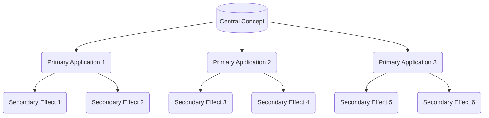

   
import os   
   
import shutil   
   
from pathlib import Path   
   
     
   
# Set the base path to your Faith with Physics vault   
   
BASE_PATH = r"D:\CLoud Accounts\OneDrive\Documents\Yellowkid Laws of the universe\1 Faith with Physics"   
   
     
   
# Define the Law folders (1 through 10)   
   
LAW_FOLDERS = [f"Law {i}" for i in range(1, 11)]   
   
     
   
# Define the improved folder structure for each Law   
   
IMPROVED_STRUCTURE = {   
   
    "Academy": [   
   
        "Connection Maps",   
   
        "Cross-Law Analysis",   
   
        "Hypothesis Labs"   
   
    ],   
   
    "Meta": [   
   
        "Law Meta"   
   
    ],   
   
    "Research": [   
   
        "Law Academy",   
   
        "The Research of {law_number}"   
   
    ]   
   
}   
   
     
   
# Define file templates for each Law   
   
LAW_FILE_TEMPLATES = {   
   
    "core_law": {   
   
        "filename": "{law_name}.md",   
   
        "content": """---   
   
tags: [law, core, {law_number_tag}]   
   
   
---   
   
     
   
# {law_name}   
   
     
   
## Core Principle   
   
(Define the core principle of {law_name})   
   
     
   
## Physical Manifestation   
   
(Describe how this law manifests in physical reality)   
   
     
   
## Spiritual Parallel   
   
(Describe the spiritual parallel to this physical law)   
   
     
   
## Mathematical Expression   
   
(Provide a mathematical expression of this law if applicable)   
   
     
   
## Key Concepts   
   
   
- [Concept 1](Concept%201.md)   
   
   
- [Concept 2](Concept%202.md)   
   
   
- [Concept 3](Concept%203.md)   
   
     
   
## Related Laws   
   
   
- (Links to related laws)   
   
     
   
"""   
   
    },   
   
    "information_theory": {   
   
        "filename": "Information Theory & Divine Logos.md",   
   
        "content": """---   
   
tags: [information-theory, divine-logos, {law_number_tag}]   
   
   
---   
   
     
   
# Information Theory & Divine Logos in {law_name}   
   
     
   
## Information Theory Perspective   
   
(How information theory relates to {law_name})   
   
     
   
## Divine Logos Connection   
   
(How the Divine Logos relates to this law)   
   
     
   
## Mathematical Framework   
   
(Mathematical models that express this connection)   
   
     
   
## Key Insights   
   
   
- (Key insight 1)   
   
   
- (Key insight 2)   
   
   
- (Key insight 3)   
   
     
   
## Research Questions   
   
   
- (Research question 1)   
   
   
- (Research question 2)   
   
     
   
"""   
   
    },   
   
    "quantum_entanglement": {   
   
        "filename": "Quantum Entanglement.md",   
   
        "content": """---   
   
tags: [quantum, entanglement, {law_number_tag}]   
   
   
---   
   
     
   
# Quantum Entanglement in {law_name}   
   
     
   
## Quantum Principles   
   
(How quantum entanglement relates to {law_name})   
   
     
   
## Spiritual Entanglement   
   
(Spiritual parallels to quantum entanglement in this law)   
   
     
   
## Observable Effects   
   
(What effects might be observable)   
   
     
   
## Experimental Approach   
   
(How this might be tested or experienced)   
   
     
   
## Related Concepts   
   
   
- [**1️⃣ [Quantum](../enveloppe/Quantum.md)]] Superposition: Multiple Possible Futures Exist Simultaneously**]]]]]] Superposition: Multiple Possible Futures Exist Simultaneously**]]   
   
   
- [Non-locality - The quantum phenomenon where distan...](./Non-locality%20-%20The%20quantum%20phenomenon%20where%20distan....md)   
   
   
- [Wave Function - The mathematical description of a ...](./Wave%20Function%20-%20The%20mathematical%20description%20of%20a%20....md)   
   
     
   
"""   
   
    },   
   
    "spiritual_parallels": {   
   
        "filename": "Spiritual Parallels of {law_number}.md",   
   
        "content": """---   
   
tags: [spiritual, parallels, {law_number_tag}]   
   
   
---   
   
     
   
# Spiritual Parallels of {law_name}   
   
     
   
## Physical to Spiritual Mapping   
   
(How the physical principles map to spiritual realities)   
   
     
   
## Theological Framework   
   
(The theological framework that supports these parallels)   
   
     
   
## Practical Applications   
   
(How these parallels can be applied in spiritual practice)   
   
     
   
## Biblical Connections   
   
(Biblical passages that relate to these principles)   
   
     
   
## Experiential Dimensions   
   
(How these principles might be experienced)   
   
     
   
"""   
   
    },   
   
    "law_story": {   
   
        "filename": "{law_name} Story.md",   
   
        "content": """---   
   
tags: [story, narrative, {law_number_tag}]   
   
   
---   
   
     
   
# The Story of {law_name}   
   
     
   
## Narrative Introduction   
   
Once upon a time...   
   
     
   
## The Physical Reality   
   
(Narrative explanation of the physical principle)   
   
     
   
## The Spiritual Journey   
   
(Narrative explanation of the spiritual parallel)   
   
     
   
## The Resolution   
   
(How understanding this law transforms perspective)   
   
     
   
## Discussion Questions   
   
   
- (Question 1)   
   
   
- (Question 2)   
   
   
- (Question 3)   
   
     
   
"""   
   
    },   
   
    "paradox": {   
   
        "filename": "The Paradox of {law_number}.md",   
   
        "content": """---   
   
tags: [paradox, philosophical, {law_number_tag}]   
   
   
---   
   
     
   
# The Paradox of {law_name}   
   
     
   
## The Apparent Contradiction   
   
(Describe the paradoxical elements of this law)   
   
     
   
## Philosophical Implications   
   
(Explore the philosophical dimensions of this paradox)   
   
     
   
## Resolving the Tension   
   
(How the paradox might be resolved or embraced)   
   
     
   
## Quantum Perspective   
   
(How quantum principles might address this paradox)   
   
     
   
## Spiritual Wisdom   
   
(What spiritual wisdom emerges from this paradox)   
   
     
   
"""   
   
    }   
   
}   
   
     
   
# Additional file templates for specific folders   
   
FOLDER_FILE_TEMPLATES = {   
   
    "Connection Maps": {   
   
        "concept_map": {   
   
            "filename": "{law_name} Concept Map.md",   
   
            "content": """---   
   
tags: [concept-map, visualization, {law_number_tag}]   
   
   
---   
   
     
   
# {law_name} Concept Map   
   
     
   
This document provides a visual mapping of the key concepts in {law_name}.   
   
     
   
## Core Concept Map   
   
     
   
```mermaid

graph TD

    L{{{law_name}}} --> A[Physical Principle]

    L --> B[Spiritual Parallel]

    L --> C[Mathematical Expression]

    A --> A1[Physical Concept 1]

    A --> A2[Physical Concept 2]

    B --> B1[Spiritual Concept 1]

    B --> B2[Spiritual Concept 2]

    C --> C1[Mathematical Model 1]

    C --> C2[Mathematical Model 2]

    %% Cross-connections

    A1 --- B1

    A2 --- B2

    %% Styling

    classDef law fill:#f9d5e5,stroke:#d64161,stroke-width:2px

    classDef physical fill:#eeeeee,stroke:#333333,stroke-width:2px

    classDef spiritual fill:#e6f7ff,stroke:#0099cc,stroke-width:2px

    classDef math fill:#e6ffe6,stroke:#339933,stroke-width:2px

    class L law

    class A,A1,A2 physical

    class B,B1,B2 spiritual

    class C,C1,C2 math

```
   
   
     
   
## Related Concepts   
   
     
   
   
- Concept 1: (Brief description)   
   
   
- Concept 2: (Brief description)   
   
   
- Concept 3: (Brief description)   
   
     
   
## Connection Hierarchy   
   
     
   
How these concepts relate to one another hierarchically:   
   
     
   

   
   
     
   
"""   
   
        }   
   
    },   
   
    "Cross-Law Analysis": {   
   
        "cross_law": {   
   
            "filename": "{law_name} and Law X Integration.md",   
   
            "content": """---   
   
tags: [cross-law, integration, {law_number_tag}]   
   
   
---   
   
     
   
# {law_name} and Law X Integration   
   
     
   
## Connection Points   
   
     
   
   
- How {law_name} connects with Law X   
   
   
- Shared principles   
   
   
- Complementary aspects   
   
     
   
## Integrated Mathematical Model   
   
     
   
   
- Combined mathematical expression   
   
   
- Integrated framework   
   
     
   
## Enhanced Understanding   
   
     
   
   
- How these laws mutually illuminate each other   
   
   
- Deeper insights from integration   
   
     
   
## Practical Applications   
   
     
   
   
- How the integrated understanding can be applied   
   
   
- Spiritual practices that engage both laws   
   
     
   
## Research Directions   
   
     
   
   
- Areas for further exploration   
   
   
- Potential experiments or studies   
   
     
   
"""   
   
        }   
   
    },   
   
    "Hypothesis Labs": {   
   
        "hypothesis": {   
   
            "filename": "{law_name} Hypothesis - Concept.md",   
   
            "content": """---   
   
tags: [hypothesis, experiment, {law_number_tag}]   
   
   
---   
   
     
   
# {law_name} Hypothesis: [Concept]   
   
     
   
## The Hypothesis   
   
     
   
A testable proposition about how {law_name} manifests or operates.   
   
     
   
## Theoretical Background   
   
     
   
   
- Existing knowledge this builds upon   
   
   
- Related theories and concepts   
   
   
- Current gaps in understanding   
   
     
   
## Proposed Mechanism   
   
     
   
   
- How this hypothesis explains the phenomenon   
   
   
- The causal chain or process involved   
   
   
- Boundary conditions and limitations   
   
     
   
## Experimental Design   
   
     
   
   
- How this hypothesis could be tested   
   
   
- Measurement methodology   
   
   
- Control variables   
   
     
   
## Predicted Outcomes   
   
     
   
   
- What results would confirm the hypothesis   
   
   
- What results would falsify it   
   
   
- Alternative explanations to consider   
   
     
   
## Theological Implications   
   
     
   
   
- How this relates to spiritual understanding   
   
   
- Theological framework it supports or challenges   
   
   
- Spiritual practices it might inform   
   
     
   
"""   
   
        }   
   
    },   
   
    "Law Meta": {   
   
        "meta_analysis": {   
   
            "filename": "{law_name} Meta Analysis.md",   
   
            "content": """---   
   
tags: [meta, philosophical, {law_number_tag}]   
   
   
---   
   
     
   
# {law_name} Meta Analysis   
   
     
   
## Philosophical Foundation   
   
     
   
   
- The philosophical underpinnings of this law   
   
   
- Historical philosophical context   
   
   
- Ontological implications   
   
     
   
## Epistemological Framework   
   
     
   
   
- How we know what we know about this law   
   
   
- Limits of understanding   
   
   
- Integration of faith and reason   
   
     
   
## Hermeneutical Approach   
   
     
   
   
- How to interpret this law across domains   
   
   
- Principles of translation between physical and spiritual   
   
   
- Metaphorical vs. literal understanding   
   
     
   
## Axiological Dimensions   
   
     
   
   
- Value systems implied by this law   
   
   
- Ethical implications   
   
   
- Aesthetic dimensions   
   
     
   
## Teleological Significance   
   
     
   
   
- Purpose and directionality   
   
   
- How this law relates to ultimate purpose   
   
   
- Eschatological implications   
   
     
   
"""   
   
        }   
   
    },   
   
    "Law Academy": {   
   
        "academic_framework": {   
   
            "filename": "{law_name} Academic Framework.md",   
   
            "content": """---   
   
tags: [academic, framework, {law_number_tag}]   
   
   
---   
   
     
   
# {law_name} Academic Framework   
   
     
   
## Scientific Foundation   
   
     
   
   
- Core scientific principles   
   
   
- Empirical evidence   
   
   
- Current research status   
   
     
   
## Theological Integration   
   
     
   
   
- Theological framework   
   
   
- Biblical connections   
   
   
- Historical theological perspectives   
   
     
   
## Interdisciplinary Connections   
   
     
   
   
- Related fields of study   
   
   
- Cross-disciplinary insights   
   
   
- Academic gaps and opportunities   
   
     
   
## Research Methodology   
   
     
   
   
- Approaches to studying this law   
   
   
- Measurement and validation   
   
   
- Integration of qualitative and quantitative methods   
   
     
   
## Curriculum Development   
   
     
   
   
- How to teach these concepts   
   
   
- Learning progression   
   
   
- Pedagogical approaches   
   
     
   
"""   
   
        }   
   
    },   
   
    "The Research of {law_number}": {   
   
        "research_paper": {   
   
            "filename": "{law_name} Research Paper.md",   
   
            "content": """---   
   
tags: [research, paper, {law_number_tag}]   
   
   
---   
   
     
   
# {law_name}: A Research Paper   
   
     
   
## Abstract   
   
     
   
(Brief summary of the research)   
   
     
   
## 1. Introduction   
   
     
   
   
- Background   
   
   
- Problem statement   
   
   
- Research objectives   
   
   
- Significance of the study   
   
     
   
## 2. Literature Review   
   
     
   
   
- Current state of knowledge   
   
   
- Gaps in understanding   
   
   
- Theoretical framework   
   
     
   
## 3. Methodology   
   
     
   
   
- Research approach   
   
   
- Data collection   
   
   
- Analytical framework   
   
     
   
## 4. Results   
   
     
   
   
- Key findings   
   
   
- Supporting evidence   
   
   
- Statistical analysis   
   
     
   
## 5. Discussion   
   
     
   
   
- Interpretation of results   
   
   
- Implications   
   
   
- Limitations   
   
   
- Future research directions   
   
     
   
## 6. Conclusion   
   
     
   
   
- Summary of findings   
   
   
- Contribution to knowledge   
   
   
- Final thoughts   
   
     
   
## References   
   
     
   
   
- (List of references)   
   
     
   
"""   
   
        }   
   
    }   
   
}   
   
     
   
def create_improved_structure():   
   
    """Create the improved folder structure in each Law folder."""   
   
    for law in LAW_FOLDERS:   
   
        law_path = os.path.join(BASE_PATH, law)   
   
        # Skip if the law folder doesn't exist   
   
        if not os.path.exists(law_path):   
   
            print(f"⚠️ Warning: {law_folder} folder not found at {law_path}")   
   
            continue   
   
        print(f"📁 Setting up improved structure for {law}...")   
   
        # Extract the law number for templating   
   
        law_number = law.split(" ")[1]   
   
        # Create the folder structure   
   
        for folder, subfolders in IMPROVED_STRUCTURE.items():   
   
            folder_path = os.path.join(law_path, folder)   
   
            os.makedirs(folder_path, exist_ok=True)   
   
            print(f"  ✅ Created: {folder}")   
   
            for subfolder in subfolders:   
   
                # Replace {law_number} if present in the subfolder name   
   
                actual_subfolder = subfolder.format(law_number=law_number)   
   
                subfolder_path = os.path.join(folder_path, actual_subfolder)   
   
                os.makedirs(subfolder_path, exist_ok=True)   
   
                print(f"    ✅ Created: {actual_subfolder}")   
   
                # Create template files for this subfolder if they exist   
   
                if actual_subfolder in FOLDER_FILE_TEMPLATES:   
   
                    for template_key, template in FOLDER_FILE_TEMPLATES[actual_subfolder].items():   
   
                        create_template_file(subfolder_path, template, law, law_number)   
   
     
   
        # Create main law documents   
   
        for template_key, template in LAW_FILE_TEMPLATES.items():   
   
            create_template_file(law_path, template, law, law_number)   
   
     
   
def create_template_file(folder_path, template, law, law_number):   
   
    """Create a template file in the specified folder."""   
   
    # Format the filename with the law name and number   
   
    filename = template["filename"].format(   
   
        law_name=law,   
   
        law_number=law_number   
   
    )   
   
    file_path = os.path.join(folder_path, filename)   
   
    # Skip if the file already exists   
   
    if os.path.exists(file_path):   
   
        return   
   
    # Format the content with the law name and number   
   
    content = template["content"].format(   
   
        law_name=law,   
   
        law_number=law_number,   
   
        law_number_tag=f"law-{law_number}"   
   
    )   
   
    with open(file_path, "w", encoding="utf-8") as f:   
   
        f.write(content)   
   
    print(f"      📄 Created: {filename}")   
   
     
   
def create_theology_folder():   
   
    """Create a dedicated Theology folder structure."""   
   
    theology_path = os.path.join(BASE_PATH, "Theology")   
   
    os.makedirs(theology_path, exist_ok=True)   
   
    print(f"📁 Creating Theology folder at: {theology_path}")   
   
    # Define the theology folder structure   
   
    theology_structure = [   
   
        "Core Concepts",   
   
        "Biblical Foundations",   
   
        "Doctrinal Frameworks",   
   
        "Spiritual Dynamics",   
   
        "Integration Maps"   
   
    ]   
   
    # Create the folder structure   
   
    for folder in theology_structure:   
   
        folder_path = os.path.join(theology_path, folder)   
   
        os.makedirs(folder_path, exist_ok=True)   
   
        print(f"  ✅ Created: {folder}")   
   
    # Create a theology index file   
   
    index_path = os.path.join(theology_path, "Theology Index.md")   
   
    index_content = """---   
   
tags: [theology, index]   
   
   
---   
   
     
   
# Theology Index   
   
     
   
This document serves as the central index for theological concepts and their integration with physics principles.   
   
     
   
## Core Theological Concepts   
   
     
   
   
- Divine Unity & Covenant   
   
   
- Sin & Separation   
   
   
- Truth & Light   
   
   
- Holy Spirit as Binding Agent   
   
   
- Divine Observer Effect   
   
     
   
## Biblical Foundations   
   
     
   
   
- Creation Physics   
   
   
- Fall Entropy   
   
   
- Covenant Binding   
   
   
- Spirit Flow   
   
     
   
## Doctrinal Frameworks   
   
     
   
   
- Trinity Quantum Framework   
   
   
- Redemption Thermodynamics   
   
   
- Ecclesial Network Theory   
   
     
   
## Spiritual Dynamics   
   
     
   
   
- Prayer Field Dynamics   
   
   
- Faith Quantum Transitions   
   
   
- Worship Energy Transfer   
   
     
   
## Integration Maps   
   
     
   
   
- Theology-Physics Integration Map   
   
     
   
## Research Areas   
   
     
   
### Primary Research Questions   
   
1. How do quantum principles illuminate Trinitarian theology?   
   
2. Can spiritual forces be modeled using field equations?   
   
3. How does information theory apply to divine revelation?   
   
4. What mathematical models best describe faith dynamics?   
   
5. How do theological concepts map to the Laws of Physics-Faith?   
   
     
   
"""   
   
    with open(index_path, "w", encoding="utf-8") as f:   
   
        f.write(index_content)   
   
    print(f"  📄 Created: Theology Index.md")   
   
     
   
def create_physics_folder():   
   
    """Create a dedicated Physics folder structure."""   
   
    physics_path = os.path.join(BASE_PATH, "Physics")   
   
    os.makedirs(physics_path, exist_ok=True)   
   
    print(f"📁 Creating Physics folder at: {physics_path}")   
   
    # Define the physics folder structure   
   
    physics_structure = [   
   
        "Quantum Concepts",   
   
        "Relativity Principles",   
   
        "Thermodynamics",   
   
        "Field Theory",   
   
        "Mathematical Models"   
   
    ]   
   
    # Create the folder structure   
   
    for folder in physics_structure:   
   
        folder_path = os.path.join(physics_path, folder)   
   
        os.makedirs(folder_path, exist_ok=True)   
   
        print(f"  ✅ Created: {folder}")   
   
    # Create a physics index file   
   
    index_path = os.path.join(physics_path, "Physics Index.md")   
   
    index_content = """---   
   
tags: [physics, index]   
   
   
---   
   
     
   
# Physics Index   
   
     
   
This document serves as the central index for physics concepts and their integration with theological principles.   
   
     
   
## Quantum Concepts   
   
     
   
   
- Quantum Entanglement   
   
   
- Quantum Superposition   
   
   
- Wave Function Collapse   
   
   
- Quantum Field Theory   
   
   
- Observer Effect   
   
     
   
## Relativity Principles   
   
     
   
   
- Special Relativity   
   
   
- General Relativity   
   
   
- Space-time Curvature   
   
   
- Reference Frames   
   
   
- Invariance   
   
     
   
## Thermodynamics   
   
     
   
   
- Entropy   
   
   
- First Law of Thermodynamics   
   
   
- Second Law of Thermodynamics   
   
   
- Energy Transfer   
   
   
- Heat Death   
   
     
   
## Field Theory   
   
     
   
   
- Electromagnetic Fields   
   
   
- Quantum Fields   
   
   
- Unified Field Theory   
   
   
- Force Carrier Particles   
   
   
- Field Equations   
   
     
   
## Mathematical Models   
   
     
   
   
- Differential Equations   
   
   
- Wave Equations   
   
   
- Quantum Mechanics   
   
   
- Information Theory   
   
   
- Complex Systems   
   
     
   
## Integration Areas   
   
     
   
### Primary Research Questions   
   
1. How do quantum phenomena relate to spiritual realities?   
   
2. Can thermodynamic principles explain spiritual transformation?   
   
3. How do fields provide models for spiritual presence?   
   
4. What mathematical structures underlie both domains?   
   
5. How do observer effects in physics relate to divine observation?   
   
     
   
"""   
   
    with open(index_path, "w", encoding="utf-8") as f:   
   
        f.write(index_content)   
   
    print(f"  📄 Created: Physics Index.md")   
   
     
   
def create_root_index():   
   
    """Create a root index file for the entire Faith with Physics project."""   
   
    index_path = os.path.join(BASE_PATH, "Faith with Physics Index.md")   
   
    index_content = """---   
   
tags: [index, navigation]   
   
   
---   
   
     
   
# Faith with Physics Index   
   
     
   
This document serves as the master index for the entire Faith with Physics project.   
   
     
   
## Laws   
   
     
   
The core framework of the Faith with Physics project consists of 10 Laws:   
   
     
   
"""   
   
    # Add links to each law   
   
    for law in LAW_FOLDERS:   
   
        index_content += f"- [{law}](%7Blaw%7D/%7Blaw%7D.md)\n"   
   
    index_content += """   
   
## Theology   
   
     
   
The theological framework that integrates with physics principles:   
   
     
   
   
- [Theology Index](Theology/Theology%20Index.md)   
   
   
- [Divine Unity & Covenant](Theology/Core%20Concepts/Divine%20Unity%20&%20Covenant.md)   
   
   
- [Sin & Separation](Theology/Core%20Concepts/Sin%20&%20Separation.md)   
   
   
- [Truth & Light](Theology/Core%20Concepts/Truth%20&%20Light.md)   
   
   
- [Holy Spirit as Binding Agent](Theology/Core%20Concepts/Holy%20Spirit%20as%20Binding%20Agent.md)   
   
   
- [Divine Observer Effect](Theology/Core%20Concepts/Divine%20Observer%20Effect.md)   
   
     
   
## Physics   
   
     
   
The physical principles that parallel theological concepts:   
   
     
   
   
- [Physics Index](Physics/Physics%20Index.md)   
   
   
- [Quantum Entanglement](Physics/Quantum%20Concepts/Quantum%20Entanglement.md)   
   
   
- [Special Relativity](Physics/Relativity%20Principles/Special%20Relativity.md)   
   
   
- [Entropy](Physics/Thermodynamics/Entropy.md)   
   
   
- [Quantum Fields](Physics/Field%20Theory/Quantum%20Fields.md)   
   
   
- [Information Theory](Physics/Mathematical%20Models/Information%20Theory.md)   
   
     
   
## Academy   
   
     
   
Research and connections across domains:   
   
     
   
   
- [Connection Ideas](1%20Faith%20with%20Physics/Template/Academy/Connection%20Ideas.md)   
   
   
- [Concept Inventory](1%20Faith%20with%20Physics/Template/Academy/Concept%20Inventory.md)   
   
   
- [Cross-Law Connections](1%20Faith%20with%20Physics/Template/Academy/Cross-Law%20Connections.md)   
   
   
- [Concept Network Visualization](1%20Faith%20with%20Physics/Template/Academy/Concept%20Network%20Visualization.md)   
   
     
   
## Navigation Guide   
   
     
   
   
- **Laws:** Core principles and their applications   
   
   
- **Academy:** Research, connections, and academic exploration   
   
   
- **Theology:** Theological concepts and frameworks   
   
   
- **Physics:** Physical principles and models   
   
     
   
## Recent Developments   
   
     
   
(Add notes about recent work or discoveries here)   
   
     
   
"""   
   
    with open(index_path, "w", encoding="utf-8") as f:   
   
        f.write(index_content)   
   
    print(f"📄 Created: Faith with Physics Index.md")   
   
     
   
# Run the script   
   
if __name__ == "__main__":   
   
    print("🔄 Faith with Physics - Improved Structure Generator")   
   
    print("=" * 50)   
   
    create_improved_structure()   
   
    create_theology_folder()   
   
    create_physics_folder()   
   
    create_root_index()   
   
    print("\n🎉 Improved structure setup complete!")   
   
    print("\nNext steps:")   
   
    print("1. Navigate to each Law folder to explore the new structure")   
   
    print("2. Check out the Theology and Physics folders for domain-specific content")   
   
    print("3. Use the Faith with Physics Index for navigation")   
   
    print("4. Run your Concept Mapper script to identify connections between your content")